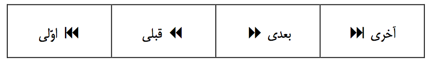

Chapter 2 - Principles of Graphical User Interface Design
=========================================================

In order to design successful and friendly interfaces, designers should be familiar with principles of GUI (Graphical User Interface) design. In this chapter, we first briefly examine some common principles and then point out some additional considerations that apply to Persian and bi-directional GUI design. We will also mention some aspects of supporting Persian locale as part of the design process.

## 2.1. Common Principles of GUI Design

Years of experience in the design of graphical user interfaces has shown that conforming to some principles and practices helps ensure the quality and usability of the GUI. As a result, today’s desktop environments come with documentation covering GUI design guidelines according to their flavor and priorities. Although it has been a long time since the first commercially successful GUI environments appeared in the market[^1], their design principles have seen very little change over the time. The different GUI design guidelines available for different environments are also fundamentally very similar. This is surprising considering the amount of changes in the industry during the past twenty years.

There have been various attempts at improving and changing the initial principles governing GUI design, but such attempts so far have not been successful. See [Raskin], [Jentner/Nielson].

This indicates that innovation in basic principles of the user interface design is difficult and developers should stick to the established guidelines and principles to create quality software.

It should also be noted that properly supporting these design principles for bi-directional locales sometimes implies none-obvious changes to the existing designs. The special considerations for bi-directional friendly designs are scarce and lacking.

**Rule 1: When designing or localizing graphical user interfaces, conform to the GUI guidelines and style guides available for the target environment. The prerequisite for conformance to this document is to first conform to the GUI design documentation available for the target platform as follows:**

- Targeting GNOME: Use GNOME Human Interface Guidelines” available online at: [http://developer.gnome.org/projects/gup/hig/](http://developer.gnome.org/projects/gup/hig/) [GNOME-HIG]
- Targeting KDE: Use KDE Style Guide” and KDE User Interface Guidelines” [http://developer.kde.org/documentation/standards/kde/style/basics](http://developer.kde.org/documentation/standards/kde/style/basics) [KDE-SG] & [KDE-UIG]
- Targeting Java: Use Java™ Look and Feel Design Guidelines” (Two volumes, available online at: [http://java.sun.com/products/jlf/](http://java.sun.com/products/jlf/)) [Java1] & [Java2]
- Other environments: User the available GUI design documentation if any, or use one from another platform.

In addition, studying additional resources including articles and GUI design documentation from different platforms including Apple Macintosh [Apple-HIG] and Microsoft Windows is highly recommended. It helps you gain a better understanding of the various aspects of GUI design.

  [^1]: "Apple Macintosh GUI introduced in 1984."

## 2.2. Applying GUI Design Principles to Persian

There are many common rules in GUI design. They may be differently worded or prioritized but the essence of the principles are very similar if not identical. The existing implementations of the GUI designs sometimes fail to maintain conformity to these common principles when they are localized for Persian/Iran or more generally any bi-directional locale. In this section we briefly mention some of these principles and indicate how they are violated in a bi-directional locale.

**Principle 1: Conform to User Expectations**

One of the most important characteristics of any good software is that they behave in a way that is consistent with user expectations, hence not confusing them. Any action or reaction from software that is unexpected or unfamiliar to the user will be seen by the user as confusing. In order to maintain the principle of conforming to user expectations, the designer of the software should have a good understanding about the experiences and expectations of the typical user.

It is worth noting that some designers believe in positively surprising user by guessing what user intends to do and getting ahead of the user and doing it for them. The problem with this approach is that there is a good chance of guessing wrong, which leads to irritating the user. Only use this so called “intelligence” if you are pretty sure you actually know the user’s intention. Also such “active assistance” (as it is sometimes called) should not be distracting.

Many designers and developers of internationalized software don’t have enough information about the expectations of the users in bi-directional locales. This leads to designs that show confusing behavior when localized for bi-directional locales. The most important case in this regard is the incorrect assumption that supporting the Unicode bi-directional algorithm takes care of most of the requirements of bi-directional languages. The other incorrect assumption is that the behavior of Unicode bi-directional algorithm matches user expectations. As we will see below this is not the case.

**Guideline 1: Supporting Unicode and its bi-directional algorithm is not enough to support bi-directional locales. In addition to Unicode, the software should support proper bi-directional layout and interaction.**

To make the above point clear, please note the intention of Unicode: It is designed to facilitate exchange, storage and processing of text streams. This leads to design choices that may complicate the visual display and editing of text. For example, Unicode uses semantic character encoding as opposed to visual character encoding. Visualizing and editing semantically coded character streams can be tricky in bi-directional text. For example, the Unicode character U+0028 is interpreted as opening parenthesis (although it is historically called left parenthesis). This means that the visual display of the character depends on how we interpret the direction of the text containing this character.

The semantic encoding of Unicode does not mix well with GUI way of doing things. As we know, graphical user interfaces rely on visual communication and direct manipulation of visual elements. The fact that current text editing solutions rely on Unicode model instead of a more visual-friendly approach, is currently causing confusing and unpredictable behavior such as jumpy text cursor or dual cursors.

**Guideline 2: Do not directly map Unicode bi-directional concepts and model to the design of GUI applications. The software should use a consistent and easily predictable visual model when dealing with bi-directionality.**

**Principle 2. Free User’s Minds for Productive Tasks**

We use computers to free ourselves from engaging our mind in none-creative, repetitive and boring chores. One of the ways that we can improve our productivity and free our mind to concentrate on important things is by learning basic skills and performing them sub-consciously. Well designed software reduces the burden on users and lets the user gain productivity by helping the user apply existing skills and learn new skills quickly and efficiently.

Graphical user interfaces help reduce the need for abstract thinking of users by creating a visual model where the user could directly manipulate and interact with the objects of the visual model. Once the user gets comfortable with the visual model, the user can sub-consciously interact with the model and concentrate on the task at hand and avoid wasting time trying to remember or figure out how to tell the computer what to do. One of the most important properties of such visual model is its stability and consistency so that its behavior can be easily predicted.

Some of the existing designs in bi-directional environments violate the basic requirement of visual stability and predictability of the environment. In such designs, the user interface elements (such as vertical scroll bar) keep jumping around and user can’t tell for sure what will be selected if the user drags the mouse over a piece of bi-directional text or what happens to the surrounding text if you type a new character. If the position of the important interface elements (like scroll bar) is not stable, users will not be able to learn their position and they have to constantly and consciously search for them.

**Guideline 3: The position of the user interface elements should be stable and predictable.**

**This does not apply to elements that have to change position to remain readable depending on writing direction.**

**Principle 3. Respect the Users and Give them Confidence**

The user interface should indicate and reinforce the fact that the computer is serving the user and not the other way around. To achieve this, user interface should have some properties, for example:

- The software should do what it is told to do. Any user action should have a direct and expected outcome[^2].
- The software should carry out user commands by itself. Breaking down each operation into too many steps and constantly asking for permission to proceed or asking for additional information in different steps should be avoided.
- The software operations should be safe so that user can confidently work without fearing potential damage to the work at hand. This is normally achieved by maintain reversibility of actions and delaying irreversible operations[^3].
- The software should not pretend to know more than the user or treat the user as being dumb. Using names such as Wizards and Experts for assisting services in the applications is not recommended. Use a name such as Assistant instead. Also too much explanation and breaking operations into very small steps does not improve user friendliness and ease of use. Although this may be useful in rarely used operations (such as first time internet connection setup), or for novice users.
- The software should be polished. The user should feel that the software has attention to detail to make it more comfortable and productive for the user.

In a bi-directional environment the issues of lack of stability and predictability adversely affect the software in this regard, too.

  [^2]: "Warning the users about dangerous and irreversible operations is OK and desired."
  [^3]: "A good example is the trash can (recycle bin) metaphor."

**Principle 4. Design Software for the International Market**

Designing for the global world market have seen increasing importance and attention in recent years. Even if you initially plan on releasing your software to the local market, taking the time to plan for its internationalization will not add too much work in the initial design but will save a lot of time and cost when you decide to go international.

**Rule 2: You should first properly internationalize your software to correctly support Persian locale.**

For more information about software internationalization refer to you platform’s appropriate documentation, such as:

- Unicode How To [Unicode]
- KDE Internationalization Site (i18n.kde.org) [KDE-i18n]
- Internationalization with Qt [Qt-i18n]
- GTKmm Tutorial, Chapter 20 [GTKmm-i18n]
- Internationalizing GNOME Applications [GNOME-i18n]
- GNOME L10N Guidelines for Developers [GNOME-L10N]
- ICU User Guide [ICU-UG]

**Other Principles**

The above principles are not the only principles in GUI design. Also, the above principles are discussed from different perspective in the GUI design literature (see [KDE-UIG], [GNOME-HIG] and [Apple-HIG]). The above principles where only mentioned to indicate that bi-directional locales may pose some challenges in adhering to the established GUI design principles.

## 2.3. Specifics of Bi-directional GUI Design

There are some bi-directional specific considerations that are usually overlooked in software design. In order to bring the most important issues in this regard to light, we define some additional principles.

**Principle 5. Left and Right differs from Previous and Next**

The architecture of the existing environments and toolkits is heavily affected by strictly left to right writing direction in the locale where they originated. Many of the existing architectures do not make a clear (or any) distinction between the concrete and visual concept of left and right and some abstract concepts such as previous and next or near and far.

For example, the most common visual symbol for the concept of *Previous* is a left pointing arrow ← but this is based on the left-to-right writing direction. In a bi-directional environment, a left pointing arrow means visual direction left and never means *Previous*. The only common symbols that can be used to indicate *Previous* and *Next* seem to be the symbols used in the AV equipment, solely based on their wide-spread deployment all over the world. This will be discussed in more detail later. A similar issue is related to the order of placement of elements such as buttons. Most of the time, the first element is put on the left side which does not indicate the first position in right-to-left locales.

**Rule 3: Use horizontal arrows only to indicate visual directions, do not use them to indicate *previous* or *next*. Use the text “Previous” and “Next” when possible and place them according to writing direction. To visualize previous and next you may use symbols used in the controls of audio/visual equipment. In that case, maintain their visual order (*previous* in left and *next* in right). You may also use up-pointing arrow to visualize *previous* and down-pointing arrow for *next*.**

**Examples**

When the user interface is text oriented so that the user reads it like text, conform to the writing direction when placing the buttons, as shown below:

نمایش فیلم: [آغاز] [درنگ] [پایان] رجوع به فصل: [اوّل] [قبل] [بعد] [آخر]

Movie Playback: [Start] [Pause] [Stop] Jump to chapter: [First] [Previous] [Next] [Last]

When the user interface resembles audio/visual equipment, the order of placement and symbols should conform to their conventions, as shown below:

or for more symmetry:

**Principle 6. Left Justify and Right Justify Differs From Left-to-Right and Right-to-Left**

When writing from right-to-left we usually start writing from the right edge of the paper, so the natural text alignment when writing from right-to-left is right justified. Similarly, the natural text alignment for left-to-right will be left justified. But this does not mean that the application should change explicitly set justification when user changes the writing direction. Applications should also provide separate controls for text direction and justification.

**Rule 4: Text processing applications should provide independent controls for text direction and text justification. When justification is not explicitly specified, applications should change text justification to reflect natural text alignment based on writing direction.**

**Principle 7. Position and Orientation of User Interface Elements follow Tradition**

The above principle indicates that the position of the interface elements is based on existing practices and traditions which do not necessarily follow writing direction. Some developers make the incorrect assumption that the position and direction of user interface elements always conforms to the main writing direction. Hence, they simply mirror their user interfaces for right-to-left locales as if those locales exist in a mirror universe. Such mirroring usually creates acceptable result, but this is not always the case. Consider the example of positioning previous/next buttons according to the way they are traditionally positioned in audio/visual equipment.

The position of user interface elements should be compatible with the experiences and expectations of the users (Principle 1). Such experiences and expectations may not be related to writing direction. As a rule of thumb, the interface elements that users read like normal text should follow writing direction. For other cases, you have to find out how they are traditionally placed in the locale you are targeting. Many expected placements actually follow left-to-right conventions even in right-to-left locales. The reason is that they either follow mathematical direction (like a progress bar) which is universally left-to-right, or they follow some real world equipment which have left-to-right orientation (such as audio/visual equipment mentioned earlier).

Items such as radio dials and the buttons on audio/visual equipment do not have locale specific versions with different layouts and directions. For example, a left pointing “Forward Play” button  is never expected in any locale, since the symbol universally reflects the same audio/visual equipment distributed all over the world.

It should also be noted that some apparently directional symbols get their direction from other origins that do not have anything to do with writing direction. For example, although the normal shape of a check mark  is directional, but it does not follow writing direction. Its direction indicates that it is right-handed. A left handed person will be more comfortable to put check mark with a mirrored shape. This is true both in right-to-left writing and left-to-right writing.

In many cases the placement of user interface elements are simply a matter of design choice. In such cases, it is not advised to change the position or orientation of elements for different writing directions. A clear example of things that are design choices and have nothing to do with writing direction is to placement of window control widgets in the two major proprietary operating systems Microsoft Windows and Apple Macintosh. As you can see in the pictures below, the widgets are placed at the opposite sides of the window:

**Microsoft Windows:**

**Apple Macintosh:**

**Guideline 1: Avoid blindly mirroring everything in the user interface to make them right-to-left. So called right-to-left locales are actually bi-directional. Only rearrange elements that users read like text. The correct position and orientation of each element is determined based on user expectations which do not always reflect writing direction.**

## 2.4. Locale Requirements for Iran

Any software with Persian user interface should properly support fa\_IR GNU/Linux locale. This includes different items specified in locale data files including sorting, searching, etc. In the following sections, we will mention the main topics regarding support of fa\_IR locale.

A textual description of locale related items such as paper size, date and time format and similar items can be found in the Persian document titled: [Locale’03]

مرتب‌سازی فارسی، جستجوی نادقیق فارسی، نیازهای شرایط محلی فارسی ایران

Any software application that is properly internationalized and supports GNU/Linux locales should normally work properly with Persian locale without requiring any modification or special treatment.

**Rule 1: Any software with Persian user interface should properly support fa\_IR GNU/Linux locale.**

### 2.4.1. Search and Sort

Supporting proper Persian search and sort is one of the locale support requirements. For more information and a textual description of sort requirements you may refer to the following Persian document: [Sort’03]

ترتیب‌بندی و مرتب‌سازی برای زبان فارسی ایران

For more information and a textual description of search requirements you may refer to the following Persian document: [Search’03]

جستجوی تقریبی برای زبان فارسی ایران

There is an additional consideration which is causing some issues in getting the expected search and sort results: Many existing keyboard layouts (mostly deployed on computers running older versions of Microsoft Windows) do not conform to proper encoding of Persian text in Unicode as specified in the National Standard ISIRI-6219. See [ISIRI-6219]

As a result, a lot of the existing Persian text in files and databases are not properly encoded and contain foreign (typically Arabic) characters. A lot of new text input also suffers from this issue. So, it is recommended that the software applications designed for fa\_IR locale provide some facilities for filtering and cleaning up the incoming text from foreign sources. This is usually easy and consists of simple character substitution or composition/decomposition. The typical problem characters include the incorrect use of the following characters in Persian text:

U+0643, U+0649, U+064A, U+0660 to U+0669, U+06AA, U+06C0 to U+06C2

**Guideline 5: Filter the imported text to ensure that it conforms to ISIRI-6219 standard.**

**Rule 6: Any software with Persian user interface that performs text search and sort should properly support searching and sorting despite receiving text that is not fully ISIRI-6219 compliant.**

### 2.4.2. Calendar

Another important issue in properly supporting Persian locale is the proper support for official calendars of the Islamic Republic of Iran. This is the area that creates the most amount of work for developers. The reason is that the calendar requirement in Iran is not very common in other well known regions of the world. Iran is one of the very few countries where the calendar used for business and official operations is not Gregorian.

The main official calendar in Iran which is the basis for business and government is called *Hijri Shamsi* (هجری شمسی) also sometimes called *Jalali* (جلالی). This calendar unlike the usual Islamic Hijri calendar is solar instead of lunar. A reference algorithmic implementation of this calendar which is (supposed to be) endorsed by Iran National Open Source Project is available. See [Calendar’03].

The official religious calendar in Iran is the Iranian interpretation of the Islamic Hijri calendar called *Hijri Qamari* (هجری قمری). This calendar is used to determine the religious holidays and ceremonies. Since this calendar is based on moon observation, some dates may change and this calendar is not exactly computable in advance. For this reason, the calendar should remain adjustable. This can complicate the stored future dates in this calendar. For example, a pre-computed religious holiday may shift as a result of calendar change.

The Gregorian calendar is also officially used in Iran for international business and transportation. It is also used to determine the international events. Some holidays common in Christian countries such as the birthday of Jesus Christ is determined based on Armenian Church which represents the largest Christian minority in Iran.

The most important calendar related difference of Iran with most of the other countries is the fact that there are multiple calendars in daily use. For example, almost all of the calendars printed in Iran show every day in each of the above three calendars. So, you effectively get three calendars in one. This means that any software that intends to replace the printed calendars and diaries in Iran should be able to fulfill multi-calendar functions of their paper counterparts.

This means that calendar related applications in Iran have some special functional requirements regarding multi-calendar display, dynamic calendar switching and date conversions. Even simple applications that accept date input or display dates are affected.

Applications that are localized for Iran not only need to support any one of the official calendars of Iran but they should also support dynamic change of active calendar and input and display of dates in any of the calendars (not just the active or default calendar). It means that the localized applications should be able to interpret date input qualified with a calendar suffix in any of the supported calendars. A single character suffix is sufficient to aid in data entry. These suffix characters include: U+0634 for *Hijri Shamsi*, U+0642 for *Hijri Qamari* and U+0645 for Gregorian (م is the first character of the word *Miladi* میلادی which is the name of the Gregorian calendar in Iran)

The localized applications should display a calendar suffix when displaying dates that are not expressed in the currently active default calendar. It is also advised that date display labels (such as column labels) reflect the default calendar they display (or expect in case of input).

Also, the localized applications that store future dates in *Hijri Qamari* should be able to take into account the possible change of the physical day representing the date and dynamically adjust their behavior. Calendar focused applications need even more capabilities, details of which are beyond this document.

**Rule 7: Applications that deal with date should support all Iranian calendars.**

**Rule 8: Applications that deal with date and calendar should be able to handle multiple simultaneous calendars and dynamically changing the active and default calendars.**

**Rule 9: Date entry field should be capable of accepting date input in any of the official calendars in Iran regardless of the currently active or default calendar.**

**Rule 10: Applications that store future dates in *Hijri Qamari* should be able to cope with possible change in the physical day representing the date.**

### 2.4.3. Week

The start of the week and weekend holidays in Iran is different from the countries using Gregorian calendar and is very similar to the most of the other Islamic countries. The start of the week is Saturday in Iran and based on the local rules in different offices, the duration of the weekend holiday is either one, one and a half or two days. The actual holidays are: Friday, half of Thursday and Friday, Thursday and Friday or Friday and Saturday. The latter is used in the offices of the foreign companies or institutions.

Calendar and diary applications localized for Iran should be able to properly support the above rules for week start and weekends in Iran.

The other point worth mentioning regarding Iranian week is that it is not customary in Iran to number the weeks of the year. For this reason, there is no official rule for the method of determining the first week of each year.

**Rule 11: Calendar and diary applications localized for Iran should be able to accept Saturday as the start of the week and support Thursday (half day of full day), Friday and Saturday as weekend holidays.**

### 2.4.4. Naming GUI Objects

Naming rules for GUI objects such as the name of files and directories in the file system should be flexible enough to accept Persian names. This includes many types of object names from file system to network entities (such as server or service names) and user names, addresses, etc.

The support of Persian (actually Unicode) names for such objects currently faces some technical limitations and lack of support in the existing protocols and infrastructures. Many existing facilities or conventions limit names to contain only a subset of seven bit ASCII characters. These limitations are gradually being reduced and in many cases workarounds exist.

For example, the current conventions limit short user names to a subset of seven bit ASCII characters, but the comment section of a user account record accepts Unicode text which is commonly interpreted as full user name. Where necessary, applications should introduce Unicode names or support existing secondary Unicode names to let the users have object names in their preferred language. This may introduce additional functional requirements for some applications like contact databases or address books. In these applications, you may need to support two sets of name fields, one to contain the spelling of the name using Latin alphabet and the other to contain the name in its native language and alphabet.

Object name extensions and object path name separators are another area which may need special considerations. Separators used to separate path elements or name extensions should not be confusing for users in Persian/Iran locale. Fortunately, the existing conventions for the most widely used cases of such separators (file system objects) are acceptable. Developers who may introduce new separators for their specific application needs should be careful when deciding on such separators. For example, using mirrored characters such as U+00E probably is not a good idea.

The other issue in this regard is that the standard name extensions are defined using ASCII characters which may not look very good when attached to a Persian name. To improve the ascetics of your software it is advisable to support hiding extensions and supporting extension-less names.

The are some issues related to protocol prefixes in URIs (Uniform Resource Identifiers) and new proposals such as Internationalized Resource Identifiers (IRIs) does not seems to fully address these concerns. This issue does not have a well established solution yet.

Truncating names and other text strings is another issue which needs special attention in Persian. This will be discussed in a future update of this document.

**Rule 12: Persian software should be able to accept Persian names for the objects they are dealing with. Current infrastructures and protocols may not permit this, but this is expected to change over time.**

## 2.5. Dual Language User Interface

Most of the existing software user interfaces are not localized for Persian. Limited availability of the Persian localization is expected to continue for quite some time. Also, many types of software are too specialized to be localized for Persian. Also, the existing global trends necessitate the use of the English language in many cases. This means that for the time being, instead of having a unified Persian working environment on the computer, we are facing a bi-lingual environment.

The differences in the text direction of Persian and Latin (mostly English) in such a bi-lingual environment create some issues. For example, consider the menu bar. Since the menu bar is text oriented and is usually read like text, it is expected to follow the direction of the text it is written in. On the other hand, we specified that often used and common elements in the user interface should have stable and constant placements to facilitate ease of use.

There is a contradiction among the rules here that needs a resolution. In most cases, when an element is used in many places (which is the case with menu bar) the principle of keeping stability and consistency has a higher priority and we have to keep both menu bars in the same direction which means that one of them will not be in the correct reading order. Items that have more local and specific uses adhere to the orientation implied by their language. For example, a text label for an entry field written in a Latin should be always placed to the left of the field, while the text label for an entry field in written in Persian should be always placed to the right of the field. This issue is further discussed in chapter 5.
