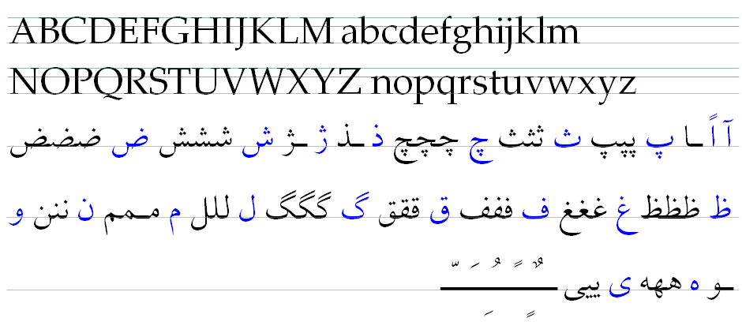
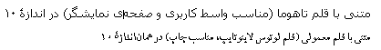
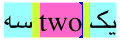
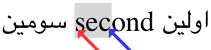
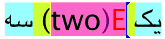
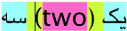
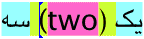
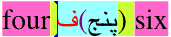

Chapter 3 - Persian Text in the GUI
-----------------------------------

### 3.1. Characteristics of the Persian Text

There are very obvious differences between Persian text and Latin text, but one of the issues in proper support of Persian language is that many developers treat Persian and Arabic as being the same. To overcome the issues caused by treating Persian like Arabic, we will specify the differences of Persian with Arabic as well as Latin script.

Some may be surprised to know that Persian language is an indo-European language like English, French and German. The writing script of the Persian language which uses a modestly extended Arabic script causes many people to think that Persian is a derivative of the Arabic language, which is not true. Here we will list the main characteristics of the Persian language as far as normal usage in the user interface is concerned:

1.  Like the Arabic language, Persian is written from right to left. Numbers and numeric expressions are written from left to right. The difference of the Persian with other Arabic locales is the lower emphasis on right to left direction, especially when numbers are involved. For example, in Persian/Iran locale many tables and graphs that are numerically oriented use Cartesian direction which is left to right, whilst they may be preferred to be right to left in Arabic speaking locales.

2.  Printed Latin text does not cursively connect adjacent characters and the shape of characters does not depend on their position in the word. In Persian, just like Arabic, the cursive connection of adjacent letters is required and the shape of characters depends on adjacent characters.

3.  In normal Latin printed writing, combining adjacent characters to form a ligature (like replacing  with ) is optional and is used to improve the typographical look of the text. Some ligatures in Persian and Arabic are required for correct writing. The main example is the ligature of letter Lam (U+0644) with Alef (U+0627). For this reason, text rendering subsystem should support automatic formation of ligatures.

4.  In Latin text, each character has two forms: lower case and upper case. This does not apply to Persian and Arabic. They don’t have a concept similar to upper case of lower case of Latin.

5.  Like Arabic the only required set of ligatures in Persian are the ligature of Lam (U+0644) with Alef-based characters (U+0627, U+0622, U+0623, etc) It is worth mentioning that mark to mark positioning by combining them into a single glyph (such as combining U+0651 with U+064E to get U+FC60) is not considered a ligature. The main difference of Persian with Arabic concerning ligatures is in the preferred optional ligatures. Here are the most common optional ligatures in Persian:

    -   The ligature of either U+06A9 and U+06AF with either Lam (U+0644) or Alef-based characters (U+0627, U+0622, U+0623, etc)
    -   The ligature combining certain previous characters with the word final Yeh (U+06CC) in to morph a dandanah in the previous character to a hill in the head of Yeh, similar to this example that combines U+0633 with U+06CC: 
	-   The ligature of either of U+0633 to U+0636 with U+0631, U+0632 or U+0698. Also ligatures of medial form of some other characters (e.g. U+028, U+062A, U+062B) with U+0631, U+0632.

6. The following optional Arabic ligatures are not desired in Persian. Avoid them for Persian text:

	-   The ligature of Lam (U+0644) with Meem (U+0645) which looks like: 
	-   The ligature of Meem (U+0645) with Alef (U+0627) which looks like: 
	-   The ligature of Lam (U+0644) or Feh (U+0641) with any Yeh (U+64A or U+06CC) which look like: 
	-   The ligature of U+0628, U+062A, U+062B or U+0644 to U+0647 with U+062C to U+062E. For example U+0644 with U+062D forms this glyph in initial form: 
	-   None of the three character Arabic optional ligatures are desired for Persian.

7. Marks called accents that are added to some base characters in Latin are different from the floating marks used in Persian and Arabic. The characteristic of Latin accents is that some very specific accents are used on some very specific base characters. Those accented characters usually play a role very similar to a stand-alone character different from the base character. For this reason, it is common to use composed accented characters in Latin where a base character and an accent are combined to form a new character. In Persian and Arabic the use of floating marks is a lot more free and arbitrary. The floating marks in Persian and Arabic have stand-alone significance (many of them represent vowels, for instance) similar to an independent character. This means that in Persian and Arabic the floating marks are not composed with the base character to make new characters and remain independent and are editable independent of their base glyph.

8. The short vowels in Persian and Arabic (U+064E, U+0650, U+064F) are zero-width floating marks that are normally omitted in writing.

9. Among Arabic floating marks other than the above, only U+0651 and U+064B are commonly used in Persian. Unlike the vowels, their presence is normally required to have a correct text.

10. In Arabic when positioning the two floating marks U+0651 and either U+064D or U+0650 on the same base glyph, the second mark (the vowel) is placed on the first mark not on the character. So, in Arabic the combination of U+0651 and U+0650 looks like: ـِّ This is not the case in Persian and both marks are placed on the base character. For example, the combination of U+0651 and U+0650 is displayed as:ـّ‌ِ

11. There is a floating mark that is specific to Persian and is not well documented. A short description of this mark follows: When you want to add a U+0650 to the end of a word, if certain conditions are met, U+0650 vowel mark is replaced with a mark whose shape is  and it is called *Yayeh Morakham* (یای مُرَخَّم) which means “shortened Yeh” and represents an added *Yeh* pronunciation to the usual pronunciation of U+0650 vowel. If a word ends in Heh (U+0647) but the Heh is not pronounced, *Yayeh Morakham* will be used instead of U+0650.

A example usage of this mark in Persian is the phrase: خانۀ من (Meaning “my house”) Since writing this mark has not traditionally been well supported in typewriters and computers, it is also written with a full *Yeh* as: خانه‌ی من So, the sequence of U+200C + U+06CC appended to a word ending in U+0647 is equivalent to the presence of *Yayeh Morakham* at the end of the word.

Since *Yayeh Morakham* is only used in this specific place and after this specific character it is treated more like accents and there is no separate and specific Unicode entry for it. Instead, in order to support this mark, the usage of *Arabic Hamza Above* (U+0654) is extended in Persian as follows:

U+0654 is valid if it appears after U+0647 in Persian and is treated as *Yayeh Morakham*. It should be combined with the shape of base glyph in the form of an added mark above the base glyph shaped  (A small *Yeh* whose tail swash is cut)

The sequences U+0647 + U+0654 and U+0647 + U+200C + U+06CC at the end of a word are equivalent and are valid if U+0647 is not pronounced. The meaning of U+0654 or U+200C + U+06CC are equivalent to U+0650 (which in this context means “of”). The text services in a Persian localized environment should correctly support this special floating mark.

12. As mentioned in the beginning of this section, Persian is an Indo-European language. This means that Persian uses compound words, prefixes and suffixes. The rule of writing these compound words or prefixes and suffixes is an extension to normal Arabic script in that the components (sub-words) or prefixes and suffixes may not be cursively connected the other parts of the word. According to ISIRI-6219, this is facilitated by adding a Zero-Width None-Joiner (U+200C) between the components of the word or the word and its prefix and/or suffix. The correct display of this disconnection in the middle of the word usually requires that this control character behave as if in addition to splitting the cursive connection, it adds a very short white space between the components it is separating (as if it is U+202F for instance). The text services in a Persian localized environment should correctly support this style of Persian compound words.

13. Unlike many languages, feminine vs. masculine distinction does not exist in Persian.

14. In Persian we either have plural or singular and unlike Arabic, a pair is not distinguished. The count of objects specified in Persian also does not require using a plural name. For example, instead of the English phrases “One Book vs. Three Books” in Persian both cases are written identically with singular name (as if we say “Three Book”).

15. In the Latin alphabet only a few characters descend below the baseline (g, j, p, q, y and Q) but in Persian and Arabic there are many characters that descend below the baseline. The amount of this descend is also traditionally much more than Latin. Generally, the extra swashes in Normal Persian and Arabic and the presence of floating marks causes Persian to require more line spacing than English to be readable. This requires that the Persian localized applications permit enough interline spacing to provide readable Persian text.

16. Mono-spaced fonts are common in display of Latin text on computers. True mono-space font is impossible in Persian (because of the required ligatures and floating marks). Nearly mono-space font also is not as readable and appealing as Latin text because of inherently more varied character widths and use of swashes in the word final shape of characters. This means that Persian localized software may not assume presence of a mono-space font and depend on mono-space fonts.

17. Latin text absolutely requires inter-character spacing to be readable but the different shape of word initial and word final characters cause Persian text to stay much more readable if the inter-word spacing approaches zero. This has some undesirable side effects: Some people typing Persian text omit some inter-word spaces without causing user noticeable defect in the display. This is specially the case when a phrase is so common that people start to treat it as a compound word. An example is the three word phrase زد و خورد which is commonly written as زدوخورد. This causes problems with text processing software which require an explicit word delimiter which is practically sometimes absent in Persian. Although the above practice is considered incorrect, but it is actually very common. So, software that needs to accurately separate words in the text will need special lookup dictionaries and other facilities to detect and correct such cases.

18. Persian text needs kerning for readability and aesthetics much more than Latin text does. So, it is advised that text rendering facilities targeting Persian text support kerning and the Persian fonts provide adequate kerning data.

19. In Latin text the most common text alignment and justification is left aligned text. Since the cursive connection points in Persian (and Arabic) text are ductile, fully justified text is much more common and usually the expected default in Iran. So, it is advised that text rendering facilities targeting Persian text support full justified.

20. Full justification of Latin text is mostly achieved by adjusting inter-word spacing and relies on inter-character spacing mostly as a last resort. On the other hand the, full justification of Persian text usually does not involve adjusting inter-word spacing at all. Full justification in Persian text (like Arabic) is achieved by extending the inter-character cursive connections. This effect is usually achieved by adding special glyphs between the connected glyphs. These glyphs are called Tatweel or Kashida and look like horizontal bars placed on the baseline. There is one manually inserted Tatweel defined in Unicode (U+0640), but it is not the most desirable glyph to be used for justification since it is too wide. In order to properly support Persian text, it is necessary that the text rendering services properly support text justification by extending cursive connections. One important step to achieve this goal is the support of OpenType justification features, namely the support of OpenType JSTF table which is not yet supported well on GNU/Linux.

21. Persian uses some additional alphabetic characters compared to Arabic which include: پ (U+067E) چ (U+0686) ژ (U+0698) گ (U+06AF).

22. Some Arabic letters are not used in Persian such as إ (U+0673) and *Alef Maksura* ى (U+0649) which looks identical to Persian *Yeh* (U+06CC). When writing Arabic words such as موسی (Moses) which contain *Alef Maksura* in Persian, it is written using Persian *Yeh* instead of *Alef Maksura* and treated as if it actually is *Yeh*. It has been recently suggested that such words be written with normal *Alef* in Persian which is gradually gaining some acceptance. So the above word can also be written as موسا in Persian.

23. Some Arabic letters are written with a slightly different appearance in Persian. Since Unicode tries to avoid coding language into its encoding while preserving character appearance, it defines different code points for semantically equivalent Arabic and Persian letters. So, instead of Arabic ك (U+0643) and ي (U+064A) Persian uses ک (U+06A9) and ی (U+06CC) respectively.

24. The shape of some digits and the shape of decimal and thousand separators in Persian differs from Arabic. There are also some differences in the directional behavior of Persian numbers with Arabic numbers. For this reason, there is a second group of digits defined in Arabic block (U+06F0 to U+06F9) which are used for Persian and Urdu and some other languages. Although the same code points are used, the display shape of some digits differs among Persian and Urdu. This is also the case with decimal and thousand separators (U+066B and U+066C). Text rendering services may need to use knowledge of the language (gained for instance through the keyboard layout used to perform text entry) to determine the correct shape of some digits and the shape of decimal and thousand separators in Persian.

### 3.2. Characteristics of the Persian Fonts

Since Persian writing is based on Arabic script, Persian fonts share many characteristics with Arabic fonts. The main differences between Arabic and Persian fonts are the result of different styles and calligraphic tastes among Persian and Arabic typographic designers and calligraphers. Since such differences exist, some of the Arabic font designs look foreign and even ugly to the Persian user. On the other hand, some of the best fonts used in Persian have Arabic designs such as Linotype Lotus font.

**Rule 1: Avoid using Arabic fonts that are not familiar for users in Persian/Iran locale in your software user interface.**

**This does not include Arabic text and Arabic designs that are popular in Iran.**

#### 3.2.1. Persian vs. Latin Fonts

There are important differences between Persian (including Arabic) fonts and Latin fonts. This leads to issues in deciding the proper font, font size and font style for use in Persian user interface. For this reason we will compare Latin and Persian fonts and discuss some of the issues involved.

Normal Latin fonts usually contain many parallel vertical stems that reside between three well-defined parallel horizontal guide lines. In contrast, there is only one well-defined baseline recognizable in Persian font and the angle, shape and height of the stems in the Persian fonts are quite varied. The following figure shows a sample of Latin vs. Persian Fonts (Linotype Palatino vs. Linotype Lotus):

Both fonts descend below the baseline but the amount and variation of this descend is much more in the Persian font. Extra descend and the presence of swashes, dots and floating marks in the Persian fonts causes the Persian text to require more line spacing to be easily readable.

An important historical side effect of the shape of Persian font is the different effective optical size of Persian fonts with Latin fonts. The more line spacing requirement of Persian fonts means that you have to make Persian font smaller to fit a certain height which determines the point size of the font. So, a 12 point Persian font usually looks smaller and is less readable than a 12 point Latin font. This can significantly affect the readability of the text used in the user interface. The following figure illustrates this effect. In the first line, both fonts have the same size. In the second line the Persian font is enlarged to 117% to make it as readable as the Latin font:

To get equivalent readability, the point size of the Persian fonts usually needs to be 5 to 20 percent more than the adjacent Latin font. Since selectively changing font size for the text in the user interface based on the script and language of the text is not supported now, the easiest solution is to have special Persian user interface fonts whose readability vs. size is adjusted to be equivalent to the Latin fonts.

**Rule 2: For displaying Persian text in the user interface use Persian fonts that are specifically designed or adjusted for this purpose.**

It is also highly recommended that word processing applications support different font and size setting for each language (or at least script) that is used in the document and avoid applying the same font and font size to the entire text containing different languages.

There is also another difference between Persian and Latin fonts apparent from the previous figures: In Persian text horizontal stems are thicker and make up the main bulk of the font but in Latin text vertical stems are thicker and provide the bulk of the font. As we will see this further affects line spacing, especially for boldface text in Persian.

#### 3.2.2. Persian Font Styles

It is a normal practice to use different font style or underlining to emphasize portions of the text. The most common font styles in Latin include **Bold**, *Italic* and ***Bold-Italic***. The main characteristic of the bold font style is the added stem thickness that makes the text look blacker. The main property of the italic style is the slanted vertical stems in the font which makes it look more dynamic. The fonts that lack other italic characteristics but posses the slanted vertical stems are usually called *Oblique* or *Slant* instead of *Italic*.

Since the advent of printing in Iran similar font styles have been created for Persian. The properties of Persian font cause the Persian text styles to have some differences with their Latin counterparts. In the Persian fonts the horizontal stems are dominant and determine the blackness of a font. This fact with the added effect of multiple dots on some characters, cause the Persian bold style to have a tendency to grow more in height rather than width. In contrast, the Latin bold text tends to grow in width but maintain its height. When designing Persian font families, usually the line spacing of the font is taken even higher to accommodate for the increase in height for the bold style. The other issue caused by this fact is the reduced effectiveness of the normal algorithm used to simulate bold style when a true design is not available. The existing method usually strikes the normal font twice with a slight (one pixel) horizontal shift to simulate bold text. This method creates ugly (sometimes damaging) results in Persian and does not provide enough blackness.

**Guideline 1: Always try to design and have bold style for Persian fonts targeting screen and GUI.**

In Persian, Italic style is not defined and a simple Oblique or slanted style is used which is called *Mayel* (مایل). Although the direction of the slant may be the same as Latin, it is less desired and less common and the usual slant angle is the reverse of Latin. So, the default Oblique or Slant style in Persian uses a slant angel opposite to Latin fonts and the one which has the same angle than Latin are considered to be Reverse-Oblique or Back-Slant called *Mayel-be-Aghab* (مایل به عقب). This is a bit confusing for developers used to Latin fonts. If we have a Persian-only text always the normal oblique style is used (which is the reverse of Latin) but if the text is bi-lingual, the reverse oblique may be used.

There is also a general issue which limits the usefulness of this style in Persian. The fact that in the Persian fonts the horizontal stems are dominant causes a slanted font to be less distinguishable in Persian. This means that slanting vertical stems in Persian text does not create enough visible difference and it is hardly noticeable in a word like *سست*. It is also worth mentioning that there have been some efforts to define an italic-inspired font style for Persian called *Iranic* which tries to address the distinction issue above. Unfortunately, Iranic fonts are practically none-existent.

**Guideline 2: Try to limit or eliminate the use of Italic (or Oblique) style in Persian user interfaces.**

**Guideline 3: The software that supports font style should be adaptable to show the actual styles available instead of listing the generic bold and italic as the available style variants.**

There is another point concerning underlined text in Persian. Because of the extra descent and presence of dots below the baseline, Persian underline needs to be lower down the baseline than Latin underline. To get the correct effect, font designers should properly specify underline position for Persian fonts and application software should actually read and adhere to the underline position specified in the font instead of drawing a generic underline in a fixed position. This difference in suitable underline position creates another issue. If underlined text is a mix of Persian and Latin, the underline will be broken and will look unacceptable as shown below:

For this reason, the underline position should be determined as the lowest line indicated by various fonts that are used on the same line. If this is not possible try to eliminate the use of underlined text in your Persian user interfaces.

**Guideline 4: Using underlined style for a text containing both Persian and Latin font requires special handling and is not recommended.**

**If the underline is used, it should conform to Persian position of underline even for the portions using Latin font.**

The other important and widespread issue regarding usage of underline for Persian text involves underlining a single character of a word to indicate the shortcut or command character for the action represented by the text. Because of some vary narrow characters and presence of many dots below Persian text, a single character underline is not readable and is not recommended in Persian. To highlight such a character in Persian, use a different color for the character or its background or at least use a colored underline to make it distinguishable.

**Guideline 5: Underlining a single character should be avoided in Persian text.**

In addition to the Latin inspired font styles, there are some other methods used to highlight a portion of the Persian text. They include:

1. Putting the text inside Persian quotes (U+00AB and U+00BB) without implying citation but intended for emphasis.

2. Inserting Tatweel (U+0640) characters manually to stretch a word or phrase.

3. Changing calligraphic style of text from Naskh to Nastaliq or vice versa (which is currently limited to handwriting because of lack of acceptable Nastaliq Tahrir fonts)

#### 3.2.3. Persian Font Size and Metrics

As mentioned, compared to the Latin font of the same point size, Persian font usually looks smaller and is less readable. This effect depends on the font design. Also, the required line spacing for proper readability of Persian text at a given font size is more than Latin text. This is the result of more varied ascents and specially descents of the characters and presence of dots, swashes (like ک U+06A9) and floating marks. The comfortable line spacing for Persian text is usually 15% to 60% more than Latin text and may be up to 120% if the text heavily uses floating marks.

The other notable difference regarding vertical font metrics is the ratio of ascender to descender of the Persian fonts compared to Latin. For Latin text, the ratio is usually greater than 2 and may be as high as five, while for the Persian text the ration is usually less than 2 and normally never goes above 3. This potentially creates another issue when putting Persian and Latin text on the same line. The combination of Persian and Latin font of same size may require more space than any one of them needs alone.

So, if the sum of ascender + descender (which roughly determines the point size) is the same for a Persian and Latin font, the ascender of the Latin font is normally higher which determines the ascender for the combination and the descender of the Persian font is larger which determines the descender of the combination. The new sum which indicates minimum line spacing will be increased.

For example, consider a Persian font with ascender of 0.9cm and descender of 0.6cm combined with a Latin font with ascender of 1.1cm and descender of 0.4cm. The resulting combination needs a minimum of 1.1cm + 0.6cm = 1.7cm which is more than the 1.5cm any one of them would require alone. A line containing both Persian and Latin font needs more space than a text with any one of these fonts alone.

Since the text used in the user interface potentially can contain both Persian and Latin, the above issue should be noted when selecting font for the user interface and in the design of Persian fonts for the user interface.

#### 3.2.4. GUI Fonts

Font designed for use on display screens which are used for GUI text and web pages have important differences with the normal fonts designed for printed output. To improve readability these fonts usually look larger and more widely spaced with exaggerated features. For example look at the difference in on-screen rendering of the following two fonts:

The above figure shows a 10 point screen font rendered at 96dpi (first line) vs. a 10 point normal font rendered at 96dpi. The limited resolution available when rendering display fonts makes proper display of the variations in stem widths and serif sizes impossible. So, most display fonts use an almost constant stem width with thick, oversized serifs. The stem width is also usually much thicker in the boldface variation of the display font.

The other design feature of the display fonts is the increased attention to the quality of the low resolution rendering of the font. This is attained by using TrueType (instead of PostScript) curves and extensive TrueType hinting. Extensive hinting of a font is a difficult and expensive process, which makes production of display fonts more expensive and time consuming. This limits the availability of high quality display fonts compared to the normal fonts.

The above features are common for display fonts in any script. There are some features that are important for Persian GUI (screen) fonts:

Since the Persian and Latin GUI fonts are used side by side, a Persian GUI font should be compatible and in harmony with its Latin equivalent. To achieve this, it is necessary to reduce the descender of the Persian font compared to the traditional designs. This may even require using a different and higher actual baseline for the Persian character than the nominal baseline encoded in the font. This technique has been used in the old (pre-Mac OS 8) Persian and Arabic GUI fonts of Apple Macintosh as shown in the following figure:

Since the readability of the font is the primary concern in GUI fonts, a Persian GUI font needs to be made larger to improve its readability.

#### 3.2.5. Classification of Persian Fonts

Latin fonts have been categorized in different ways and these categories are well documented. There are different classification schemes that have minor differences. This classification has various uses. For example, by using the font classification, some software are intelligent enough to substitute a similar font (with similar metrics and design) when the font specified in the document is missing. It is possible to store some of these classifications in OpenType fonts.

The above classifications do not exist for Persian fonts and are not usually applicable to Persian fonts. Still, sometimes it is useful or required to classify Persian fonts. Unfortunately, there isn’t any notable published work on categorizing and classification of Persian fonts. This seems like a legitimate subject for future research.

We may look at font classification from a different angle as well: Matching each category of Latin fonts with the matching font along their recommended relative sizes. There isn’t any official work or published document in this regard, although many typesetters have their own matching collections.

In order to use Persian fonts in GNU/Linux, we need a minimal classification of Persian fonts to support fontconfig. The three main fontconfig font categories are:

1.  Serif, such as:
	
2.  Sans-serif, (Sans for short) such as:
	
3.  Mono-space, (Mono for short) such as:
	

Here we determine the equivalent categories in Persian fonts:

A feature like the serifs in Latin fonts (as displayed below) does not exist in Persian fonts. Since the traditional Latin fonts are serif and have varied stem width, we assume that the traditional Persian fonts with varied stem widths are Serif.

**Rule 1: Traditional Persian fonts with varied stem widths are defined to be Serif.**

Sans-serif fonts are more recent designs whose main features are lack of serifs and usually almost constant stem width. Based on the latter property, the recent Persian fonts that use an almost constant stem width are considered Sans-serif.

**Rule 2: Persian fonts with nearly constant stem width are defined to be Sans-serif.**

Early typewriters popularized fixed-pitched or mono-space fonts. As the name implies, each character in these fonts has the same width as any other character. As we mentioned earlier, true mono-spaced fonts are not possible in Persian and near-mono-space fonts designed for Persian in early computer age are now extinct because of the lack of readability and aesthetics. For this reason, mono-space Persian font does not exist and only may be created for the sole purpose of providing near-mono-space functionality for legacy applications that require it. There isn’t any notable example or worthy effort in designing such font for Persian in a modern format (such as OpenType)

**Rule 3: Software targeting Persian/Iran locale should not depend on the presence of a mono-spaced font for Persian.**

**Applications are allowed to depend on custom mono-spaced font they install themselves.**

#### 3.2.6. Persian OpenType Fonts

The recommended font format for Persian fonts is OpenType font format developed by Microsoft and Adobe. The important feature of this font format which makes it suitable for Persian is its advanced functionality for mapping characters to different glyphs based on different criteria and support for language specific glyph variations. Unfortunately, language specific glyph variation is not well supported by most text rendering services.

For information on how to make a Persian OpenType font refer to the following Persian document: [OpenType’03]

توصیف قلم اپن‌تایپ مرجع برای زبان فارسی

The font described and provided by the above document provides the minimum that is normally required. The following additional capabilities are also recommended:

-   A more extensive glyph repository to cover more typographical needs such as different types of dashes and spaces.

-   Complete kerning information

-   Optimal mark positions information

-   Contextual correction of the display of the Hyphen-Minus U+002D since the shape of hyphen and minus are too different in Persian

-   Proper support of *Yayeh Morakham* as described in item 3.1 of the section 3.1

-   Proper display of Persian or Arabic decimal and thousand separators based on the digits used. See item -3.1 of the section 3.1

-   Definition of correct cursor position within ligatures in GDEF table

There are other desirable features that are not discussed here.

Now let’s ask this question: Is the existing features (the 4 character feature tables in GSUB and GPOS tables) of OpenType fonts enough for complete Persian support? The short answer is almost yes. There are some other desirable features, one important example follows:

It would be very useful if there was a UDUistinguished UGUlyph UShUapes feature (suggested feature id ‘dgsh’) that would display otherwise identical appearance of different glyphs so that the editor would have a chance to know exactly what character they are looking at. This feature is useful in Persian because there are some cases that some none-Persian characters in some display positions would look identical to some Persian characters. For example, Arabic U+0643 looks identical to Persian U+06A9 in initial and medial forms.

#### 3.2.7. Other Font Issues

There are some other internationalization issues regarding fonts that are not specific to Persian. Such issues are not discussed in this document. For these issues refer to internationalization documentation of you target platform.

### 3.3. Writing in Persian for the GUI

Authoring text for use in GUI has some special considerations such as being consistent, concise and simple. Such considerations when writing in Persian in discussed in the Persian version of this document. Since this section only applies to people writing in Persian it is not reproduced in this English edition document. If you know Persian, please refer to the Persian edition of this document.

### 3.4. Translating User Interface to Persian

Similar to the above section, most of the discussion in this section is only relevant to Persian readers. There is only one point that concerns the text in internationalized software that is discussed here. For the rest of the discussion refer to the Persian edition of this document.

Separate localizable text should be provided in internationalized software for each different context and meaning where the same string appears. For example, “OK” may be used as a button label. “OK” may also be used to indicate a status. If an application uses “OK” in both contexts, it should provide two separate localizable “OK” strings with additional comment to describe the context of the string usage. A standard glossary for reference or semi automatic localization should also provide such context information. Any tool for semi-automatic localization should also be made aware of such context information.

### 3.5. Persian Keyboard

Persian keyboard like the keyboard for any other none-Latin script consists of two key definition groups. One group provides the keyboard layout for typing in Persian while the other provides a Latin (usually U.S. English) layout for typing Latin text.

The main key group which provides the Persian layout should conform to Iranian National standard ISIRI-2901 as of this writing. [ISIRI-2901] This standard is currently being revised to support ISIRI-6219 Persian Unicode text. Supporting the latest draft of this new standard is recommended.

The secondary key group which provides the Latin layout is usually an English layout supporting U.S. English or International English (ISO-9995-x series). It is permitted to be other Latin layouts for special deployments. Adding additional key groups for specialized requirements is also permitted.

**Rule 1: Persian keyboard consists of at least two key groups. The primary key group provides Persian layout while the secondary group provide the Latin (usually English) layout. Only one key group is active at any time and the active key group should be easily recognizable.**

**Key interpretations according to both key groups should be marked on the keyboard and distinguished by position and/or color. In addition to the main alphabet and digits, at least these characters should be marked for the Persian group of the keyboard: U+0021, U+0028, U+0029, U+002B, U+002D, U+002E, U+002F, U+003A, U+003D, U+005B, U+005D, U+007B, U+007D, U+00AB, U+00BB, U+00D7, U+00F7, U+060C, U+061B, U+0640, U+064B, U+0651, U+0654, U+066A, U+066B, U+066C, U+200C, U+200D, U+2010, U+2212**

The two key groups share some common characters, but the interpretation and effect of typing them using each group may be different. Another possibility is contextual interpretation of a keystroke based on adjacent characters. These cases will be discussed later.

To aid in the above cases software applications should be able to tell which key group produced any given input character and be able to receive notification on the events of active key group change.

**Rule 2: Application should be able to determine the active key group (or active layout) of the keyboard.**

**Application should also be able to listen to active key group (or active layout) change events.**

To facilitate ease of use and to conform to the GUI design principles, the following rules need to be followed:

**Rule 3: When starting up the computer in a Persian localized environment, Persian key group (layout) should be selected by default.**

**Rule 4: The user should be able to easily recognize which key group (Persian or Latin) is active at any given time. It is recommended that the active key group be recognizable by just looking at the text cursor.**

**Rule 5: Changing the active key group from Persian to Latin and vise versa should be easily possible via keyboard and mouse.**

**Rule 6: Explicit change of the active key group by user has a global effect in all windows. Automatic change of active key group should follow the conditions of 3.5**

**Rule 7: Application are permitted (sometimes forced) to change or restrict the active key group of the keyboard to facilitate data entry or data integrity. The change of key group should satisfy the following conditions: 1) Provide clear feedback and inform the user about the change. 2) The automatic change has locale effect in the active window, or active text field. Leaving the context that caused the change should restore the keyboard with appropriate user feed back, so the user knows that keyboard is restored. 3) If after automatic keyboard change, the user explicitly changes keyboard the explicit change should be honored and automatic keyboard change suspended until either user leaves the context or changes keyboard back to the same key group that automatic change would select. 4) In the above case if the change of active key group is not permitted, the software should react to the attempted change and inform the user why the change is not permitted. 5) If data entry in a field is restricted to a given keyboard layout (key group), the application should visually indicate this by specially marking the entry field (e.g. putting the layout badge next to the field). In such a case the keyboard should change automatically and user should not be asked to do it manually.**

The behavior of command key equivalents and keyboard shortcuts also needs to be specified. For example, it is common to define Control-P as the shortcut for the Print… command in the File menu. Since at any given time one group in the keyboard is active and P is only defined in one of them, the correct behavior may not be obvious.

First let’s examine the question of whether such keyboard shortcuts are localizable. The answer is no. Keyboard shortcuts are always defined using Latin alphabet and standard keyboard shortcuts are the same for all languages. As a result, always the Latin key group is active for the purpose of keyboard shortcuts and command key equivalents. So, the active key group only affects typing and when shortcut or command modifiers are held (Control, Alt, Meta or combinations of them) the keyboard behaves as if the Latin group is selected.

It should also be noted that Persian applications are permitted to select and document their keyboard shortcuts based on the Persian keys. For example, the shortcut for selecting a command labeled تجدید محاسبات could be considered as being Control-ت and be documented to the user as such but actual shortcut is Control-J. There is a slight chance of such a shortcut definition not working properly if the Latin keyboard layout is different than the one expected.

**Rule 8: Keyboard shortcuts and command key equivalents are not localizable. Persian applications are permitted to document their custom shortcuts as if they are defined in Persian.**

**Rule 9: Keyboard always behaves as if Latin layout if active when a key is typed while holding down one of Control, Alt or Meta keys or their combinations with other modifiers.**

### 3.6. Entering and Editing Persian Text

There are some challenges in entering and editing Persian text because of the characteristics of the Arabic script such as its directionality. The existing Unicode-based solutions do not address these challenges very well which causes lack of user friendliness in Persian text editing.

#### 3.6.1. Types of Text Editors

Before getting to the proposed text entry and editing solution, we will examine the common scenarios in text editing and the major types of text editors. The common text editing activities include:

1.  Simple full screen plain text editing. For example, text editing with gedit of GNOME. In this case only text is important and text formatting is not relevant.
2.  Entering and editing text in single-line or multi-line text fields possibly having length restriction or input templates. This case also focuses on the text without formatting options.
3.  Letter typing and correspondence: In this case text formatting and page margins also become important.
4.  Typesetting and page layout: In addition to text formatting and page margins involves text columns, style sheets, master pages, table of contents and indexing and etc. There are two main approaches to this type of text editing: GUI approach and markup text approach such as T~E~X.
5.  Entering and editing text boxes in graphics or CAD applications.
6.  Entering and editing structured text such as program source code or XML or other similar markup. The special features in this type of editing involve syntax checking and assistance and structure auto-enforcement.
7.  Automatic text processing such as database publishing and XML transformations.
8.  Text input and editing using unconventional input methods such as speech recognition, OCR or hand-writing recognition.

In each of the above case there are some differences in the functional requirements for text editing. To address these cases various text editing solutions and environments have been created.

The requirement for the cases 1, 2, 3 and part of 5 are addressed today by the standard toolkits provided by popular graphical desktop environments (GNOME and KDE) which provide usually adequate support for Persian these days. For most of the other cases (except maybe 8) there are Free/Open Source projects that address the requirements but their compatibility with Persian and Unicode may be very limited.

There are also some Persian specific scenarios:

9.  Entry and editing heavily marked text (usually Arabic religious and Qoranic text) which needs special facilities to ease the text entry and editing.
10. Entry and editing of simulated Persian calligraphic text or hand-writing style text.
11. Entry and editing of Persian poetry which uses a special formatting not well supported by ordinary solutions.

There isn’t any mature Free/Open Source software to address the above more specialized Persian text editing requirements. This document will not go into such special cases and only focus on generic baseline text input and editing. There are two main types of generic text editing solutions:

Type One) Focuses on text input and editing with emphasis on plain text and its structure. It is mostly used for the above cases 1, 2, 6 and 7. Many Latin solutions for this type of text editing use mono-space font and limit text formatting to syntax highlighting by changing the color of the text. A single line text field editor is also usually of this type. This type of editors if are restricted to mono-space fonts are not usable for Persian.

Type 2) Text editors that support multiple fonts, sizes and styles and are GUI oriented in their design. Basic support for Persian in this type of editor is usually easier but full support of bi-directional operation can be quite tricky.

#### 3.6.2. Persian Text Editing Issues

Simple entry of Persian text unlike some languages (e.g. Japanese) is almost as easy as English and does not have a serious issue despite the fact that it is bi-directional. The real challenge starts when we start editing the Persian text. There are two main challenges:

The first challenge is the visual discontinuity of Persian text compared to its semantic (logical) order. This makes the visual selection and editing of Persian text difficult and the behaviors none-obvious.

The second challenge involves the lack of clear boundary around characters and separate editablity of floating marks despite being placed on base characters. This also makes selecting text more difficult than Latin.

#### 3.6.3. Shortcomings of the Existing Editors

As mentioned in Chapter 2, the existing text editing solutions incorrectly use the semantic and logical text model used in Unicode as the basis for their visual text editing behavior. Visual text editing common in GUIs requires a model that provides easier visual interaction and predictability. As a result the existing text editing solutions are not user-friendly.

The Unicode model works well when sequentially entering data because in the user can input the text in the natural order of speaking it. Once the text is input, the resulting visual presentation of bi-directional text does not reflect this logical order. The existing attempts at addressing this issue (such as paired text cursors on direction boundaries) have not been very successful.

The most notable effect caused by the existing behavior is having a jumpy cursor and difficulty in prediction of the result of typing actions and difficulty and visual discontinuity of text selection. Even in some editing environment, arrow keys will sometimes move the cursor in the opposite direction.

#### 3.6.4. Resolving Persian Text Editing Issues

One of the key to the solution is noticing that entering and editing text are two very distinct operations. When entering text, the source of the action is the concept of the text on user’s mind and its natural order is semantic. So, the easiest and most natural order of text entry is the semantic order. So far, the existing Unicode-based behavior is good, although the visual feedback of the writing action needs some work.

When editing text, the user starts with the visual representation of the text and locates the visual position of edit action. In this case, the visual presentation and result of editing action is what matters most. So the editing position specified by the user is completely visual by nature. The main rules that determine the correct editing behavior are:

The visual point of effect for editing actions should be constant and predictable. The user should be able to easily and unambiguously specify and recognize this point of effect. The editing should not wreck the visual representation and should only have local visual effect on the editing spot without visually changing the surrounding text.

As we will see, the above rules will result in the logical edit position to become more difficult to determine and also may imply additional changes to the surrounding text to maintain its visual appearance.

Since the above rules only apply to editing, the first step is precisely distinguishing text input from text editing.

#### 3.6.5. Detecting Input and Edit Mode

The short definition of text input is easy: when user is typing characters that are added to the text, or deleting the character(s) just entered using Backspace key, the text input mode is active. If the previously active mode has been the edit mode it is changed to the input mode. There is one exception in edit mode if user types Backspace key, the editing mode continues until user types another character.

Any action that interrupts the continuity of text input sequence causes input mode to end. The following actions explicitly start editing mode:

-   Changing cursor position using mouse, navigation keys (arrow keys, page up/down, etc) or other commands (e.g. search)
-   Selecting a range of text by mouse, navigation keys (arrow keys, page up/down, etc) or other commands (e.g. search)
-   Issuing editing commands such as Cut, Copy, Paste

To better illustrate the mode transitions, we also provide some case that do not affect text input/edit modes:

-   Change of text style and appearance (size, color, etc)
-   Commands that affect a paragraph or section without moving the cursor such as changing text margins of applying style sheet.
-   Changing the active key group of the keyboard. This action has some other effects on editing that we will discuss later.
-   Commands that do not directly affect text such as saving the document.

#### 3.6.6. Directionality Definitions

Before defining the input and editing behaviors we need to define some terms:

Character Directionality: The natural directional property of the character (not the direction it assumes in a certain context). Some characters have strong directionality and some have weak or neutral directionality.

**Character Direction**: Also called effective character direction. The direction assigned to a character in a certain context. It is always either left-to-right or right-to-left and may even be the opposite of its natural direction. Character direction is determined using Unicode bi-directional algorithm.

**Direction Run**: A sequence of characters that have the same resolved direction. We may not have two adjacent direction runs with the same direction, because they would be parts of the same direction run. Each direction run boundary is either ending point for both adjacent runs or the starting point for both of them.

**Text Direction**: The dominant direction of a text is either left-to-right or right-to-left which determines the relative position of adjacent direction runs. The text direction is either explicitly specified or is inferred from the context and is always known. If the text is left-to-right the adjacent direction runs are placed from left-to-right. If the text is right-to-left the adjacent direction runs are placed from right-to-left.

**Default Text Direction**: If the text direction is not explicitly specified, the text direction is inferred from context (keyboard layout or the text being entered). As long as there isn’t enough context information, the text direction will have an assumed direction. This assumed direction is the default text direction and is right-to-left in a Persian localized environment.

**Direction Boundary**: The boundary between two direction runs is a direction boundary. The adjacent text to a boundary either runs toward the boundary on both sides or runs away from the boundary on both sides.

**Keyboard Direction**: At any given time, the keyboard has a defined direction. When the Persian key group (layout) is selected in the keyboard, it is defined to be right-to-left. When the Latin key group (layout) is selected in the keyboard, it is defined to be left-to-right.

**Common Keyboard Characters**: the characters that can be typed with both Persian key group and Latin key group of the keyboard are called common keyboard characters. An example is the space (U+020) character.

Color Codes of Direction Runs: To make it easier to understand the definitions, the text in the figures is color coded as follows:

 Right-to-Left direction run

 Left-to-Right direction run

 A part of the direction run that has weak direction and may get separated form the run if the context is changed

 Persian number (left-to-right) direction run

#### 3.6.7. Cursor Visual Cues for Text Input/Edit

To aid in text input and editing it is recommended that the shape of text cursor changes based on context. The suitable shape of the cursor during text editing is determined based on the direction of the text at the two sides of the cursor and the direction of the keyboard. During text input the shape of the cursor is also determined based on the text and keyboard direction. The main difference between input and edit is the possibility of cursor jump during text input[1][1] which causes appearance of jump indicator in addition to cursor. The suggested shapes for the cursor include:

-   The existing normal shape of the text cursor which is a vertical thin bar is used when the cursor is inside a direction run and the keyboard direction is the same as the run direction. It is true both while editing and entering text. This shape is also used when the keyboard direction is the same as text direction and the cursor is on the text boundary (beginning or end of line)
-   During the entry or editing of Persian text, when the cursor is inside a number or on the boundary of a number its shape will be:
    -   Before starting the typing action: 
    -   During typing digits:  In this case, a jump marker such as  indicates the jump target (which occurs if a right to left character is typed)
-   When one of the following conditions is met, the shape of the cursor indicates the keyboard direction. If the keyboard is right-to-left it will be  and when keyboard is left-to-right the cursor shape will be 
    -   The cursor is on a direction boundary
    -   The cursor is on line boundary and the keyboard direction does not match writing direction.
    -   The cursor is inside a direction run but the direction of the keyboard does not match the text run.
-   When entering Persian number or typing text whose direction is the opposite of current text direction, there is a potential jump point for the cursor. It is useful to mark this point, but the mark should be easily distinguishable from the actual cursor which remains adjacent to the character just typed. Examples are shown below:

In the middle of typing digits: 
After typing a RTL character: 

-   When the character visually adjacent to the text cursor is a Unicode control character, (U+200C to U+200F, and U+ 202B to U+ 202E) it is recommended that a visual marker appears on the same visual side as the cursor which identifies the control character.
-   To better display the position of cursor inside a ligature it may be useful to have a slanted or even broken cursor to clearly show the position of the cursor.
-   In Persian text, when the cursor moves on a character with floating marks using arrow keys, it will stay on the same spot as it passes the floating marks. To properly visualize the actual cursor position, a small tag should appear above and/or below the character (depending on mark) and behind the cursor to indicate the position of cursor relative to the floating marks as shown in the following example. In the following sequence of images from right to left the right to left traversal of a word is shown using left arrow key:

  [1]: During text editing, the cursor never jumps in the suggested behavior.

#### 3.6.8. The Desired Text Input Behavior

The desired text input behavior is defined in a way to maintain semantic order of the input (which may cause the cursor to jump on direction boundaries). This behavior is currently implemented in the existing Unicode-based solutions. So, there is no need to explain it here. The desired behavior defined in this document only attempt to reduce text jump and rearrangement compared to existing visual feedback of text input. This involves changing the directional behavior of common keyboard characters (that have weak direction) to adhere to keyboard direction while being typed.

The easiest way to describe this behavior is using a virtual character. When a character is typed, it is displayed as if there is a direction mark character with the same direction as the keyboard just after the typed character. So, if the keyboard is right-to-left, it behaves as if there is a U+200F (Right to Left Mark) just after the typed character and if the keyboard is left-to-right, it behaves as if there is a U+200E (Left to Right Mark) just after the typed character. This virtual character should not actually be stored in the text. The effect of this virtual direction mark only starts after user starts typing and switching keyboard alone should not affect the displayed text.

The following figures visualize the effect of these virtual characters. The first line shows the intended text. The next couple of lines show the visual feed back during some points of typing with the existing implementations. The last couple of lines show the same points of typing with the suggested behavior:

The desired sentence is:

The existing behavior during type:

The suggested desired behavior during type:

#### 3.6.9. Selecting Edit Location

Before actually starting to edit text we first need to determine the position where we want to edit. As we mentioned earlier, this is a visual action. It means that we determine the visual location of the edit not the logical position as it is the case with the current implementations. We consider two cases of selecting the location of the edit. The first case is using keyboard navigation keys and the second case is using the mouse. The other issue that we will discuss along the selection process involves intelligent and automatic selection of appropriate editing keyboard which is strongly recommended. User may temporarily (by the explicit keyboard setting described in the previous section) or permanently disable this keyboard switch behavior.

First we consider the case where we want to select a single point of editing, which means placing the text cursor without selecting a range of text.

##### 3.6.9.1. Moving Cursor with Keyboard

Moving text cursor is a visual operation. Arrow keys should always move the cursor in the direction indicated by the arrows. There is an important issue with this definition when applied to left and right arrow keys. When cursor moves beyond the current line when moving with left or right arrow keys, it jumps to one of the opposite side of one of the adjacent lines. When crossing text direction, this can be problematic. To minimize the issues created by crossing text direction boundary we define the following behavior:

**Left arrow at the left edge of the line**: When the text (paragraph) direction in the starting position of the text cursor is right-to-left, typing left arrow at the left edge of the line causes the cursor to jump to the right edge of the line below regardless of text direction of the next line. When the text (paragraph) direction in the starting position of the text cursor is left-to-right, typing left arrow at the left edge of the line causes the cursor to jump to the right edge of the line above regardless of text direction of the previous line.

**Right arrow at the right edge of the line**: When the text (paragraph) direction in the starting position of the text cursor is right-to-left, typing right arrow at the right edge of the line causes the cursor to jump to the left edge of the line above regardless of text direction of the previous line.

When the text (paragraph) direction in the starting position of the text cursor is left-to-right, typing right arrow at the right edge of the line causes the cursor to jump to the left edge of the line below regardless of text direction of the next line.

**Clarification of auto-repeat behavior:** We used “starting position of the text cursor” in the above definitions to imply that if cursor moves automatically as a result of key auto repeat, the directional behavior of the arrow keys is determined once and in the start of movement, not with each step of the movement. This eliminates trapping the cursor between two paragraphs with opposing text direction. So, that if the user holds the left or right arrow key long enough, the cursor will end up at the beginning or the end of the document.

**Passing over ligatures and floating marks:**When the cursor passes floating marks its shape is augmented by a specially positioned floating mark tag as described in 3.6.7. When the cursor passes ligatures, for each character in the ligature, the cursor advances a bit on the ligature glyph, the amount of this advance should be normally given by OpenType GDEF ligature caret positioning information or can be estimated by dividing the width of the ligature to the number of characters in it.

**Passing over control characters:**When the cursor passes control characters its shape is augmented by a specially positioned control character tag as described in 3.6.7.\

##### 3.6.9.2. Intelligent Keyboard Selection

Each time cursor passes the Persian/Latin boundary (A direction boundary where neither side is a Persian number) Keyboard may intelligently switch to conform to the new text run. In the case, the first arrow key instead of moving into the new text run switches the cursor but stays on the boundary, the second arrow key will then move to the new boundary. This is illustrated in the following figures: (Text direction is right to left)

**Left arrow key is pressed. As a result cursor reaches direction boundary from right to left, its shape changes from vertical bar to indicate its direction which is the same as the keyboard layout (Persian):**

**Left arrow key is pressed again. Instead of cursor movement, keyboard layout is switched to Latin and cursor shape changes to indicate the keyboard layout direction:**

**Left arrow key is pressed again. The cursor moves to left-to-right text while keyboard is also left to right. The shape of the cursors returns to normal vertical bar which indicates that text and keyboard directions are the same:**

When the cursor is positioned using mouse the keyboard is synchronized with the character that is closer to the actual click location.

##### 3.6.9.3. Positioning Cursor with Mouse

Since the cursor position is strictly visual, the positioning of cursor with mouse is very easy and predictable. Here is how the position is determined:

If a simple glyph is clicked cursor is placed either to the left or to the right of the glyph depending on whether the left or right half of the glyph is clicked. If the click is dead center, text direction decides: RTL chooses left and LTR chooses right.

If a ligature glyph is click you may either behave as above or use division of glyph width among characters (using GDEF or estimate) to put the cursor in the middle of the ligature.

If the glyph has floating marks, since the position is visual, the cursor is positioned in a way that would be passed the floating marks if it is placed to the left of the glyph.

If there is control character adjacent to the clicked glyph, the cursor position never passes the control character.

When the click is outside the line boundary, the cursor is placed at the visual edge of the line on the same side that is clicked.

##### 3.6.9.4. Selecting a Text Range

Selecting a range of text is one of the most common text editing activities. The existing solutions which select a logically continuous text create a visually discontinuous selection. This creates difficulties in text selection. The other issue involves correct selection behavior at the edges of the line.

To achieve the most natural and user friendly effect it is recommended that a visually continuous range of text to be always selected. This implies potentially discontinues logical text selection which is not supported by most text engines. Since this may require extensive changes in the text engine, it is also acceptable to keep the current selection mechanism with the following refinements:

As long as the starting and ending points of selection is concerned, the previously described behavior still holds. Some extra care needed to select the correct side that falls into the selection which leads to the logically selected range of text. The rule of thumb in this regard is: Try to keep the selected area between the visual starting and ending points of selection. To illustrate what we mean by the above statement, follow figure that shows the step by step selection of bi-directional text using mouse with the current text selection behavior:

**1. Mouse pointer is clicked on the right of c (blue arrow) and is dragged past e (red arrow):**

**2. Mouse pointer continues to drag just to the left passing over s:**

**3. As the mouse pointer reaches the right edge of space to the left of s, the****incorrect behavior****occurs:**

**4. As the mouse pointer passes to the left edge of the space, the correct discontinuous selection is made:**

The third step in the above selection is incorrect where the imaginary cursor position is still between s and space but instead of selecting from c to s, the selection is from o to space where both characters fall outside of the visual range from start to the end of the selection. The correct behavior in the third step would have been to continue to select like the previous step. The fourth step is acceptable since the selection visually touches both starting and ending points of the selection and a portion (the space) of the selected text is actually between the two points.

Correctly interpreting the intention of the user based on mouse movement has many fine points that are beyond this document but can help improve software behavior.

#### 3.6.10. The Desired Text Editing Behavior

As mentioned during text editing first a visual location or text range is specified for editing. The main intention of the editing behavior should be maintaining the initial visual appearance as much as possible. A single keystroke that causes the whole text line to rearrange and become something else is not something that users like or anticipate. The users expect the edit to affect the visual point that receives the edit. Achieving this goal can create a lot of work behind the scene for the editing software.

If all of the items involved in the edit have the same direction, the existing behavior will be perfectly valid. The main problem starts when we edit positions in the inclusive interval of a yellow zone. The name yellow zone comes from the convention used in the figures of this section. The part of each direction run that is subject to direction change is marked yellow.

The other case where things can get tricky is when inserting a text of opposite direction in a direction run that is not the same as text direction.

We will study these cases in this section. First we will start by the assumption that there is one insertion point (cursor) and we don’t have a range. We also assume that the edit consists of adding a single character. The following figure illustrates the expected behavior in each case. Comments for each case will follow:

**Environment 1: Persian keyboard layout, Right-to-Left text, cursor as shown below:**

**Case 1: A Persian letter********ف********(U+0641)****is typed, the result is:**

**Case 2: A Persian digit********۵********(U+06F5)****is typed, the result is:**

**Case 3: A Slash********/****(U+002F)****is typed, the result is:**

**Comments on** **Cases 1 to 3**: Nothing special, the same as the existing behavior, since the result of the edit already appears where it should.

**Environment 2: Latin keyboard layout, Right-to-Left text, cursor as shown below:**

**Case 4: A Latin letter********E****(U+0045)****is typed, the result is:**

**Comments on Case 4**: The LTR character is added to the yellow zone of the RTL run which would be re-arranged with the existing behavior. So, the following is performed instead of a straight insert:

-   The yellow zone from the cursor to the end of the run (its left) is removed.
-   The removed zone is scanned for mirrored characters and each mirrored character is replaced with its pair. In the example, U+0028 is replaced with U+0029.
-   The logical order of characters in the removed section is reversed. This is not actually illustrated since the removed section is a single character.
-   The removed section is added to the end (right) of the adjacent LTR run.
-   The typed LTR letter is appended to the end of the adjacent LTR run.

**Case 5: A Slash********/****(U+002F)****is typed, the result is:**

**Case 6:****U+0028****is typed, the result is:**

**Comments on Cases 5 & 6**: The operation is the same as 4 with the added step to preserve keyboard direction in the common keyboard character:

-   After the character typed is appended to the LTR run, an LTR mark (U+200E) is also appended to the LTR run.

**Environment 3: Persian keyboard layout, Right-to-Left text, cursor as shown below:**

**Case 7: A Persian letter********ف********(U+0641)****is typed, the result is:**

**Comments on Case 7**: Nothing special, the same as the existing behavior, since the result of the edit already appears where it should.

**Case 8: A Persian digit********۵********(U+06F5)****is typed, the result is:**

**Comments on Case 8**: Before inserting the digits a U+200F is inserted to maintain the yellow zone visual arrangement.

**Case 9: A Slash********/****(U+002F)****is typed, the result is:**

**Comments on Case 7**: Nothing special, the same as the existing behavior, since the result of the edit already appears where it should.

**Environment 4: Latin keyboard layout, Right-to-Left text, cursor as shown below:**

**Case 10: A Latin letter********E****(U+0045)****is typed, the result is:**

**Comments on Case 10**: LTR character is added to the yellow zone of RTL run which would be re-arranged with the existing behavior. So, the following is performed instead of a straight insert:

-   The yellow zone from the beginning of the run (its right) to cursor is removed.

-   The removed zone is scanned for mirrored characters and each mirrored character is replaced with its pair. In the example, U+0029 is replaced with U+0028.

-   The logical order of characters in the removed section is reversed. This is not actually illustrated since the removed section is a single character.

-   The removed section is added to the start (left) of the adjacent LTR run.

-   The typed LTR letter is inserted to the start of the adjacent LTR run.

**Case 11: A Slash********/****(U+002F)****is typed, the result is:**

**Case 12:****U+0028****is typed, the result is:**

**Comments on Cases 11 & 12**: LTR keyboard is used to type a character with weak direction. Same as above with an additional step to maintain LTR direction:

-   After the character typed is inserted to the start of the LTR run, an LTR mark (U+200E) is also inserted to the start of the LTR run.

**Environment 4: Persian keyboard layout, Left-to-Right text, cursor as shown below:**

**Case 13: A Persian letter********ف********(U+0641)****is typed, the result is:**

**Comments on Case 13:** RTL text is added to the yellow zone of the LTR run which would be re-arranged with the existing behavior. So, the following is performed instead of a straight insert:

-   The yellow zone from the cursor to the end of the run (its left) is removed.

-   The removed zone is scanned for mirrored characters and each mirrored character is replaced with its pair. In the example, U+0028 is replaced with U+0029.

-   The logical order of characters in the removed section is reversed. This is not actually illustrated since the removed section is a single character.

-   The removed section is added to the end (left) of the adjacent RTL run.

-   The typed RTL letter is appended to the end of the adjacent RTL run.

**Case 14: A Persian digit********۵********(U+06F5)****is typed, the result is:**

**Comments on Case 14**: Despite the LTR directionality of the Persian digit, the result should be RTL according to the keyboard and no additional adjustment is needed in this case for the digit direction. So, the operation is identical the Case 13 above.

**Case 15: A Slash********/****(U+002F)****is typed, the result is:**

**Case 16:****U+0028****is typed, the result is:**

**Cases 15 & 16**: Same as 13 & 14, with the following additional step to ensure keyboard directionality is enforced:

-   After the character appended to the end of the RTL run, an RTL mark (U+200F) is also appended to the end of the RTL run.

**Environment 5: Latin keyboard layout, Left-to-Right text, cursor as shown below:**

**Case 17:****A Latin letter********E****(U+0045)****is typed, the result is:**

**Case 18:****A Slash********/****(U+002F)****is typed, the result is:**

**Comments on Cases 17 & 18**: Nothing special, the same as the existing behavior, since the result of the edit already appears where it should.

**Environment 6: Persian keyboard layout, Left-to-Right text, cursor as shown below:**

**Case 19: A Persian letter********ف********(U+0641)****is typed, the result is:**

**Comments on Case 19**: RTL character is added to the yellow zone of the LTR run which would be re-arranged with the existing behavior. So, the following is performed instead of a straight insert:

-   The yellow zone from the start of the run (its left) to the cursor is removed.

-   The removed zone is scanned for mirrored characters and each mirrored character is replaced with its pair. In the example, U+0029 is replaced with U+0028.

-   The logical order of characters in the removed section is reversed. This is not actually illustrated since the removed section is a single character.

-   The removed section is added to the beginning (left) of the adjacent RTL run.

-   The typed RTL letter is inserted to the start of the adjacent RTL run.

**Case 20: A Persian digit********۵********(U+06F5)****is typed, the result is:**

**Case 21: A Slash********/****(U+002F)****is typed, the result is:**

**Case 22:****U+0028****is typed, the result is:**

****

**Comments on Cases 20 to 22**: Same as 19, with the following additional step to ensure keyboard directionality is enforced:

-   An RTL mark (U+200F) is also inserted to the start of the RTL run.

**Environment 7: Latin keyboard layout, Left-to-Right text, cursor as shown below:**

**Case 23:****A Latin letter********E****(U+0045)****is typed, the result is:**

**Case 24:****A Slash********/****(U+002F)****is typed, the result is:**

**Comments on Cases 23 & 24**: Nothing special, the same as the existing behavior, since the result of the edit already appears where it should.

After dealing with the above cases, we continue to define the other behaviors:

**Behavior of Backspace and (Forward) Delete Keys**: For the moment, since a new behavior based on the above logic to maintain visual appearance still needs further development, we currently recommend to maintain the existing behavior with the following adjustment regarding directional control characters: It is normally better to skip these control codes to maintain the proper appearance of the remaining parts of text. In this case the application might need to add an explicit command to delete directional control characters. Also, mapping the visual cursor to the logical starting point of the delete action is performed based on the direction of the keyboard if the cursor is on the direction boundary.

Text Insertion Behavior: The logical location of text insertion is determined based on the text direction of the pasted text. As the general rule: The text visually appears where it is inserted. Also the text maintains its original appearance. To maintain the original visual layout we need to know the original text direction. So, when cutting or copying text either one of U+202A or U+202B should be added to the start of the text to indicate text direction and a U+202C should be added to the end of text to restore directionality. The pasting behavior is very similar to typing a single character, and involves some adjustment to the yellow zone. There are additional cases to be considered, for example when the pasted text has two halves of opposing directions pasted in the yellow zone with similar directions on each side. There also may or may not be a need to keep directional embedding control characters in the pasted text. The rule here is trying to maintain visual appearance while minimizing changes and use of control characters. A through and exhaustive discussion of all cases would be too lengthy and would add little to the general understanding of the desired behavior, so we will not go into further details here.

**Inserting Text of Opposite Direction**: One final case that we mention here is adding a character of the opposite direction to the middle of a direction run whose direction is the opposite of text direction. This case would cause the text segments to the sides of the cursor would swap which wrecks the visual appearance. In such cases, use of directional embedding to bracket the enclosing direction run which houses the cursor is used to maintain visual stability. It means surrounding the text run with directional embedding of the same direction before inserting the character.

There are still other cases not covered here, but the general approach to dealing with them should be easy to infer from what was discussed here. To conserve some space and avoid drowning in details, we will end this section here. We hope to provide an appendix with detailed algorithmic description (similar to Unicode Annex \#9) of the desired behavior along with a reference implementation in a future edition of this document.

#### 3.6.11. Normalizing Text After Editing

As we saw in the previous section, the steps taken during the edit session to maintain the visual stability of the edited text will result some re-ordering and directional control code insertions in the middle of text. This may adversely affect the quality of text for data processing purposes (even as simple as a search). To maintain the quality of the edited text, some post processing of the text will be required after each edit action. The application may mark a portion of text (at most the affected paragraph) as dirty whenever any re-ordering or control code insertion occurs during editing. Then the application needs to normalize text by re-arranging it to remove auto-inserted directional control characters so that the order of the backing store character matches the natural reading order of the text. We hope to provide an appendix with detailed algorithmic description (similar to Unicode Annex \#9) of how to normalize backing store to match reading order along with a reference implementation in a future edition of this document.

As a side note, it should also be noted that determining natural reading order in rare cases may actually require addition of directional control characters. Since such cases need to be taken care of during the typing action, such control characters need to be inserted manually. The bi-directional text editing services should provide an appropriate user interface (that would insert matching pairs of directional embeddings for example). The existing solutions in this regard do not work for normal users. A dedicated section for this topic may be added to a future update of this document.

### 3.7. Text Engine Architecture

From the previous section it is apparent that the information regarding the visual layout and order of text is as important as the logical order for text editing. So, such information should be properly maintained and easily available within the text editing architecture. For example the text engine should be able to readily (with very low overhead) answer such questions:

What is (are) the character(s) behind this glyph?

What is the character to the left (or right) of this character?

What is the character to the left (or right) of cursor?

Is the cursor in the yellow zone (the zone that can potentially change direction)?

Also, it should be noted that rendering Persian text is mush more expensive than Latin text because of contextual shaping and mark positioning. This means that the text engine should be optimized based on the assumption that converting characters to glyphs is very expensive and avoid repeatedly performing this action. This means that caching composed glyphs is necessary and even invalidating cache should be kept to the minimum glyphs that are really invalid. For example, it is possible to push the cached glyphs aside and insert the new glyphs instead of throwing away an entire line or paragraph and recomposing all of its glyphs. Minimally invalidating the cache also means using more knowledge about the text to glyph conversion process to correctly determine what remains valid after a change in the text buffer.

Unfortunately, the existing engines are very slow in handling Persian text and their architecture is not optimized for handling complex bi-directional text layout efficiently. The reason for this lack of performance is repeatedly re-computing a lot of things that have not changed. If implemented properly, it can be almost as efficient as Latin text layout.

The other very important shortcoming of the existing text engines is their lack of support for proper justification of Persian text using Tatweel (extending cursive connections) or other means as defined by OpenType JSTF table. Some engines also lack proper kerning support which is necessary in Persian.

A full specification of a desirable text engine for handling Persian text is beyond this document. The main reason that this issue is brought up here is that the existing text engines are inadequate for Persian and their lack of performance and functionality adversely impacts the user experience which is a key factor in GUI design.
