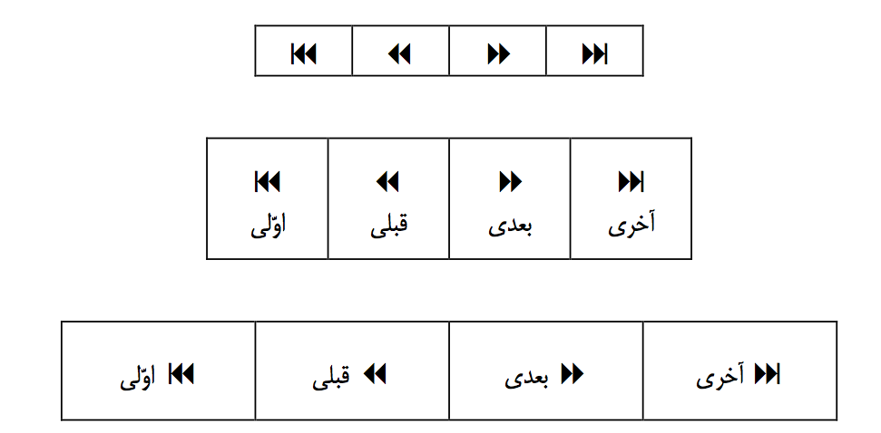
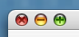

فصل ۲ - اصول کلّی طرّاحی میانای کاربر گرافیکی فارسی
----------------------------------------------------------

آشنایی با اصول، مبانی و فلسفه طرّاحی میانای کاربر گرافیکی، یکی از مهم‌ترین پیش‌نیازهای طرّاحی میانای کاربر فارسی و بومی‌سازی نرم‌افزارهای جهانی است. با توجّه به اهمیت این امر در تأمین کیفیت مطلوب برای نرم‌افزارهای فارسی، در این فصل ابتدا به اصول کلّی طرّاحی میانای کاربر گرافیکی می‌پردازیم.

### ۲.۱. اصول بنیادی طرّاحی میانای کاربر گرافیکی

سالها تجربهٔ طرّاحی میانای کاربر نشان داده است که پای‌بندی به اصول و چارچوبهای مشخص به بهبود کیفیت و کارآیی میانای کاربر گرافیکی کمک می‌کند. حفظ این اصول هنگام طرّاحی و بومی‌سازی یک نرم‌افزار لازمهٔ تضمین کیفیت آن است. باید توجّه داشت که رعایت اصول طرّاحی به شکلی که با شرایط بومی هماهنگی داشته باشد، گاهی به معنی لزوم ایجاد تغییرات غیر بدیهی در نرم‌افزار است. در این مورد در بخش‌های بعدی توضیح خواهیم داد.

امروزه برای هریک از محیطهای میز کار گرافیکی مجموعهٔ مدوّن و جامعی از این اصول، راه‌کارها و استانداردها تدوین شده است. از زمان ظهور اوّلین میانای کاربر موفّق گرافیکی سال‌های زیادی گذشته است[][8] و در طیّ این مدّت شکل ظاهری میانا‌های کاربر گرافیکی تغییرات زیادی کرده است، ولی اصول حاکم بر طرّاحی آنها، ضمن توسعه و تکمیل، دچار تغییرات اندکی شده است. ثبات نسبی این اصول تا حدودی عجیب می‌نماید، چرا که در طّیِ بیش از دو دهه‌ای که از آغازِ رواج یافتنِ میانا‌های کاربر گرافیکی می‌گذرد، تغییرات زیادی در کاربرد رایانه‌ها و حجم و نوع اطلاعات مورد پردازش با آنها ایجاد شده است. به همین دلیل، سال‌ها است که لزوم بهبود میانا‌های کاربر گرافیکی و ابتکارات جدید در رابطهٔ انسان و رایانه مطرح شده است. در طّیِ دو دههٔ گذشته نیز تلاشهای متعدّدی در این زمینه صورت گرفته است[][9]، امّا تاکنون موفّقیّتِ این تلاشها در جلب مخاطبین محدود بوده است.

نتیجه‌ای که از این امر گرفته می‌شود، دشواری ابتکارات موفّق در میانای کاربر است. بنا بر این باید سعی کنیم که به اصول و استانداردهایی که در زمینهٔ طراحی میانا‌های کاربر گرافیکی جا افتاده است پای‌بند بمانیم و از ابتکارات نسنجیده بپزهیزیم.

**ضابطهٔ ۱: هنگام طّراحی یا بومی‌سازی میانای کاربر هر نرم‌افزار، از مستندات طرّاحی میانای کاربر موجود برای بستر (یا بسترهای) هدف استفاده کنید و رهنمودها و ضوابط آن را رعایت کنید. بر حسب بستر هدف، مطالعه و رعایت حداقل یکی از مراجع زیر برای سازگاری با این آیین‌نامه لازم است:**
 - ۱. برای محیط بستر گنوم: مستندات GNOME Human Interface Guidelines که از طریق آدرس اینترنت [http://developer.gnome.org/projects/gup/hig/](http://developer.gnome.org/projects/gup/hig/) در دسترس است. [GNOME-HIG]
 - ۲. برای محیط بستر کی.دی.ئی: مستندات KDE Style Guide که از طریق آدرس اینترنت [http://developer.kde.org/documentation/standards/kde/style/basics/](http://developer.kde.org/documentation/standards/kde/style/basics/) در دسترس است. بعلاوهٔ مستندات تکمیلی KDE User Interface Guidelines که از طریق آدرس اینترنت [http://developer.kde.org/documentation/design/ui/](http://developer.kde.org/documentation/design/ui/) در دسترس است. [KDE-SG] و [KDE-UIG]
 - ۳. برای محیط بستر جاوا: کتاب‌های Java™ Look and Feel Design Guidelines (دو جلد، مخصوصاً جلد دوّم) که از طریق آدرس اینترنت [http://java.sun.com/products/jlf/](http://java.sun.com/products/jlf/) در دسترس است. [Java1] و [Java2]
 - ۴. برای محیطهای دیگر: در صورت وجود مستندات رسمی به آنها مراجعه کنید.

علاوه بر منابع فوق، مطالعه کتب و مقالات دیگر در این زمینه می‌تواند بسیار مفید باشد و توصیه می‌گردد[][10]. همچنین به دلیل شباهت مبانی طرّاحی بسترهای مختلف گرافیکی، مطالعه و مقایسه مستندات بسترهای مختلف می‌تواند به درک بهتر مطالب آنها کمک کند. به عنوان نمونه، مقایسهٔ مستندات میانای کاربر اپل [Apple-HIG] با مراجع فوق مفید است.

 [9]: به عنوان مثال، مراجعه کنید به [*Jentner**/Nielsen*] و همچنین [*Raskin*]

 [10]: به عنوان نمونه به کتب و مقالات آقایان بروس تاگنازینی (Bruce Tognazzini سایت www.asktog.com)، آلن کوپر (Alan Cooper سایت www.cooper.com)، دونالد نورمان (Donald Norman سایت www.jnd.org)، یاکوب نیلسِن (Jakob Nielsen سایت www.useit.com)، و سایت www.usabilityviews.com مراجعه کنید. از جمله مراجع [Tognazzini’95]، [Cooper’03]، [Norman’02] و [Nielsen’99]

### ۲.۲. کاربرد اصول طرّاحی میانای کاربر گرافیکی در میانای فارسی

برخی از اصول طرّاحی بین تمام بسترها مشترک هستند، اگرچه ممکن است به شکلهای متفاوتی بیان شده باشند، یا در برخی محیطها تأکید کمتری داشته باشند. برخی از این اصول در نرم‌افزارهای جهانی موجود به هنگام کاربرد در بوم ایران (و به طور کلّی بوم‌های راست به چپ و دوجهته) دچار اخلال می‌شوند. در اینجا اشاره‌ای به برخی از این اصول خواهیم داشت و در طیّ آن به بیان بعضی از مشکلاتی می‌پردازیم که رعایت این اصول را در بوم‌های راست به چپ و دوجهته مشکل‌تر ساخته است:

**اصل ۱: کاربر را غافل‌گیر نکنید**

یکی از مهمترین اصول طراحی یک میانای کاربر خوب، اجتناب از غافل‌گیر کردن کاربر است. منظور از «غافل‌گیر کردن»، کنش یا واکنشی از طرف نرم‌افزار است که بر خلاف انتظار کاربر باشد. شرط موفقیت در اجتناب از غافل‌گیر کردن کاربر، داشتن درک درستی از انتظارات و پیش‌ذهنی‌های کاربر است. بسیاری از طّراحان نرم‌افزارهای جهانی در مورد انتظارات و پیش‌ذهنی‌های کاربران بوم‌های با جهت اصلی نوشتار راست به چپ اطلاعات ناقص یا نادرستی دارند. همین امر موجب غافل‌گیر شدن کاربران این بوم‌ها می‌شود.

برخی معتقدند غافل‌گیر کردن مثبت کاربر از طریق هوشمندی نرم‌افزار مفید است. مثلاً اگر نرم‌افزار حدس بزند که کاربر قصد انجام چه کاری را دارد و آن کار را به طور خودکار انجام دهد، بهره‌وری کاربر بیشتر می‌شود. این امر به شرطی درست است که در اغلب موارد (بیش از ۹۵ درصد) حدس نرم‌افزار درست باشد و طوری عمل کند که تمرکز حواس و روال کار کاربر را به هم نزند. در غیر این صورت، کنشهای غافل‌گیر کنندهٔ نرم‌افزار کاربر را کلافه خواهد کرد.

یکی از مهمترین فرضیات نادرستی که باعث غافل‌گیری کاربران می‌شود، در مورد جایگاه استاندارد یونیکد است. بسیاری از دست‌اندرکاران نرم‌افزارهای جهانی فکر می‌کنند با پیاده‌کردن الگوریتم دو جهتهٔ یونیکد، قسمت عمدهٔ کار لازم برای پشتیبانی بومهای راست به چپ را انجام داده‌اند و دیگر حاضر نیستند برای درک درست نیازهای کاربران این بوم‌ها سرمایه‌گذاری کنند.

**رهنمود ۱: پشتیبانی یونیکد و الگوریتم دوجهتهٔ آن برای پشتیبانی بومهای راست به چپ (دوجهته) کافی نیست.**

**علاوه بر پشتیبانی یونیکد، نرم‌افزارها باید نمایش و تعامل صحیح راست به چپ و دوجهته را نیز پوشش دهند.**

همچنین، از آنجا که یونیکد استانداردی برای مبادله و ذخیرهٔ متن با تأکید روی سهولتِ پردازشِ ماشینیِ متن است، طرّاحی آن مبتنی بر مفهوم نویسه‌ها[][11] است. مثلاً در یونیکد یک نویسه با مفهوم «پرانتز باز» وجود دارد که تجسّم دیداری آن در حالتی که پرانتز از راست به چپ تفسیر شود با حالتی که از چپ به راست تفسیر شود متفاوت است. تجسم دیداری مفهوم «پرانتز باز» در محیط گرافیکی دو جهته دشوار است و نمایش مجرد «(» یا «)» (مثلاً آنچه روی صفحه‌کلید حک شده است) هیچکدام مفهوم درست نویسهٔ یونیکد U+0028 را نمی‌رسانند.

در مقابل این گرایش به مفاهیم در یونیکد، یکی از ویژگیهای مهم میانای کاربر گرافیکی تأکید بر ارتباط دیداری[][12] است. در بسیاری از نرم‌افزارهای جهانی موجود، مدل مفهومی یونیکد به نادرستی در جاهایی که یک مدل ارتباط دیداری مورد نیاز است به کار رفته است. این امر مخصوصاً انتخاب و ویرایش دیداری متن‌های دو جهته را به دلیل حرکت و پرش‌های ناگهانی و غافل‌گیر کنندهٔ نویسه‌ها و مکان‌نما[][13] دشوار می‌سازد.

**رهنمود ۲: مدل ذخیرهٔ متن یونیکد را به طراحی تعامل کاربر با نرم‌افزار و طراحی دیداری میانای کاربر تعمیم ندهید.**

**در موارد متعارف تعامل کاربر با نرم‌افزار باید با یک مدل سازگار دیداری انجام شود.**

یکی دیگر از مواردی که کاربران محیط دوجهته را غافل‌گیر می‌کند، پیش‌فرض‌های نامناسب در مورد مکان و جهت مناسب و مورد انتظار چیزهای مختلف است. در این مورد در ذیل اصل بعدی توضیح بیشتری خواهیم داد.

**اصل ۲: کاربر را وادار به تلاش ذهنی زائد نکنید**

یکی از دلایل گسترش روز افزون کاربرد رایانه، کمک آن به کاهش فعالیت‌های ذهنی غیر خلاق، تکراری و زائد انسانها است. از طرفی، روش طبیعی کاستن از تلاش ذهنی انسان و سرعت دادن به کارها و آسان کردن آنها، فراگیری، تمرین و عادت است. بنا بر این یک محیط رایانه‌ای خوب باید امکان فراگیری و عادت کردن به کاربر بدهد، بدون اینکه کاربر را درگیر تلاشهای ذهنی اضافی و امور دست و پا گیر و تکراری سازد.

یکی از نقاط قوت میانای کاربر گرافیکی که باعث فراگیر شدن آنها شده است، کاهش تلاش ذهنی کاربر از طریق ارائهٔ دیداری و عملکرد مستقیم روی اشیاء[][14] است. یکی از عواملی که برای کاربران بوم‌های دارای نوشتار از راست به چپ این خصوصیت را تضعیف می‌کند، تأثیرگذاری نادرست مدل مفهومی یونیکد بر روی زبان دیداری میانای کاربر است. به این موضوع در اصل قبل نیز اشاره شد.

مشکل دیگر ثابت نبودن جای برخی عناصر و ادوات[][15] در میانای کاربر دوجهته است. توجّه داشته باشید که کاربران به مکان ادوات میانای کاربر گرافیکی عادت می‌کنند و در این حالت به طور انعکاسی و بدون تلاش ذهنی اضافی، دست آنها (که موشی[][16] را هدایت می‌کند) به سوی این ادوات حرکت می‌کند. اگر جای ادوات اصلی میانای کاربر گرافیکی مکرراً تغییر کند، کاربر امکان یاد گرفتن و عادت کردن به محلّ آنها را از دست می‌دهد. این امر موجب تلاش ذهنی غیر سازنده برای کاربر خواهد بود. به عنوان نمونه، این نادرست است که نوار پیمایش[][17] گاهی در لبهٔ سمت چپ و گاهی در لبهٔ سمت راست کادر ظاهر شود. متغیّر و مشروط کردن مکان اجزای میانای کاربر، نفع آشکاری ندارد و کاربرد نرم‌افزارها را دشوارتر می‌کند.

**رهنمود ۳: مکان ادوات و عناصر دیداری میانای کاربر باید با ثبات و مشخص باشد و از جابجایی غیر ضروری آنها به منظور تطبیق با جهت نوشتار سند فعال خودداری کنید.**

**این امر عناصری که برای نمایش و قرائت صحیح متن لازم باشد را شامل نمی‌شود.**

**اصل ۳: به کاربر احترام بگذارید و به او اعتماد به نفس بدهید**

میانای کاربر باید به کاربر این احساس را القا کند که رایانه در خدمت انسان است و نه برعکس. برای رسیدن به این هدف نرم‌افزار باید ویژگیهای خاصی داشته باشد، از جمله:

 - نرم‌افزار باید آن کاری را انجام دهد که کاربر اراده کرده است. کنشهای کاربر باید نتیجه و واکنش واضح و مورد انتظار را داشته باشد به طوری که احساس تسلط به ابزار (رایانه) را به کاربر القا کند. البتّه هشدار در مورد امور خطرناک و سعی در پیشگیری از خطاهای سهویِ کاربر جایگاه خود را دارد ولی نباید اصلِ موضوع فوق را تحت‌الشعاع قرار دهد.
 - نرم‌افزار باید کارش را خودش انجام دهد. یعنی نباید برای انجام کاری که به آن محول شده کاربر را سئوال‌پیچ کند و یا به خدمت خود بگیرد و کارهای تکراری و خسته‌کننده از کاربر بخواهد. به عنوان نمونه، اگر کاربر فرمان «چاپ کن» را صادر کند، نرم‌افزار باید با فرضیات متناسب و اخذ تأیید بابت این فرضیات (از قبیل: نام چاپگر، اندازهٔ کاغذ، تعداد نسخه و غیره) بلافاصله عمل چاپ را انجام دهد.
 - کاربرد نرم‌افزار باید تا حد امکان امن و بی‌خطر باشد. پس باید از عملیات غیر قابل برگشت تا حد امکان اجتناب نمود و انجام آنها را تا موقعی که واقعاً لازم نشده باشد به تأخیر انداخت[][18] تا کاربر فرصت تجدید نظر داشته باشد.
 - نرم‌افزار نباید خود را توانا یا دانا و کاربر را ناتوان یا نادان جلوه دهد. به عنوان نمونه در مورد بخش‌هایی از نرم‌افزار که وظیفهٔ یاری کاربر و تسهیل کار را دارند، از انتخاب نامهایی چون «ساحر[][19]» یا «خبره[][20]» بپرهیزید و به جای آن از نامهایی چون «دستیار[][21]» یا «پیشکار» استفاده کنید.

در طرّاحیِ یک نرم‌افزار خوب، بر روی روش انجام هر کاری دقّت شده و نرم‌افزار طوری طرّاحی می‌شود که کار را برای کاربر راحت‌تر، بدیهی‌تر و امن‌تر کند، حتّی اگر نتیجهٔ این امر مشکل شدن کار تولیدکنندهٔ نرم‌افزار باشد. در بهترین حالت، کاربر وجود نرم‌افزار و نقش آن را در کاری که انجام می‌هد فراموش می‌کند و فقط موقعی متوجه وجود آن می‌شود که نرم‌افزار به کمک کاربر در نجات او از امور تکراری و خسته‌کننده می‌شتابد[][22].

مشکلات ذکر شده در ذیلِ دو اصل قبلی در اینجا هم تولید اشکال می‌کنند، چرا که احساس امنیت، ثبات و تحت فرمان بودن نرم‌افزار را کاهش می‌دهند.

**اصول دیگر**

علاوه بر اصول فوق، اصول کلّی دیگری نیز در طرّاحی میانای کاربر گرافیکی مطرح هستند که در اینجا نیازی به مرور تک به تک آنها نیست. اصول فوق نیز به این دلیل مورد اشاره قرار گرفته‌اند تا مشخص شود که حفظ اصول اولیّهٔ طرّاحی میانای کاربر گرافیکی در بوم‌های راست به چپ و دو جهته مشکلاتی دارد.

اماّ یکی دیگر از این اصول که به تازگی مطرح گردیده، با طرّاحی میانای کاربر فارسی ارتباط مستقیم دارد. این اصل عبارتست از:

**اصل ۴: نرم‌افزارهای خود را جهانی طرّاحی کنید و آن را به یک بوم خاص وابسته نکنید**

رعایت این امر ملاحظات ویژه‌ای را در طرّاحی نرم‌افزار طلب می‌کند که در این سند مورد بحث قرار نگرفته‌اند ولی رعایت آنها یکی از ملاحظات اساسی برای ایجاد میانای کاربر فارسی است.

**ضابطهٔ ۲: اصول جهانی‌سازی نرم‌افزار[][23] را برای ایجاد نرم‌افزار فارسی رعایت کنید.**

**برای این منظور، نکات مطرح شده در مستندات جهانی‌سازی/بومی‌سازی محیط بستر مورد استفادهٔ خود را رعایت کنید.**

برای رعایت ضابطهٔ فوق، به منابع مربوط به هر یک از بسترها از جمله منابع زیر مراجعه کنید:

- Unicode How To [Unicode-HT]
- KDE Internationalization Site (i18n.kde.org) [KDE-i18n]
- Internationalization with Qt [Qt-i18n]
- GTKmm Tutorial, Chapter 20 [GTKmm-i18n]
- Internationalizing GNOME Applications [GNOME-i18n]
- GNOME L10N Guidelines for Developers [GNOME-L10N]
- ICU User Guide [ICU-UG]

 [11]: Semantic Character Encoding
 [12]: Visual Communication
 [13]: Cursor
 [14]: direct object manipulation
 [15]: widgets
 [16]: Mouse (pointing device)
 [17]: scrollbar
 [18]: منظور از تأخیر، استفاده از پرسشهای مکرر و کلافه‌کنندۀ «آیا مطمئنید؟» نیست. یک مثال موفق در تعویق غیر مزاحم عملیات برگشت ناپذیر، کاربرد نماد سطل بعنوان جایگاه اسناد دور ریختنی است.
 [19]: Wizard
 [20]: Expert
 [21]: Assistant
 [22]: این کمک باید ضمن رعایت اصل عدم غافل‌گیری انجام شود.
 [23]: Internationalization

### ۲.۳ اصول ویژهٔ طرّاحی میانای کاربر گرافیکی راست‌به‌چپ و دوجهته

همآنگونه که اشاره شد، یکی از خصوصیّات بارز بوم ایران، جهت نوشتار راست به چپ و دو جهته است. در بخش قبل، برخی از اصول کلّی طرّاحی میانای کاربر را از دیدگاه تأثیر جهت نوشتار مورد بررسی قرار دادیم. به منظور تصریح و تأکید بر نکاتی که در طرّاحی میانای کاربر خاصِ بوم‌های با نوشتار راست به چپ و دو جهته اهمیت دارند، اصول زیر باید علاوه بر اصول کلّی طرّاحی میانای کاربر مد نظر قرار گیرند:

**اصل ۵: چپ و راست مترادف قبلی و بعدی نیست**

معماری اغلب محیطهای بستر و مجموعه ادوات میانا‌های کاربر گرافیکی موجود، بدون توجّه کافی به ویژگیهای بوم‌های با جهت نوشتار راست به چپ و دو جهته طرّاحی شده‌اند. همین امر موجب شده که بسیاری از مفاهیم به شکل درست و جامعی در آنها تعریف و از یکدیگر تفکیک نشده باشد. یکی از این موارد، اختلاط مفهوم دیداری راست و چپ با مفهوم ذهنی تقّدم و تأخّر (قبل و بعد) است. این اختلاط از آنجا ناشی شده است که به نظر می‌رسد ساده‌ترین نماد برای تجسّم مفهوم ذهنی قبل و بعد استفاده از نماد پیکان یا مثلّث رو به چپ و راست باشد، امری که رواج زیادی دارد. مشکل اینجاست که در نوشتار چپ به راست نماد → مفهوم «بعدی» را تداعی می‌کند در حالی که در نوشتار راست به چپ مفهوم «قبلی» را می‌رساند. تنها نمادهایی که برای مفهوم قبل و بعد قابل استفاده هستند، (با وجود جهت‌دار بودن در امتداد افقی) نمادهای مورد استفاده برای کنترل پخش لوازم صوتی و تصویری هستند. در این مورد در ‏فصل 44 توضیح داده می‌شود. همچنین با توجه به اینکه جهت عمودی متن فارسی و لاتین هر دو از بالا به پایین است، گاهی (مخصوصاً وقتی با سندی برگ‌برگ یا فهرستی از سندها سر و کار داریم) می‌توان از نشانهٔ پیکان سربالا برای مفهوم «قبل» و پیکان سرپایین برای «بعد» استفاده کرد. در این حالت ترتیب افقی این پیکانها چندان مهم نیست، فقط مهم است که این ترتیب ثابت باشد.

**ضابطهٔ ۳: از نشانهٔ پیکان افقي فقط وقتی استفاده کنید که جهت واقعی و دیداری مورد نظر باشد و مفهوم تقدّم و تأخّر مورد نظر نباشد. برای نمایش مفهوم تقّدم و تأخّر، بهتر است از متن کلمات «قبل» و «بعد» (یا کلمات و ترکیبات مترادف) بجای تصویر استفاده کنید.**

**در صورت نیاز به تجسّم تصویری تقّدم و تأخّر، از نمادهای لوازم الکترونیکِ صوتی و تصویری با حفظ شکل و ترتیب دیداری آنها استفاده کنید. همچنین در برخی موارد می‌توان از نشانهٔ پیکان سربالا برای مفهوم «قبل» و پیکان سرپایین برای «بعد» استفاده کرد. در این حالت ترتیب افقی این پیکانها مهم نیست.**

**مثال‌های ‏ضابطهٔ ۳**

اگر در میانای کاربر، متن مسلط باشد به طوری که کاربر میانای کاربر را مانند متن «قرائت» کند، جهت چیدن ادوات تابع جهت نوشتار است:

نمایش فیلم: [آغاز] [درنگ] [پایان] رجوع به فصل: [اوّل] [قبل] [بعد] [آخر]

Movie Playback: [Start] [Pause] [Stop] Jump to chapter: [First] [Previous] [Next] [Last]

در حالتی که ادوات میانای کاربر گرافیکی مجسم کنندهٔ دستگاه‌های الکترونیکی باشد، ترتیب چیدن ادوات مانند دستگاه‌های مذکور از چپ به راست خواهد بود:

یا در صورتی که بخواهید تقارن بیشتری داشته باشید:

**اصل ۶: چپ‌چین و راست‌چین مترادف چپ‌به‌راست و راست‌به‌چپ نیست**

در شرایط معمولی هنگام نوشتن (راست به چپ) قلم از لبهٔ سمت راست شروع به حرکت می‌کند، در نتیجه به طور طبیعی دست‌نوشتهٔ فارسی معمولاً راست‌چین است. امّا به دلایل مختلف از جمله تنوع و زیبایی ممکن است هنگام صفحه‌آرایی برای متن چاپی بخواهیم که از متن چپ‌چین استفاده کنیم. با توجه به این موضوع نتیجه می‌شود که جهت متن و ترازبندی آن اگرچه در حالت متعارف و پیش‌فرض با هم رابطه دارند، امّا باید مستقل از یکدیگر قابل تعیین باشند.

**ضابطهٔ ۴: در نرم‌افزارهایی که با ترازبندی متن سر و کار دارند باید بتوان جدای از چپ‌چین و راست‌چین کردن متن، جهت نوشتار متن را تعیین کرد و تغییر داد.**

**اصل ۷: محل ادوات میانای کاربر تابع عرف و قرارداد است**

منظور از این اصل تصریح این امر است که جهت نوشتار یک عرف و قرارداد در میان عرف و قراردادهای متعدد یک جامعه است. اگر در میانای کاربر متن مسلط باشد، به طوری که میانای کاربر مانند متن «قرائت» شود، جهت چیدن ادوات تابع جهت نوشتار است. در غیر این صورت باید ببینیم قرارداد یا عرف حاکم بر آن چیست و کاربران چه انتظاری در مورد محل ادوات دارند.

یکی از اشتباهات مرسوم در جهانی کردن نرم‌افزار برای بوم‌های دارای نوشتار راست به چپ، افراط در جابجا کردن و قرینه‌کردن عناصر دیداری میانای کاربر است. برخی طرّاحان طوری جهت نوشتار را به همه چیز تعمیم می‌دهند که گویی کاربران این بوم‌ها در دنیایی متفاوت با کاربران دیگر زندگی می‌کنند که قرینهٔ آینه‌ای دنیای آنهاست.

توجّه داشته باشید که بسیاری از لوازمی که در زندگی روزمره کاربرد دارند، نسخهٔ ویژهٔ بوم‌های راست به چپ ندارند. به عنوان نمونه، جهت عقربهٔ ساعت‌ها، جهت پیچ موج‌یاب رادیو و جهت حرکت عقربهٔ موج‌نمای آن، جهت حرکت نوار ضبط صوت و علائم حک شده روی دکمه‌های پخش، عقب‌بر و جلوبر در وسایل صوتی و تصویری را در نظر بگیرید.

بخش بزرگ فنّاوری امروز را مردمی ایجاد کرده‌اند که از چپ به راست می‌نویسند و این امر اثر خود را بر زندگی روزمرهٔ مردم تمام جهان باقی گذاشته است، از جمله آنهایی که از راست به چپ (یا از بالا به پایین) می‌نویسند. دیدن یک دکمهٔ پخش با علامت مثلث رو به چپ (به این شکل  ) برای کاربر بوم راست به چپ به همان اندازهٔ کاربران دیگر بوم‌ها غیر منتظره است. جهت برخی چیزهای دیگر نیز بیش از آن که به جهت نوشتار مربوط باشد به چپ‌دستی یا راست دستی نویسنده یا عوامل دیگر مربوط است. مثلاً جهت علامت تأیید[][24]  برای انسان راست دست مناسب است و جهت آن ربطی به جهت نوشتار ندارد. از طرفی، محل بسیاری از اجزای میانای کاربر ارتباط تنگاتنگی با جهت نوشتار ندارد و تنها یک قرارداد است. به عنوان نمونه، دکمهٔ بستن پنجره در محیط میز کار ویندوز[][25] در سمت راست ولی در محیط میز کار مکینتاش[][26] در سمت چپ قرار دارد:

**ویندوز**

**مکینتاش**

**رهنمود ۴: از قرینه‌سازی بی‌رویهٔ میانای کاربر اجتناب کنید. تنها عناصری را جابجا کنید که برای نمایش و قرائت صحیح عناصر متنی موجود در میانای کاربر لازم یا لااقل مفید هستند.**

**مکان صحیح عناصر در آن مکانی است که کاربر عادت به آن دارد، حتی اگر به نظر برسد که این مکان چندان منطقی و موجه نیست.**

 [24]: این علامت در فارسی وجود ندارد و از فرهنگ‌های غربی به ایران راه یافته است.
 [25]: Microsoft Windows
 [26]: Apple Macintosh

### ۲.۴. ‏نیازهای بوم ایران

یک نرم‌افزار که میانای کاربر گرافیکی فارسی دارد باید تابع ضوابط عمومی تعریف شده برای بوم[][27] فارسی ایران (fa\_IR) باشد. این امر موارد متعددی را شامل می‌شود که در اینجا مجال پرداختن به جزئیات آنها وجود ندارد. با این همه، در این بخش به معرفی اجمالی سرفصل‌های اصلی مطرح در این زمینه و ارجاع به منابع مربوط اقدام خواهیم کرد.

ضوابط مربوط به واحدهای مورد استفاده، قطع کاغذ و ترکیب نمایش اعداد، تاریخ، ساعت، اسامی افراد و موارد مشابه در توصیف بوم ایران آمده است. برای اطلاع بیشتر به سند «نیازهای شرایط محلی برای زبان فارسی ایران» (بخشی از پروژهٔ «مرتب‌سازی فارسی، جستجوی نادقیق فارسی، نیازهای شرایط محلی فارسی ایران» از طرح ملّی نرم‌افزارهای آزاد/متن‌باز) مراجعه کنید [بوم۸۲]. نرم‌افزارهایی که بوم‌های گنو/لینوکس را به درستی پشتیبانی کنند، به طور خودکار در محیط گنو/لینوکس بومی‌شده برای ایران اطلاعات بوم ایران را دریافت می‌کنند.

**ضابطهٔ ۵: نرم‌افزاری که میانای کاربر گرافیکی فارسی دارد، باید بوم fa\_IR گنو/لینوکس را پشتیبانی کند.**

 [27]: Locale

#### ۲.۴.۱. ‏مرتب‌سازی و جستجو

عملکرد صحیح هنگام مرتب کردن و تطبیق و جستجوی متن فارسی موضوع دیگری است که شرط لازم برای نرم‌افزاری با میانای کاربر گرافیکی فارسی است. برای اطلاعات بیشتر در این مورد می‌توانید به اسناد «ترتیب‌بندی و مرتب‌سازی برای زبان فارسی ایران» [مرتب‌سازی۸۲] و «جستجوی تقریبی برای زبان فارسی ایران» [جستجو۸۲] (بخشی از پروژهٔ «مرتب‌سازی فارسی، جستجوی نادقیق فارسی، نیازهای شرایط محلی فارسی ایران» طرح ملّی نرم‌افزارهای آزاد/متن‌باز) مراجعه کنید. و نرم‌افزارهایی که کتابخانه‌های استاندارد جستجو و مرتب‌سازی گنو/لینوکس را به درستی پشتیبانی می‌کنند، به طور خودکار در محیط توزیع گنو/لینوکسی که برای ایران بومی‌شده باشد درست عمل خواهند کرد.

تنها نکته‌ای که عملاً اشکالاتی را تولید می‌کند عبارت است از متنی که از محیطهای غیر گنو/لینوکس دریافت می‌گردد. چنین متنی ممکن است با ضوابط استاندارد متن یونیکد فارسی (استاندارد ۶۲۱۹ مؤسسهٔ استاندارد و تحقیقات صنعتی ایران [ISIRI-6219]) سازگار نباشد و درنتیجه حاوی حروف نادرست و غیر مجاز باشد. در این زمینه توصیه می‌گردد که نرم‌افزارها به هنگام دریافت متن از محیط بیرون آن را کنترل و در صورت امکان تصحیح کنند. موارد تصحیح اصلی شامل تصحیح ارقام، حرف کاف و حرف یای عربی به فارسی و گاهی تصحیح حرف ه‍ و یای مُرَخَّم است.

**رهنمود ۵: متن فارسی را که از محیط بیرون در یک نرم‌افزار دریافت می‌کنید، از نظر سازگاری با استاندارد ۶۲۱۹ کنترل و در صورت امکان تصحیح کنید.**

**ضابطهٔ ۶: نرم‌افزاری که میانای کاربر گرافیکی فارسی دارد باید مرتب‌سازی، تطبیق و جستجوی متن فارسی را به طور صحیح انجام دهد.**

#### ۲.۴.۲. ‏تقویم

موضوع سومّی که باید در طراحی نرم‌افزارهای فارسی مورد توجّه قرار گیرد پشتیبانی صحیح تقویم است. این امر ممکن است بسیار دشوارتر از چیزی باشد که در ابتدا به نظر می‌رسد. دلیل این امر محدود بودن پشتیبانی از تقویمهای غیر میلادی و مخصوصاً عدم پشتیبانی تعدد تقویم در بسترهای متعارف گنو/لینوکس است. علت این عدم پشتیبانی این واقعیت است که کشور ایران از معدود کشورهای جهان است که تقویم رسمی اداری و بازرگانی در آن تقویمی غیر از میلادی است. حتّی بسیاری از کشورهای مسلمان عربی نیز در امور اداری و بازرگانی تابع تقویم میلادی هستند.

تقویم رسمی اداری و بازرگانی در ایران تقویم هجری شمسی با تعریف کنونی آن است که پیاده‌سازی رایانه‌ای آن در پروژهٔ «تقویم رسمی ایران» [تقویم۸۲] (در چارچوب طرح ملّی نرم‌افزارهای آزاد/متن‌باز) انجام گرفته است.

تقویم رسمی مذهبی ایران تقویم هجری قمری طبق محاسبه و قرارداد ویژهٔ ایران است که در منبع فوق آمده است. این تقویم برای تعیین ایّام تعطیلات و مناسک مذهبی کاربرد دارد. به دلیل تغییر بالقّوهٔ برخی ایّام (مخصوصاً اوّل رمضان و اوّل شوّال) این تقویم قابل محاسبهٔ قطعی نیست و قطعیّت آن منوط به فتوای ولی فقیه در مورد حلول ماه رمضان و شوّال است. به همین دلیل در ضمن کاربرد باید قابل تصحیح باشد.

این امر پیچیدگی‌های خاصی را در زمینهٔ تاریخ‌های آیندهٔ ذخیره شده بر حسب این تقویم تولید می‌کند، چرا که تصحیح تقویم ممکن است تغییر و جابجایی مناسبت‌های ثبت شدهٔ بعد از تاریخ تصحیح را نیز ایجاب نماید.

تقویم میلادی نیز در ایران کاربرد دارد. کاربردهای تقویم میلادی عبارتند از: کاربرد در امور بازرگانی و حمل و نقل بین‌المللی و تعیین مناسبت‌های بین‌المللی مانند روز کارگر. لازم به ذکر است که مناسبت میلاد حضرت مسیح طبق نظر کلیسای ارمنی در ایران است که با اکثر کشورهای غربی متفاوت است.

تفاوت مهّم تقویم در ایران با کشورهای غربی علاوه بر تفاوت تقویم رسمی اصلی، عبارت است از تعدّد تقویمها. اغلب تقویمهای چاپ ایران به جای یک تقویم در واقع سه تقویم را نشان می‌دهند. به این ترتیب، کاربران فارسی زبان ایرانی نیاز به نرم‌افزار تقویم با قابلیت چند تقویمی و تطبیق و تبدیل تقویمها دارند. همین موضوع ملاحظات ویژه‌ای را در طراحی میانای کاربر نرم‌افزارهایی لازم می‌نماید که با تاریخ و تقویم سر و کار داشته باشند.

نرم‌افزارهایی که برای بوم فارسی ایران طرّاحی می‌شوند، باید علاوه بر پشتیبانی هر یک از تقویمهای رسمی ایران، بتوانند کاربرد هم‌زمان حداقل دو تقویم (ترجیحاً هر سه تقویم) و تغییر درجا و فوری تقویم فعال و تقویم اصلی را پشتیبانی نمایند. حوزه‌های ورود تاریخ باید بتوانند بدون نیاز به تغییر کلّی تقویم فعال یا تقویم اصلی، ورود تاریخ را به هر یک از سه تقویم رسمی ایران بپذیرند. نرم‌افزارهایی که یک روز تقویم را به صورت یک رشتهٔ حرفی/عددی تولید می‌کنند باید بتوانند تقویم مرجع تاریخ مورد نظر را نیز (معمولاً به صورت یک پسوند اختصاری) در رشتهٔ فوق بگنجانند.

به دلیل تغییر پذیری بالقوه، تاریخ‌هایی که بر حسب هجری قمری وارد شده‌اند باید در نرم‌افزار قابل تشخیص باقی بمانند به طوری که در صورت تغییر تقویم هجری قمری بتوان تاریخ‌های ثبت شده‌ای را که روی این تقویم ثبت شده‌اند برای تصحیح بازیابی کرد.

**ضابطهٔ ۷: نرم‌افزارهای فارسی که با تقویم و تاریخ سر و کار دارند باید تقویمهای رسمی ایران را پشتیبانی کنند.**

**ضابطهٔ ۸: نرم‌افزارهای فارسی که با تقویم و تاریخ سر و کار دارند باید بتوانند تعدد تقویم و تغییر درجا و پویای تقویم را پشتیبانی نمایند.**

**ضابطهٔ ۹: حوزه‌های ورود تاریخ باید بدون نیاز به تغییر کلّی تقویم فعال یا تقویم اصلی، ورود تاریخ را به هر یک از سه تقویم رسمی ایران بپذیرند.**

**ضابطهٔ ۱۰: نرم‌افزارهای فارسی که تاریخ معطوف به آینده را در خود ذخیره می‌کنند باید تغییرپذیری تاریخ‌هایی را که طبق تقویم هجری قمری ثبت شده‌اند را پشتیبانی نمایند.**

**با امکانات بسترهای تقویم فعلی این امر ممکن است فعلاً به طور کامل عملی نباشد.**

#### ۲.۴.۳. ‏هفته

موضوع چهارم تفاوت شروع هفته (شنبه) و روزهای تعطیل هفته با کشورهای غربی است. در ایران برحسب محل کار، تعطیلات آخر هفته ممکن است یک، یک و نیم ویا دو روز باشد و روزهای تعطیل جمعه، پنجشنبه و جمعه، یا جمعه و شنبه (معمولاً در دفاتر شرکت‌های خارجی) می‌باشد. نرم‌افزارهای تقویم و سررسید فارسی باید قابلیت انعطاف کافی برای هریک از حالت‌های فوق را داشته باشند. نکتهٔ قابل ذکر دیگر در مورد هفته این است که در ایران بر خلاف بسیاری از کشورهای غربی شمارش هفته‌های سال و شماره‌گذاری هفته‌ها متداول نیست. به همین دلیل ضوابط مدوّن و رسمی در مورد تعیین هفتهٔ اوّل سال وجود ندارد.

**ضابطهٔ ۱۱: نرم‌افزارهای فارسی که با هفته، تقویم و تاریخ سر و کار دارند باید بتوانند روز اول هفتهٔ خود را شنبه و پایان هفته را هریک از روزهای پنجشنبه، جمعه و شنبه (یک، یک و نیم یا دو روز) در نظر بگیرند.**

#### ۲.۴.۴. ‏نام‌گذاری

موضوع آخری که در زمینه پشتیبانی از بوم فارسی اهمیت دارد، پشتیبانی از کاربرد نام فارسی برای اقلام مختلف از جمله نام کاربر، نام سندها و سایر اقلام مربوط به مدیریت پرونده‌ها، شبکه و اینترنت است. در بسیاری از موارد ممکن است قراردادهای بین‌المللی و یا طرّاحی و محدودیت بسترهای نرم‌افزاری، نام‌گذاری برخی از اقلام را به زیرمجموعه‌ای از جدول هفت‌بیتی اَسکی[][28] محدود نمایند. در این حالت توصیه می‌شود که نرم‌افزارهای فارسی امکان نسبت دادن نام دوّم یونیکدی به این قبیل نامهای اسکی را پشتیبانی نمایند.

به عنوان نمونه نام کاربر در گنو/لینوکس به یک رشتهٔ اسکی محدود است. در این مورد اغلب محیطهای گرافیکی شرح نام کاربر را به عنوان نام کامل کاربر فرض کرده و حروف مجاز در آن را به یونیکد گسترش می‌دهند. این امر باید نامهای مختلف دیگر از جمله نام رایانه، خادم، اسناد و غیره را پوشش دهد.

نکتهٔ دیگری که در مورد نام‌گذاری مطرح است، نویسهٔ جداکنندهٔ اجزای نامهای سلسله‌مراتبی و دنبالهٔ[][29] نامها است. نویسهٔ جداکنندهٔ اجزای نامها باید طوری انتخاب شود که در متن راست به چپ بی‌معنی و گیج‌کننده نباشد. خوشبختانه جداکنندهٔ متداول (خط مایل / با کد U+002F) از این نظر قابل قبول است و مشکل بالقّوه ممکن است در جداکننده‌‌های خاص در کاربردهای خاص بروز کند.

با توجه به اینکه دنباله‌های استاندارد اسکی هستند، مشکلاتی برای نمایش و خوانایی دنباله برای نام فارسی متصور است. به همین دلیل مفید است که امکان پنهان‌کردن دنباله یا نمایش آن با ترکیب ویژه وجود داشته باشد. بهترین حالت، بی‌نیاز کردن نام از وجود دنبالهٔ اسکی است.

نظیر این مشکل در مورد پیشوند پروتکل در آدرس‌های اینترنت (URL) وجود دارد. بخشی از این مشکل در استاندارد نامهای جهانی دامنه (IDN) مطرح گردیده است. فعلاً برای حل این مشکل راه حل بنیادی و مطلوب وجود ندارد.

**ضابطهٔ ۱۲: نرم‌افزارهای فارسی باید امکان تعیین نام فارسی برای اقلامی که با آنها سر و کار دارند را فراهم نمایند.**

**با امکانات بسترهای فعلی این امر ممکن است فعلاً به طور کامل عملی نباشد ولی بسترها باید در جهت تحقق این امر توسعه یابند.**

 [28]: ASCII
 [29]: extension

### ۲.۵. ‏ترکیب دو زبان در میانای کاربر

در حال حاضر بسیاری از نرم‌افزارها فاقد میانای کاربر ترجمه‌شده به فارسی هستند. این امر تا مدتها ادامه خواهد داشت. به علاوه، برخی نرم‌افزارها تخصصی‌تر از آن هستند که ترجمهٔ آنها با صرفه و عملی باشد. همچنین به دلایلی که به فنّاوری و جهانی‌شدن ارتباط دارد، لزوم کاربرد زبان انگلیسی در موارد متعددی یک ضرورت اجتناب ناپذیر است.

عوامل فوق موجب می‌شود که در عمل به جای یک محیط رایانه‌ای فارسی، عملاً با یک محیط دو زبانهٔ فارسی لاتین (عمدتاً انگلیسی) سر و کار داشته باشیم. تفاوت جهت نوشتار فارسی و لاتین، دشواریهایی را در این ترکیب ایجاد می‌کند. به عنوان نمونه، نوار گزینگان[][30] را در نظر بگیرید.

بر اساس اصول میانای کاربر گرافیکی، مکان نوار گزینگان و انتخاب‌های آن باید مشخص و ثابت باشد تا به کاربر امکان فراگیری مکان آن و دسترسی سریع و انعکاسی به آن را بدهد. از طرف دیگر، در نوار گزینگان متن و جهت قرائت آن عامل مسلّط است. به همین دلیل به نظر می‌رسد که جهت نوار گزینگان باید تابع جهت زبانی باشد که متن نوار گزینگان به آن تعلق دارد. یعنی برای نرم‌افزار فارسی این گزینگان باید راست به چپ بوده و از منتهی‌الیه سمت راست پنجره شروع شود در حالی که برای نرم‌افزار لاتین گزینگان باید چپ به راست بوده و از منتهی‌الیه سمت چپ شروع شود. در محیطی که برخی نرم‌افزارها فارسی و برخی لاتین باشند، این امر ثبات مکان عناصر متناظر در میانای کاربر را نقض می‌کند.

در این حالت توصیه می‌شود که به منظور حفظ هماهنگی و ثابت نگاه داشتن مکان عناصر متناظر، محل و جهت عناصر عمده و پر مصرف (مانند «نوار پیمایش»[][31] و «نوار گزینگان» که دائماً مورد استفاده هستند) در نرم‌افزارهای مختلف تابع یک جهت واحد که جهت محیط خوانده می‌شود باشند و عناصر کم مصرف‌تر که معمولاً محتویات پنجره‌ها و محاوره‌ها را تشکیل می‌دهند، تابع جهت موضعی (یا محلی) متن باشند. این امر به تفکیک عناصر میانای کاربر برای هریک از عناصر در ‏فصل 55 مشخص شده است.

 [30]: menubar
 [31]: scrollbar
