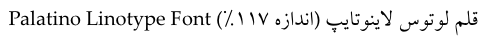
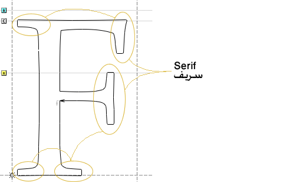
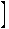
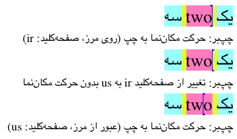
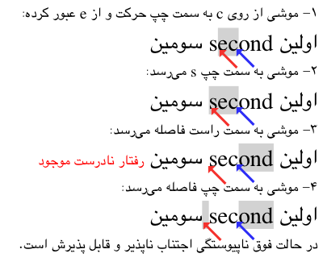
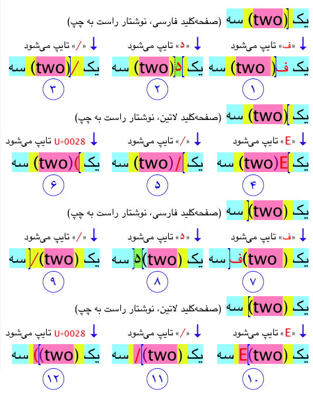
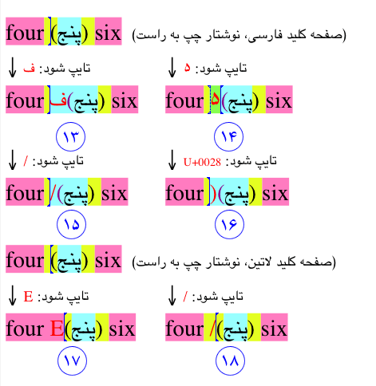
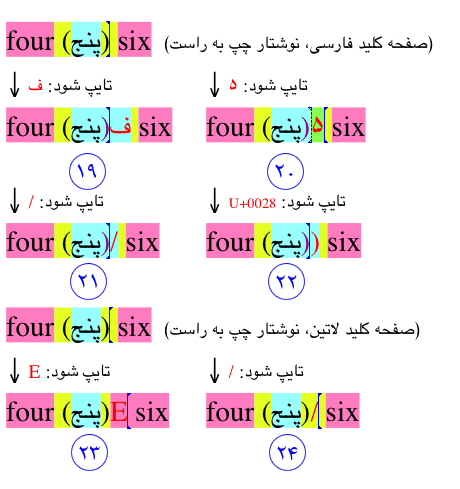

فصل ۳ - عنصر متن در میانای کاربر
===================================

## ۳.۱. ‏ویژگیهای متن فارسی

تفاوتهای مهم زبان و خط فارسی با زبانهای لاتینی از جمله انگلیسی بسیار آشکار و بدیهی است. یکی از مشکلات پشتیبانی زبان و خط فارسی درک تفاوتهای مهم آن با عربی است. این کم‌توجهی به تفاوتهای فارسی و عربی، مشکلاتی را برای نرم‌افزارهای فارسی ایجاد می‌کند.

زبان فارسی یکی از زبانهای هند و اروپایی است. خط فارسی بر اساس الفبای عربی گسترش یافته و بنا بر این بسیاری از خصوصیات نوشتاری آن مشابه سایر زبانهای با ریشهٔ سامی و مخصوصاً عربی است. خصوصیّات بارز خطّ و زبان فارسی که در آن مشابهت بسیاری نیز به زبانها و خطوط هم‌خانوادهٔ خود دارد عبارتند از:

 - ۱. مانند عربی، جهت اصلی نوشتار فارسی از راست به چپ است. اعداد و عبارات ریاضی از چپ به راست نوشته می‌شوند. تفاوت زبان فارسی با بسیاری از بوم‌های عرب‌زبان، تأکید کمتر فارسی روی جهت راست به چپ است؛ مخصوصاً در ترکیبات ریاضی، عددی، جداول و نمودارها. به عنوان نمونه، جهت متداول بسیاری از نمودارها در ایران طبق جهت مختصات دکارتی است که جهت مثبت محور افقی آن از چپ به راست است.
 - ۲. حروف متن (غیر دست‌نویس) لاتین جدا از هم نوشته می‌شوند و شکل حروف (صرف نظر از اینکه در کجای کلمه قرار گیرند یا حروف مجاور چه باشند) ثابت است. در حالی که مانند عربی، کلمات فارسی به صورت پیوسته و سرهم نوشته می‌شوند و شکل نوشتاری هر حرف بستگی به جایگاه آن در کلمه و حروف اطراف آن دارد.
 - ۳. در رسم‌الخط جدانویسی متعارف در متن لاتین، استفاده از یک شکل ترکیبی به جای چند حرف مجاور (که لیگاتور نامیده می‌شود) معمولاً اختیاری بوده و جنبهٔ زیبایی دارد؛ (مانند لیگاتور  به جای حروف ) در حالی که در زبان فارسی برخی لیگاتورها (مانند لا) اجباری هستند. به همین دلیل توصیه می‌شود که خدمات ویرایش و نمایش متن موجود در محیطهای بستر در تمامی حالت‌ها به خوبی لیگاتورها را پشتيبانی کنند.
 - ۴. حروف متن لاتین به دو شکل حروف بزرگ (مورد استفاده در اولین حرف اولین کلمه هر جمله، اولین حرف اسامی خاص و حروف اختصاری) و کوچک هستند؛ در حالی که در زبان فارسی حروف بزرگ و کوچک با تعبیری شبیه لاتین وجود ندارد.
 - ۵. همانند عربی، تنها شکل لیگاتوری اجباری در خطّ فارسی شکل ترکیبی حرف لام و حروف با پایهٔ الف یعنی «لا ‍لا»، «لأ ‍لأ» و غیره است[^۳۲]. امّا در مورد لیگاتورهای اختیاری، تفاوتهای محسوسی بین فارسی و عربی وجود دارد. لیگاتورهای اختیاری در فارسی کمتر از عربی مرسوم هستند و متداول‌ترین آنها عبارتند از:
  
   - لیگاتور دندانهٔ قبل از یای آخر کلمه مخصوصاً لیگاتور س، ش، ص، ض با ی. مانند: 
   - لیگاتور حروف کاف و گاف با حروف الف و لام.
   - لیگاتور دندانهٔ وسط با ر، ز، ژ و ن

 - ۶. در مقابل، لیگاتورهای عربی زیر در فارسی مطلوب نیستند:

   - لیگاتور لام و میم. مانند: 
   - لیگاتور میم و الف. مانند: 
   - لیگاتور دندانه‌های کوتاه و ف و ل در جایگاه اوّل با ی. مانند: 
   - لیگاتور لام، میم و دندانه‌های دیگر با حروف ج، ح، خ. مانند: 
   - کلیهٔ لیگاتورهای سه حرفی مانند ترکیبات س، ش، ص، ض، با میم و الف، لام و میم با ج، ح، خ و غیره.

 - ۷. علائمی که در برخی زبانهای لاتین روی حروف می‌نشینند و آکسان[^۳۳] نام دارند، فقط در موارد بسیار خاص و روی حروف کاملاً مشخص و محدودی کاربرد دارند و به همین دلیل ماهیت مستقلی ندارند؛ در حالی که مصوّت‌ها و اعراب‌های متن فارسی ممکن است تقریباً روی هر حرفی بنشینند و از نظر ارزش معنایی معادل حروف صدادار لاتین هستند. این امر خود موجب دو تفاوت است:

   - اول اینکه در قلمهای لاتین به هنگام حروفچینی حروف آکسان دار، از یک شکل[^۳۴] سرهم شده[^۳۵] که از حرف پایه به علاوه آکسان (در محل مناسب) تشکیل می‌شود، استفاده کنند. در حالی که قلمهای فارسی فاقد این اشکال سرهم شده هستند و قراردادن اعراب در محل مناسب توسط نرم‌افزار انجام می‌پذیرد. به همین دلیل توصیه می‌شود که خدمات نمایش متن موجود در محیطهای بستر در تمامی حالت‌ها از نشاندن اعراب در مکان مناسب پشتيبانی کنند.
   - دوم اینکه هنگام ویرایش در متن لاتین، حرف پایه و آکسان معمولاً به طور مستقل قابل ویرایش نیستند ولی در متن فارسی و عربی معمولاً حرف پایه و اعراب(های) روی آن مستقل از هم قابل ویرایش‌اند. به همین دلیل توصیه می‌شود که خدمات ویرایش متن موجود در محیطهای بستر در تمامی حالت‌ها انتخاب ویرایش اعراب را به روشی مناسب پشتيبانی کنند.

 - ۸. مصوّت‌های کوتاه (اَ U+064E، اِ U+0650، اُ U+064F) معمولاً در فارسی نوشته نمی‌شوند و هنگامی که نوشته شوند به صورت اِعراب[][^۳۶] به روی حروف قرار می‌گیرند و از خود عرض مستقل ندارند.
 - ۹. از بین سایر اِعرابهای متداول در عربی، تنها تشدید ـّ (U+0651) و تنوین فتح اً (U+064B) در فارسی متداول هستند و بقیه به ندرت مورد استفاده قرار می‌گیرند. بر خلاف مصوّت‌های کوتاه، نوشتن تنوین فتح و گاهی تشدید برای صحّت رسم‌الخطّ لازم است.
 - ۱۰. ترکیب تشدید ـّ (U+0651) و اعراب‌های دیگر در فارسی با عربی متفاوت است. در زبان عربی اگر حرف مشدّد اعراب بپذیرد، اعراب را روی تشدید می‌گذارند نه روی حرف. بنا بر این حرفِ مشدّدِ مکسور به شکل ـِّ نمایش داده می‌شود. در زبان فارسی هر دو اعراب روی حرف پایه گذاشته می‌شوند و حرف مشدد مکسور به شکل ـّ‌ِ نمایش داده می‌شود.
 - ۱۱. کسرهٔ اضافه: در کلمات مختوم به «های بیان حرکت»، در حالت مضاف، معمولاً از علامتی به شکل «» (یای کوتاه‌شدهٔ شبیه همزه) استفاده می‌شود. این علامت برای اشاره به تلفظ صامت میانجی «ی» به کار می‌رود و به آن «یای مُرَخَّم» نیز می‌گویند. مانند: «خانهٔ من» این عبارت را گاهی به صورت «خانه‌ی من» نیز می‌نویسند. به دلیل کاربرد اختصاصی این علامت به همراه حرفِ «های بیان حرکت» و شباهت آن به همزه، در استاندارد ۶۲۱۹ از افزودن نویسهٔ جدید به یونیکد صرف نظر شده و نویسهٔ همزهٔ بالا U+0654 برای این علامت به کار می‌رود. در نتیجه تفسیر نویسهٔ U+0654 در متنی که به زبان فارسی باشد، به شکل زیر گسترش یافته است:

در متن یونیکد فارسی، نویسهٔ همزهٔ بالا U+0654 به دنبال **ه‍** U+0647 مجاز است و هنگام نمایش به شکل «» روی حرف پایه نمایش داده شده و مفهوم پردازشی آن معادل کسرهٔ اضافه (کد U+0650) است. همچنین کلمه‌ای که به U+0647، U+200C، U+06CC ختم می‌شود، معادل آن است که به U+0647، U+0654 ختم شود و در این حالت مفهوم پردازشی معادل کسرهٔ اضافه دارد. اگر کاربردی بخواهد به طور خودکار کسره به انتهای یک کلمهٔ فارسی اضافه کند باید بتواند کلمات مختوم به «های بیان حرکت» را تشخیص داده و از U+0654 به جای کسره استفاده کند.

 - ۱۲. زبان فارسی ریشهٔ هند و اروپایی دارد و از نظر روش‌های واژه‌سازی و ساختار دستوری به این زبانها شباهت دارد. یکی از مهم‌ترین نتایج این امر، کاربرد واژه‌های مرکّب و پیشوندها و پسوندها است که در عربی کاربرد ندارند. این موضوع ویژگیهایی را در رسم‌الخطّ فارسی ایجاد می‌کند که در عربی وجود ندارد. اجزای واژه‌های مرکّب، پیشوندها و پسوندها معمولاً جدا نوشته می‌شوند ولی فاصلهٔ این اجزا بسیار کم‌تر از فاصلهٔ واژه‌های مستقل است. جدا کنندهٔ اجزای واژهٔ ترکیبی «فاصله مجازی» یا «نیم‌فاصله» نامیده می‌شود و طبق استاندارد ۶۲۱۹ [ISIRI-6219] با نویسه کنترلی U+200C یونیکد مشخص می‌شود. قلمهای فارسی و خدمات نمایش متن موجود در محیطهای بستر باید نمایش مناسب واژه‌های ترکیبی که در آنها نویسه کنترلی U+200C وجود دارد را تأمین نمایند. لازم به ذکر است که نمایش متوالی اجزای واژهٔ ترکیبی بدون اصلاح (غالباً افزایش) فاصلهٔ اجزای آن نتیجهٔ نازیبایی ایجاد می‌کند.
 - ۱۳. بر خلاف بسیاری از زبانها، در زبان فارسی نامها و ضمیرها حالت مذکرّ، مؤنث و خنثی ندارند؛ مگر در مورد برخی نامهای وارد شده از عربی. این امر تولید پویای عبارات را از بسیاری از زبانها مانند فرانسه، آلمانی و عربی ساده‌تر می‌سازد.
 - ۱۴. بر خلاف عربی و برخی از زبانهای دیگر، در زبان فارسی حالت مثنّی[^۳۷] وجود ندارد؛ مگر در مورد برخی نامهای وارد شده از عربی.
 - ۱۵. اغلب حروف لاتین (به استثنای g، j، p، q، Q، و y) روی خط کرسی نوشته می‌شوند و به زیر خط کرسی تجاوز نمی‌کنند. حروف معدودی که به زیر خط کرسی تجاوز می‌کنند نیز فضای کمی را در زیر خط کرسی اشغال می‌کنند. در حالی که متن فارسی به فضای بسیار بیشتری در زیر خط کرسی نیاز دارد و به طور کلّی تنوع ارتفاع حروف فارسی (مخصوصاً با توجّه به نقطه‌ها و سرکش) هم در بالا و هم در زیر خط کرسی بسیار بیشتر از لاتین است. این امر با اضافه شدن اعراب به متن تشدید می‌گردد.
 - ۱۶. در متن لاتین قلمی با حروف تک‌عرض[^۳۸] خوانایی قابل قبولی دارد[^۳۹] و در مواردی کاربرد آن بسیار متداول است؛ در حالی که قلمی با حروف تک‌عرض در فارسی تقریباً غیر ممکن است (با توجه به لیگاتور اجباری لا، نیم‌فاصله و مصوت‌ها) و خوانایی قابل قبولی ندارد. چنین قلمهایی در زبان فارسی، تنها به اجبار محدودیت ابزارها در مقاطعی رواج یافته و سپس منسوخ شده است. به همین دلیل نرم‌افزارهای جهانی نباید به وجود قلم تک‌عرض متکی باشند.
 - ۱۷. واژه‌های لاتین به فاصلهٔ بین واژه‌ها برای خوانایی همواره نیاز دارند اما در فارسی برخی واژه‌ها بدون وجود فاصله هم خوانا هستند؛ مخصوصاً اگر تشکیل یک عبارت مصطلح را بدهند. (مانند «زدوخورد» که سه کلمه است: «زد» «و» «خورد») این ویژگی باعث شده که بسیاری از کاربران به هنگام تایپ متن فارسی، برخی واژه‌ها را به غلط به یکدیگر بچسبانند. همین امر دشواریهایی را در پردازش متن ایجاد می‌کند.
 - ۱۸. وجود دنباله حروف ر، ز، ژ، و واو و همچنین وجود سرکش در حروف کاف و گاف و متداول بودن ترکیب این دو حرف در واژه‌ها، و همچنین کمتر بودن اندازه طبیعی فاصله بین واژه‌ها در فارسی، نیاز به پشتيبانی امکان اصلاح فاصلهٔ حروف[^۴۰] را نسبت به لاتين شدیدتر می‌سازد. به همین دلیل توصیه می‌شود که خدمات نمایش متن موجود در محیطهای بستر در تمامی حالت‌ها از اصلاح فاصلهٔ حروف پشتيبانی کنند.
 - ۱۹. در متن لاتین متداول‌ترین حالت ترازبندی ستون متن، حالت چپ‌چین است؛ در حالی که در زبان فارسی به دلیل کشش پذیری اتصالات حروف، ستون متن تراز شده از دو سو بسیار متداول‌تر است. به همین دلیل نرم‌افزارهای ویراستاری که امکان تعیین ترازبندی متن را به کاربر می‌هند باید متن تراز شده از دو سو را نیز علاوه بر متن چپ‌چین، وسط‌چین و راست‌چین پشتیبانی کنند.
 - ۲۰. در متن لاتین برای تراز کردن متن روی عرض یک سطر بیشتر از تغییر فاصله کلمات و معمولاً تنها در صورت اجبار از افزایش فاصله حروف در کلمات استفاده می‌شود؛ در حالی که در زبان فارسی معمولاً بیشتر از کشش اتصالات حروف برای تراز کردن استفاده می‌شود و افزایش فاصله کلمات نامطلوب است. این کشش به معنای افزایش فاصله حروف ضمن حفظ اتصال آنها به یکدیگر است. به همین دلیل نرم‌افزارهای ویراستاری که امکان تعیین ترازبندی متن از دو سو را به کاربر می‌هند باید تراز متن با کمک کشش اتصالات حروف (یا افزودن کشیده) را نیز پشتیبانی نمایند. برای تأمین این امر توصیه می‌شود که خدمات ویرایش و نمایش متن موجود در محیطهای بستر در تمامی حالت‌ها تراز متن با کمک کشش اتصالات حروف (یا افزودن کشیده) را نیز پشتیبانی نمایند. مخصوصاً در مورد قلمهای اُپن‌تایپ[^۴۱] توصیه می‌شود که نرم‌افزارهای پایه جدول JSTF اُپن‌تایپ را نیز پشتیبانی کنند. [OpenType]
 - ۲۱. برخی حروف (پ چ ژ گ) مخصوص زبان فارسی هستند و در عربی وجود ندارند.
 - ۲۲. برخی حروف عربی در فارسی مورد استفاده ندارند مانند «إ» (الف همزه پایین) و الف مکسوره (در کلمه‌ای مانند «موسی» در زبان فارسی فرض می‌شود که «‍ی» در آخر کلمه، یای فارسی است که مانند الف تلفظ می‌شود، نه یک حرف جداگانه یا الفی که به شکل یا نوشته می‌شود. (برای سند این موضوع می‌توان به اشعار متعددی که تلفظ حرف آخر موسی را به حرف «یا» قلب می‌کنند مراجعه کرد.)
 - ۲۳. شکل ظاهری بعضی از حروف (دو حرف کاف و یا) بین فارسی و عربی متفاوت است. استاندارد یونیکد که به شکل ظاهری حروف اهمیت می‌دهد و سعی داشته از کدگذاری زبان متن بگریزد، برای این حروف نویسه‌های متفاوتی را مخصوص فارسی (و اردو و غیره) تعریف کرده است.
 - ۲۴. برخی ارقام فارسی و ممیّز اعشاری و جداکنندهٔ هزارگان در عدد نویسی فارسی و عربی متفاوت هستند. همچنین در استاندارد یونیکد ارقام فارسی (به همراه اردو) نیز به دلیل تفاوت شکل ظاهری بعضی از ارقام و تفاوتهایی در رفتار جهت‌پذیری، با نویسه‌های متفاوت با عربی کد گذاری شده‌اند. روش و جهت متعارف ترکیب برخی اعداد و علائم نیز در فارسی با عربی متفاوت است.

[^۳۲]: از آنجا که ساده‌ترین راه استقرار صحیح اِعرابهای مرکب (مانند تشدید + فتحه) استفاده از یک شکل ترکیبی است، شکلهای همنشینی اعراب‌ها گاهی با شکلهای لیگاتوری اشتباه گرفته می‌شود.
 [^۳۳]: accent
 [^۳۴]: glyph
 [^۳۵]: composed
 [^۳۶]: floating marks
 [^۳۷]: برخی زبانها مانند عربی تعداد ۲ عدد را به عنوان حالت سومی جدای از مفرد و جمع در نظر می‌گیرند.
 [^۳۸]: قلمی که در آن عرض تمام شکلها (glyphs) با یکدیگر مساوی باشد را یک قلم تک‌عرض یا mono-space گویند.
 [^۳۹]: تفاوت عرض حروف لاتین شدت کمتری از فارسی دارد و در مواردی که تفاوت زیاد است، از طریق استفاده مناسب از زائده‌های انتهایی (serif) اثر این اختلاف تخفیف می‌یابد.
 [^۴۰]: kerning
 [^۴۱]: OpenType
 
## ۳.۲. ‏ویژگیهای قلم فارسی

با توجه به این که نوشتار زبان فارسی بر اساس خطّ عربی[^۴۲] است، بسیاری از خصوصیات خط فارسی و در نتیجه قلم فارسی مشابه عربی است. تفاوتهای قلم فارسی با عربی بیشتر در سبک و سیاق خطّاطی و فرم و شکل ظاهری برخی از حروف خودنمایی می‌کند. این امر نمایانگر نوعی تفاوت سلیقهٔ زیباشناسی بین قلمهای فارسی و عربی می‌باشد. به همین دلیل بسیاری از قلمهای عربی از دید کاربران ایرانی نامأنوس و حتّی نا‌زیبا جلوه می‌کنند. البته برخی از قلمهای عربی در فارسی نیز بسیار متداول هستند و جزء زیباترین قلمهای چاپی محسوب می‌شوند (مانند قلم لوتوس شرکت لاینوتایپ[^۴۳] که طرحی عربی است).

**ضابطهٔ ۱۳: از کاربرد قلمهای عربی که با سلیقهٔ کاربر ایرانی هماهنگی نداشته باشند در میانای کاربر پرهیز کنید. این امر شامل متن عربی و قلمهای عربی متداول در ایران نمی‌شود.**

 [^۴۲]: Arabic script
 [^۴۳]: شرکت Linotype^®^ GmbH بخشی از شرکت Heidelberger Druckmaschinen AG است. برای اطلاعات قلم لوتوس رجوع کنید به: [http://www.linotype.com/1183/lotus-family.html](http://www.linotype.com/1183/lotus-family.html)

### ۳.۲.۱. ‏مقایسه قلم فارسی با لاتین

قلمهای فارسی و عربی با قلمهای لاتین تفاوتهای مهمی دارند که این امر می‌تواند اشکالاتی را در انتخاب قلم و اندازه و سبک آن در میانای کاربر پدید آورد. به همین دلیل در اینجا به بررسی اجمالی برخی خصوصیات قلمهای لاتین در مقایسه با فارسی پرداخته و به مشکلات موجود و راه حل آنها اشاره می‌کنیم:

قلمهای متعارف لاتین بیشتر از خطوط موازی عمودی که میان خط کرسی و دو خط موازی افقی قرار می‌گیرد تشکیل می‌شوند. در مقابل در قلمهای فارسی تنها یک خط واضح کرسی به راحتی قابل تشخیص است و تنوع بیشتری در حرکت قلم و شکل و عرض و ارتفاع حروف به چشم می‌خورد. شکلهای زیر نمونهٔ حروف متن لاتین و فارسی را نشان می‌دهد:

در هر دو قلم فارسی و لاتین برخی حروف به زیر خط کرسی تجاوز می‌کنند. اما در قلمهای فارسی تعداد و مقدار این تجاوز به زیر خط کرسی بسیار بیش از لاتین است. وجود نقطه و اعراب در بالا و پایین حروف باعث می‌شود که در قلمهای فارسی حاشیهٔ بیشتری در بالا و پایین سطر مورد نیاز باش
د.

نتیجهٔ مهم این امر تعریف اندازهٔ قلم فارسی است. اندازهٔ قلم برحسب ارتفاع کل قلم تعریف می‌شود. این تعریف از دوران حروف سربی بر جای مانده است. به این ترتیب درشتی و خوانایی قلم فارسی 12 پنط[^۴۴] به دلیل جاگیرتر بودن قلم فارسی در ارتفاع، به طور قابل ملاحظه‌ای کمتر از قلم لاتین در همان اندازه است. این امر می‌تواند در خوانا بودن متن مورد استفاده در میانای کاربر تأثیر بگذارد. با توجه به شکل زیر دیده می‌شود که با اندازهٔ مساوی قلم، متن لاتین درشت‌تر دیده می‌شود. این اختلاف معمولاً بین پنج الی بیست درصد است.

بنابر این برای درشتی و خوانایی مطلوب، قلم فارسی باید پنج الی بیست درصد بزرگ‌تر از قلم لاتین باشد. با توجّه به این که پیاده‌سازی این امر در میانای کاربر دشوار است (و به دلایل دیگری که در بخش‌های بعدی توضیح داده می‌شود)، برای زبان فارسی بهتر است قلم ویژه‌ای تهیه شود که درشتی، خوانایی و خصوصیات دیگر آن همسنگ قلم لاتین مورد استفاده در میانای کاربر باشد.

**ضابطهٔ ۱۴: برای نمایش متن فارسی مورد استفاده در میانای کاربر از قلمهای فارسی طراحی شده مخصوص همین کار استفاده کنید.**

همچنین از نکتهٔ قبل نتیجه می‌شود که نرم‌افزارهایی که امکان ویرایش متن فارسی/لاتین دارند بهتر است که امکان تعیین نوع و اندازهٔ قلم فارسی و لاتین را جداگانه به کاربر بدهند.

خصوصیت دیگری که در شکل فوق دیده می‌شود، ضخامت افقی و عمودی قلم است. در قلمهای لاتین خطوط عمودی یا تقریباً عمودی ضخیم‌تر هستند در حالیکه در فارسی و عربی خطوط افقی یا تقریباً افقی ضخامت بیشتری دارند. این امر ملاحظاتی را در مورد انتخاب فاصلهٔ سطرهای متن فارسی ایجاد می‌کند که در ادامهٔ این بخش به آن اشاره خواهیم کرد.

 [^۴۴]: واحد اندازهٔ قلم مصطلح در حروفچینی که در انگلیسی Point گویند

### ۲.۲.۳. ‏سبک‌های قلم فارسی

به منظور برجسته‌نمایی و تمایز برخی قسمت‌های متن مرسوم است که کلمات یا عباراتی را در لابلای متن با سبکی متفاوت بنویسند یا زیر آن خط بکشند. متداول‌ترین سبک‌های لاتین که برای این منظور مورد استفاده قرار می‌گیرند عبارتند از: سیاه[^۴۵] و ایتالیک[^۴۶] و سیاه ایتالیک[^۴۷]. مهم‌ترین خصیصهٔ سبک سیاه افزایش ضخامت جان قلم است و خصوصیّت اصلی خط ایتالیک (علاوه برتفاوت در جزئیات حرکت قلم) مایل بودن آن است.

از زمان ورود صنعت چاپ به ایران این نوع سبک‌سازی برای قلمهای فارسی مرسوم شده و برای این امر از سبکهای لاتین اقتباس شده‌است. با این حال سبک‌های قلم فارسی ویژگیهای خاص خود را دارند.

در قلمهای فارسی به دلیل خطوط مسلط افقی و وجود نقطه‌ها، ارتفاع قلم سیاه بیش از عرض آن مستعد افزایش است. در حالی که درقلم لاتین عرض قلم بیشتر تمایل به ازدیاد دارد و ارتفاع آن غالباً ثابت می‌ماند. از آنجا که با تغییر سبک متن نباید فاصله سطرها تغییر کند، معمولاً در طراحی قلم پایهٔ فارسی فاصلهٔ سطرها اندکی بیشتر اختیار می‌گردد تا فضای کافی برای تولید سبک سیاه باقی بماند.

نکتهٔ دیگری که در مورد سبک قلم سیاه باید مورد توجه قرار گیرد، چگونگی شبیه‌سازی این سبک بر روی پردهٔ نمایش در هنگام موجود نبودن طراحی نسخهٔ سیاه آن است. در این حالت، اکثر محیطها از دوبار نوشتن متن با فاصلهٔ افقی یک ذرهٔ تصویر[^۴۸] استفاده می‌کنند. این روش در متن لاتین نتیجهٔ معقولی ایجاد می‌کند، امّا برای قلم فارسی نتیجهٔ رضایت بخشی ندارد. به همین دلیل توصیه می‌گردد که:

**رهنمود ۶: برای قلمهایی که مخصوص میانای کاربر طرّاحی می‌شوند، سعی کنید که حتماً قلم سبک سیاه آن را نیز طراحی کنید.**

در قلم فارسی سبک ایتالیک تعریف نشده‌است و به جای آن سبک مایل به دو‌گونهٔ مایل (مایل به جلو که زاویهٔ انحراف خطوط نسبت به امتداد عمودی در آن قرینهٔ آینه‌ای سبک ایتالیک است) و مایل به عقب (که زاویه انحراف آن مشابه سبک ایتالیک لاتین است) وجود دارند.

در متنی که کاملاً فارسی و عاری از کلمات لاتین باشد، سبک مایل (به جلو) مناسب‌تر است امّا اگر متن فارسی و لاتین لابه‌لای یکدیگر باشند سبک مایل به عقب مورد استفاده قرار می‌گیرد. لازم به ذکر است که تلاشهایی نیز برای تعریف سبکی که معادل ایتالیک برای فارسی باشد انجام گرفته و این سبک «ایرانیک» خوانده‌شده‌است، امّا قلمهایی با این سبک نایاب هستند.

در قلمهای لاتین، سبک مایل را اِسلَنت[^۴۹] یا اُبلیک[^۵۰] می‌نامند. سبک مایل در خلاف جهت را بَک‌اسلنت[^۵۱] می‌نامند که در خود لاتین کاربرد ندارد ولی ممکن است لابه‌لای متن مایل فارسی مورد استفاده قرار گیرد. قلم مایل (به جلوی) فارسی معادل سبک بک‌اسلنت لاتین است و قلم مایل به عقب فارسی معادل سبک اسلنت لاتین است.

نکتهٔ قابل توجه در مورد سبک مایل فارسی این است که به دلیل فقدان خطوط متعدد عمودی که در قلمهای لاتین موجود است، برجستگی قلم مایل در لابلای متن فارسی بسیار کمتر از برجستگی قلم ایتالیک یا اسلنت در لابلای متن لاتین است. با توجّه به این امر و با توجّه به مشکلات تطبیق جهت انحراف قلم مایل توصیه می‌شود:

**رهنمود ۷: در صورت امکان، از کاربرد قلم مایل در میانای کاربر گرافیکی اجتناب کنید.**

**رهنمود ۸: نرم‌افزارهایی که امکان تعیین سبک متن را به کاربر می‌دهند باید به سبک‌های تعریف شده در هر زبان و نام‌گذاری و معادل‌سازی آنها آگاهی داشته باشند.**

نکتهٔ دیگر در مورد خط کشیدن زیر متن برای برجسته نمودن آن است. خط زیر متن در قلم لاتین بسیار نزدیک به خط کرسی است چرا که به ندرت حروف لاتین به زیر خط کرسی تجاوز می‌کنند. امّا در قلم فارسی خط زیر متن خیلی پایین‌تر از خط کرسی ترسیم می‌شود تا با نقاط زیر خط کرسی و حروفی مانند «ر» تداخل نکند و به خوانایی متن صدمه وارد نشود.

به همین دلیل:

**رهنمود ۹: کاربرد سبک «زیر خط کشیده»[^۵۲] در عبارتی که حاوی متن فارسی و لاتین باشد توصیه نمی‌شود. در صورت نمایش ترکیب متن فارسی/لاتین، مکان زیرخط باید برای هر دو قلم فارسی و لاتین یکسان و مطابق مکان مناسب آن برای قلم فارسی باشد.**

نکتهٔ دیگری که در مورد این سبک باید مورد توجّه قرار گیرد این است که کاربرد این سبک برای خط کشیدن زیر یک حرف از کلمه در زبان فارسی نامطلوب است. خط کشیدن زیر یک حرف معمولاً در زمانی استفاده می‌شود که نرم‌افزاری بخواهد حرف معادل را برای میان‌بُرهایی که به کمک کلیدهای دگرساز[^۵۳] یا مهار[^۵۴] بعلاوهٔ یک حرف وارد می‌شوند، مشخص نماید. در زبان فارسی به دلیل وجود نقطه‌ها، ارتفاع (فرود) بسیار متنوع در زیر خط کرسی و عرض کم برخی حروف، زیرخط بسیار کوتاه روی پردهٔ نمایش خوانا نیست. در این مورد توصیه می‌گردد که از تغییر رنگ یا زمینهٔ حرف مورد نظر استفاده به عمل آید.

**رهنمود ۱۰: کاربرد سبک «زیر خط کشیده» برای خط کشیدن زیر یک حرف نامطلوب است.**

علاوه بر سبک‌های اقتباس شده از لاتین، روشهای دیگری نیز برای برجسته ساختن عبارتی در لابلای متن فارسی استفاده می‌شود که عبارتند از:
 - ۱. استفاده از علامت نقل قول و قراردادن عبارت داخل علامت نقل قول حتی اگر نقل قولی مورد نظر نباشد. این کار با وجود اینکه پشتوانهٔ رسمی ندارد عملاً توسط بسیاری از جمله آقای خانلری در کتاب معروفش «دستور زبان فارسی» استفاده شده‌است [خانلری].
 - ۲. استفاده از کشیدگی حروف برای افزایش عرض عبارت نسبت به کلمات مجاور. این روش بیشتر در متن دست‌نویس مرسوم است و درمتن چاپی ترازبندی شده کاربرد محدودی دارد.
 - ۳. تغییر سیاق قلم روش دیگری است که هم در متن چاپی و هم دست‌نویس کاربرد دارد. به عنوان مثال، استفاده از قلم تحریر (نستعلیق سادهٔ نوشتاری) برای برجسته ساختن عبارتی در لابلای متنی با قلم نسخ (و برعکس) مرسوم است. در واقع این کاربرد مفیدترین کاربرد قلم تحریر در متن‌های چاپی روزمرّ‌ه است، اما به دلیل محدودیت کنونی ابزارهای حروف‌چینی کاربرد محدودی یافته‌است.

 [^۴۵]: Bold
 [^۴۶]: Italic
 [^۴۷]: Bold Italic
 [^۴۸]: Pixel
 [^۴۹]: Slant
 [^۵۰]: Oblique
 [^۵۱]: Back Slant
 [^۵۲]: Underlined
 [^۵۳]: Alt
 [^۵۴]: Control

### ۳.۲.۳. ‏اندازهٔ قلم فارسی و فاصلهٔ سطرها

همآنگونه که اشاره شد، رابطهٔ اندازهٔ قلم فارسی با درشتی و خوانایی آن نسبت به قلمهای لاتین متفاوت و ریزتر است. این نسبت بر حسب طرّاحی قلمهای گوناگون متفاوت است. از نظر ارتفاع نیز حداقل فاصلهٔ مورد نیاز بین سطرهای متن فارسی بسیار بیش از لاتین است. این امر به دلیل تنوع ارتفاع بیشتر، وجود اعراب و فرود یا تجاوز بسیار بیشتر قلم فارسی به زیر خط کرسی و همچنین به دلیل وجود نقطه‌ها و سرکش و کلاه است.

به این ترتیب، فاصلهٔ سطرهای متن فارسی بین ۱۵ الی 60 درصد بیش از ارتفاع سطرهای لاتین است. در صورتی که متن دارای اعراب گذاری باشد ارتفاع مورد نیاز بیشتر شده و اضافه ارتفاع ممکن است تا 120 درصد هم برسد.

نکتهٔ دیگر تفاوت نسبی فراز[^۵۵] و فرود[^۵۶] قلم فارسی با لاتین است. نسبت فراز به فرود قلمهای لاتین عموماً بزرگتر از ۲ می‌باشد و تا بیش از ۵ هم ممکن است برسد، در حالی که در قلمهای متعارف فارسی این نسبت معمولاً کمتر از ۲ بوده و به زحمت ممکن است به ۳ برسد. همین امر مشکل دیگری را در تعیین فاصلهٔ سطر متن فارسی/لاتین ایجاد می‌کند. برای درک موضوع فرض کنید که فاصلهٔ سطرهای یک قلم لاتین ۱٫۵ سانتیمتر و فراز آن ۱٫۱ سانتیمتر باشد. اکنون فرض کنید فاصلهٔ سطرهای یک قلم فارسی نیز ۱٫۵ سانتیمتر است. امّا فراز قلم فارسی حدود ۰٫۹ سانتیمتر و در نتیجه فرود آن ۰٫۶ سانتیمتر خواهد بود. اکنون حالت‌های زیر را در نظر بگیرید:

اگر متنی صرفاً لاتین با قلم لاتین فوق داشته باشیم، فاصله سطرهایش ۱٫۵ سانتیمتر خواهد بود. اگر متنی صرفاً فارسی با قلم فارسی فوق داشته باشیم، فاصله سطرهای آن هم ۱٫۵ سانتیمتر خواهد بود. اما اگر متنی فارسی لاتین را با قلمهای فوق روی کرسی یکسان قرار دهیم فاصلهٔ سطرهای آن ۱٫۱ (حداکثر فراز) + ۰٫۶ (حداکثر فرود) = ۱٫۷ سانتیمتر خواهد شد. یعنی: با در نظر گرفتن کرسی یکسان فاصله سطر مورد نیاز در متن فارسی/لاتین معمولاً بیشتر از متن فقط فارسی یا فقط لاتین می‌باشد.

با توجه به اینکه متن مورد استفاده در میانای کاربر بالقوّ‌ه فارسی لاتین است، موضوع فوق ملاحظاتی را در طرّاحی و انتخاب قلم فارسی مناسب میانای کاربر پدید می‌آورد.

 [^۵۵]: Ascender
 [^۵۶]: Descender

### ۳.۲.۴. ‏قلمهای میانای کاربر

قلمهایی که برای نمایش متن میانای کاربر روی پردهٔ نمایش استفاده می‌شوند، با قلمهای عادی که برای کاربرد چاپی مصرف می‌شوند تفاوتهایی دارند. به منظور افزایش خوانایی، قلمهای میانای کاربر معمولاً درشت‌تر هستند و اجزای حروف آنها گشاده‌تر وبا ابعاد اغراق آمیزی هستند. به عنوان مثال به تفاوتهای قلمهای زیر در پردهٔ نمایش توجه کنید:

همچنین نمایش تفاوت ضخامت قلم به دلیل تعداد محدود نقاط موجود برای نمایش هریک از حروف دشوار است. درنتیجه استفاده از قلم با ضخامت ثابت در قلمهای میانای کاربر بسیار معمول است. برای ایجاد برجستگی در قلم سیاه افزایش لازم در ضخامت قلم بیش از همین افزایش در قلمهای عادی چاپی است.

نکتهٔ بسیار مهم دیگر نیاز به استفاده از تمهیدات ویژه به منظور بهبود زیبایی و خوانایی قلم در تفکیک‌پذیری محدودی است که نقاط پردهٔ نمایش ارائه می‌دهند. (بین 28 تا 38 نقطه در سانتیمتر برای پردهٔ نمایش درمقابل بیش از 110 تا 500 نقطه در سانتیمتر برای قلمهای چاپی) همین امر تولید قلمهای میانای کاربر را بسیار دشوار و پرهزینه می‌سازد وبه همین دلیل قلمهای ویژهٔ میانای کاربر تنوعی بسیار کمتر از قلمهای عادی دارند.

ویژگیهای فوق عمومی هستند و در مورد قلمهای فارسی و لاتین صدق می‌کنند. ویژگیهای مهم دیگری نیز مخصوص قلمهای میانای کاربر فارسی و عربی است:

با توجه به استفاده از دو قلم فارسی و لاتین در کنار و لابلای یکدیگر در میانای کاربر و به دلیل طرّاحی اغلب میانا‌های کاربری موجود با فرض فاصلهٔ سطرهای متناسب با قلم لاتین لازم است که قلمهای میانای کاربر فارسی به گونه‌ای طرّاحی شوند که فاصلهٔ سطرهای آنها کمتر از قلمهای متعارف باشد ومخصوصاً فرود اسمی کمتری نسبت به قلمهای متعارف داشته باشند، به طوری که ارتفاع فراز و فرود آنها نسبت به خط کرسی شبیه قلمهای لاتین باشد. در غیر اینصورت فاصله سطرهای مرکب فارسی و لاتین بیشتر از هریک از دو قلم خواهد شد. در این حالت ممکن است لازم شود خط کرسی طرّاحی قلم بالاتر از خط کرسی اسمی فرض شود تا نتیجهٔ زیباتری به دست آید. مثالی از این روش در شکل زیر نمایش داده شده است:

علاوه بر موضوع فوق، قلمهای فارسی میانای کاربر باید در مقایسه با قلمهای متعارف به طور قابل ملاحظه‌ای درشت‌تر باشند تا با قلم لاتین هماهنگ دیده شوند.

### ۳.۲.۵. ‏طبقه‌بندی قلمها

قلمهای لاتین به گروه‌های متعددی طبقه‌بندی می‌شوند. این طبقه‌بندی‌ها از نظر جزئیات تفاوتهایی دارند. برخی نرم‌افزارها به هنگام جایگزینی خودکار یک قلم با قلم دیگر[^۵۷] از بانکهای اطلاعاتی که طبقه‌بندی قلمها را در خود جا داده‌اند برای جایگزینی قلم مورد نظر از قلم هم‌خانواده و هم‌سنخ آن استفاده می‌کنند. برخی انواع این طبقه‌بندی در داخل قلمهای اُپِن‌تایپ[^۵۸] نیز قابل ثبت است.

این‌گونه طبقه‌بندی‌ها در قلمهای فارسی موجود نمی‌باشد و مستقیماً قابل اعمال نیستند. با این وجود در مواردی لازم یا مفید است که بتوانیم قلمهای فارسی را نیز طبقه‌بندی کنیم. در این مورد تاکنون کار قابل ذکری انجام نشده ولی به نظر می‌رسد این امر موضوع قابل پیگیری برای پژوهشهای آتی باشد.

طبقه‌بندی قلمهای فارسی از یک جهت دیگر نیز ممکن است مورد توجه قرار گیرد، که عبارت است از انتخاب و جفت کردن قلمهای فارسی با قلمهای متناسب لاتین آنها و تعیین ضریب مناسب اندازهٔ آنها است. این امر نیز تاکنون به طور رسمی انجام نگرفته‌است ولی عملاً توسط دست اندرکاران صفحه‌آرایی و حروفچینی انجام می‌شود اما تاکنون در این مورد نیز پیشنهاد مدوّنی منتشر نشده است.

با این وجود، برای کاربرد قلمهای فارسی در گنو/لینوکس لازم است قلمها را حداقل به صورتی بسیار کلّی طبقه‌بندی کنیم. این امر مخصوصاً به کاربرد قلمها در میانای کاربر مربوط می‌شود. درقلمهای میانای کاربر که در محیط گنو/لینوکس مورد استفاده قرار می‌گیرند سه قلم ویژه تعریف شده‌است که اسم عامی برای سه طبقهٔ اصلی از قلمهای لاتین هستند. این قلمهای عمومی عبارتند از :

 ۱.  قلم Serif مانند:
 

 ۲.  قلم Sans-serif (یا Sans) مانند:
 

 ۳.  قلم Monospace (یا Mono) مانند:

در اینجا به معادل‌یابی هریک از قلمهای فوق در فارسی می‌پردازیم:

قلمهای سِریف[^۵۹] در واقع قلمهای سنتی چاپی لاتین هستند. مهمترین ویژگی قلمهای سریف که نام خود را نیز از همین ویژگی می‌گیرند وجود زائده‌هایی در سر و ته اکثر خطوط عمودی آنها و مخصوصاً در حروف بزرگ است. این زائده‌ها در شکل زیر نمایش داده‌شده‌اند.

ویژگی دیگر قلمهای سریف ضخامت متغیر قلم است. از نظر همین ویژگی و نیز حالت سنتی این قلمها، برای معادل سازی آنها با فارسی اقدام می‌کنیم.

**ضابطهٔ ۱۵: قلمهای فارسی که طراحی سنتی و متعارف داشته و با قلمی با ضخامت متغیر نگاشته شده باشند را معادل قلمهای سریف فرض می‌کنیم.**

قلمهای سن‌سریف قلم های جدیدتر لاتین هستند و ویژگی اصلی آنها فقدان زائده های سریف فوق است. ویژگی دیگر قلمهای سن‌سریف ضخامت ثابت جان[^۶۰] قلم است. قلمهای فارسی دارای ضخامت جان ثابت، در ایران نیز به تازگی و با پیدایش قلم ترافیک رواج یافته‌اند. از این ویژگی برای تعریف قلمهای فارسی معادل سن‌سریف استفاده می‌کنیم.

**ضابطهٔ ۱۶: قلمهای فارسی که با قلمی با ضخامت ثابت نگاشته شده باشند را معادل قلمهای سن‌سریف[^۶۱] فرض می‌کنیم.**

قلمهای تک‌عرض[^۶۲] قلمهایی هستند که با پیدایش اولین ماشین تحریرها مطرح گردیدند و ویژگی اصلی آنها عرض ثابت کلیهٔ حروف و علائم آنها است. خاصیت این قلمها ساده شدن کار ماشینی با آنها است. این قلمها اکنون اغلب در پایانه‌ها و ویراستارهای برنامه‌نویسی کاربرد دارند. به طور طبیعی معادل واقعی برای قلمهای تک‌عرض در فارسی وجود ندارد. از زمان رواج رایانه در ایران تعدادی قلم تک‌عرض برای پایانه‌های متنی تولید شده است که عموماً از نوع ماتریس نقاط (یا بیت‌مپ[^۶۳]) بوده‌اند. اما امروزه به دلیل ناخوانا و نازیبا بودن منسوخ گردیده‌اند. در واقع تولید یک قلم واقعاً تک‌عرض برای فارسی به دلیل ادغام حروف (مانند لام و الف) و حرکتها (که روی حروف می‌نشینند و عرض از خود اشغال نمی‌کنند) عملاً ناشدنی است اما قلمهای تقریباً تک‌عرض (با استثناکردن دو مورد فوق) قابل تولید هستند ولی دارای مشکلات خوانایی و زیبایی خواهند بود و به همین دلیل تلاش قابل ذکری هم در این زمینه در ایران صورت نگرفته است و توصیه هم نمی‌شود.

**ضابطهٔ ۱۷: نرم‌افزارهای فارسی (یا بومی شده برای ایران) نباید نیاز به استفاده از قلم تک‌عرض داشته‌باشند و نمی‌توانند روی وجود چنین قلمی برای زبان فارسی حساب کنند. کاربردهای خاص مجاز هستند به قلم تک‌عرضی که خود نصب می‌کنند متکی باشند.**

 [^۵۷]: Font Substitution
 [^۵۸]: OpenType
 [^۵۹]: Serif
 [^۶۰]: Stem
 [^۶۱]: Sans-Serif
 [^۶۲]: mono-space
 [^۶۳]: Bitmap

### ۳.۲.۶. ‏قلمهای اُپِن‌تایپ فارسی

ترکیب و قالب مناسب برای قلمهای فارسی در گنو/لینوکس اُپِن‌تایپ است. این ترکیب توسط شرکت‌های مایکروسافت[^۶۴] و اَدوبی[^۶۵] طراحی گردیده و به صورت آزاد و عمومی منتشر گردیده است. ویژگی مهم این ترکیب که آن را مناسب کاربرد فارسی می‌سازد عبارت است از امکانات خوب برای تعیین شکل[^۶۶] بر حسب جایگاه نویسه[^۶۷] و پشتیبانی از مشروط نمودن شکل به زبان است. متأسفانه نرم‌افزارهای موجود از امکان مشروط نمودن شکل به زبان بهرهٔ مناسبی نمی‌گیرند.

برای اطلاع از چگونگی تولید قلم فارسی اپن‌تایپ فارسی به سند «توصیف قلم اپن‌تایپ مرجع برای زبان فارسی» [اپن‌تایپ۸۲] (پروژه‌ای از طرح ملّی نرم‌افزارهای آزاد/متن‌باز) و قلم ضمیمه به آن مراجعه کنید. لازم به ذکر است که قلم نمونهٔ فوق شامل تمام امکانات متصور نیست و جا دارد که نویسه‌ها و امکانات تکمیلی دیگری نیز در قلمهای فارسی پیش‌بینی شود. از جمله امکاناتی که وجود آنها در قلم مفید است، می‌توان به این موارد اشاره کرد:

 - مجموعهٔ کامل‌تر از علائمی که ممکن است در متن فارسی مورد استفاده قرار گیرد و شکل آنها در خط فارسی ویژگیهای خاصی دارد. مانند انواع خط تیره با طول‌های مختلف
 - اصلاح فاصلهٔ حروف[^۶۸] به صورت کامل و بهینه
 - جاگذاری ونشاندن بهینهٔ اعراب‌ها روی حروف پایه
 - تصحیح شکل نویسهٔ تیره‌منها[^۶۹] (U+002D) بر حسب جایگاه
 - تشکیل شکل مناسب یای‌مرخّم در جایگاه مناسب. به ویژگی ‏11 از بخش (‏‏3-1)‏ مراجعه کنید.
 - انتخاب شکل صحیح ممیّز اعشاری و جداکنندهٔ هزارگان برحسب ارقام مورد استفاده. به ویژگی ‏24 از بخش (‏‏3-1)‏ مراجعه کنید.
 - تعریف محل مناسب مکان‌نما[^۷۰] در لیگاتورها در جدول GDEF اپن‌تایپ [OpenType]

مبحث دیگری نیز در مورد قلمهای اپن‌تایپ قابل طرح است و آن عبارت از پاسخ به این پرسش است که آیا امکانات[^۷۱] استاندارد گنجانده شده در اپن‌تایپ برای زبان فارسی کفایت می‌کند یا خیر. منظور از امکانات در اینجا زیر جدول‌های (دارای کدهای چهار حرفی) به کار رفته در جداول GSUB و GPOS اپن‌تایپ است. این امکانات با هماهنگی و ثبت با مراجع استاندارد اپن‌تایپ قابل گسترش است.

پاسخ مختصر به این پرسش برای کاربردهای متعارف مثبت است. با این‌حال لااقل افزودن یک امکان بسیار مفید است:

پیشنهاد می‌شود امکانی با کد dgsh (مخفف Distinguished Glyph Shapes) به اپن‌تایپ اضافه شود که به کمک آن بتوان تمام نویسه‌ها را در شکلی متمایز دید. توجه به این نکته مفید است که شکل ظاهری بعضی نویسه‌ها در برخی جایگاه‌ها از یکدیگر غیر قابل تشخیص است. به عنوان نمونه حرف کاف و یای فارسی و عربی در جایگاه اول و وسط غیر قابل تشخیص هستند، به همین ترتیب حروف الف مکسوره (U+0649) و یای فارسی در جایگاه آخر و تنها نیز همین وضع را دارند. این امر ویراستاری متن فارسی را با دشواریهایی مواجه می‌سازد.

 [^۶۴]: Microsoft
 [^۶۵]: Adobe
 [^۶۶]: Glyph
 [^۶۷]: Character
 [^۶۸]: kerning
 [^۶۹]: Hyphen-Minus
 [^۷۰]: cursor
 [^۷۱]: features

### ۳.۲.۷. ‏ملاحظات دیگر

در مورد قلمها، ملاحظات کلی دیگری نیز باید در تولید نرم‌افزارهای جهانی مد نظر باشد که اختصاص به فارسی و عربی ندارند و در مراجع کلی جهانی‌سازی نرم‌افزار مورد بحث قرار گرفته‌اند و به همین جهت در اینجا مورد دقت قرار نگرفته‌اند. این بدان معنی نیست که این ملاحظات در فارسی مطرح نباشند. نمونه‌ای از این ملاحظات اجتناب از وابستگی به قلمی با نام و اندازهٔ مشخص و اجتناب از این فرض است که یک قلم تمام حروف و علائم مورد استفاده را پوشش می‌دهد و غیره.

## ۳.۳. ‏آیین نگارش متن فارسی در میانای کاربر

ضمن اینکه متن فارسی موجود در نرم‌افزارهای فارسی و مستندات آنها باید تابع قواعد و استانداردهای شناخته شده از جمله «دستور خط فارسی» منتشر شده توسط «فرهنگستان زبان و ادب فارسی» [دستور‌الخط] باشد؛ نگارش متن برای میانای کاربر ویژگیهایی دارد که آن را از متن متعارف متمایز می‌سازد. درک درست کاربرد و جایگاه متن در میانای کاربر لازمهٔ نگارش موفق برای میانای کاربر است. متن در میانای کاربر وقتی موفق است که به کسب نتیجهٔ مطلوب با حداقل زمان و حداکثر کارآیی منتهی شود. هدف چنین متنی ارزش ادبی نیست، بلکه اختصار، روشنی و قابل درک بودن برای مخاطب است.

متن در میانای کاربر یکی از ابزارهای ارتباط و تعامل میان کاربر و رایانه در کنار ابزارهای دیگر مخصوصاً تصویر است. افراط و تفریط در کاربرد متن یا ناهماهنگی آن با سایر ابزارهای ارتباطی به کارآیی متن در میانای کاربر صدمه می‌زند. هنگامی متن به درستی به کار رفته است که ساده‌ترین، روشن‌ترین و مستقیم‌ترین روش را برای انتقال مفهوم مورد نظر ارائه کند. در بسیاری از موارد، متن و تصویر مکمل یکدیگر هستند و ترکیب صحیح آنها نتیجه‌ای بسیار بهتر از متن یا تصویر تنها به دنبال دارد.

در بسیاری از موارد متن مورد استفاده در میانای کاربر برخلاف متن معمولی به صورت جمله و پاراگراف‌های کامل و دنبال هم نیست، بلکه از عبارات و کلمات منقطعی تشکیل می‌شود که بیان کنندهٔ گزینه‌ها، اختیارات، اشیاء، مؤلفه‌ها یا فرمانهایی هستند که کاربر در اختیار دارد. این کلمات و عبارات منقطع از طریق بقیهٔ عناصر واسط کاربر به هم ارتباط پیدا کرده و یک محیط منسجم و قابل درک را می‌سازند. در اکثر موارد برای فشردگی، بسیاری از حروف ربط و اضافه و حتی افعال به قرینهٔ لفظی یا معنوی حذف می‌شوند. چهارچوب معنوی که این حذف را موجه می‌کند، تجربیات کاربر و قوائد حاکم بر محیط است که اگرچه ممکن است بدیهی نباشد، معمولاً به راحتی قابل حدس‌زدن است.

به عنوان نمونه انتخاب گزینهٔ «چاپ…» از گزینگان «پرونده» مفهوم زیر را می‌رساند:

«(کاربر خطاب به رایانه:) با شرایطی که خواهم گفت، این پرونده را چاپ کن.» در این جا «پرونده» مشخص کنندهٔ مفعول است که در عنوان گزینگان مشخص شده. طراحی نرم‌افزار به گونه‌ای است که پروندهٔ خاصِ مورد بحث برای طرفین مشخص است و پیش روی کاربر قرار دارد. «چاپ» اختصار «چاپ کن» یا «چاپ شود» است و به فعل اشاره دارد. «با شرایطی که خواهم گفت» از وجود سه‌نقطه در آخر گزینه مشخص می‌شود و این را می‌رساند که با انتخاب گزینه هنوز گام دیگری قبل از انجام فعل برای تکمیل جزئیات فعل باقی است.

در مثال فوق ممکن است به نظر برسد که هیچکدام از تفسیرهای فوق بدیهی نیستند و متن مورد استفاده بیش از حد ناقص است. اما به واقع این طور نیست. چرا که متن به جای آن که بخواهد مفهوم را به کاربر بیاموزد، می‌خواهد با اشاره‌ای موجز مفهومی را که کاربر (ولو به طور شهودی) می‌داند به او یادآوری و منتقل کند. در چنین شرایطی رعایت بسیاری از قواعد نگارش و دستور زبان غیر ضروری و حتی مضر است. چرا که کلمات اضافه، تشخیص کلید واژه‌هایی را که مفهوم را می‌رسانند، دشوارتر می‌سازد. توجه داشته باشید که در میانای کاربر دیداری، کاربر آمادگی و تمایل به قرائت و تفسیر ندارد، بلکه انتظار دارد که با شهود و اشاره کار کند.

متن در میانای کاربر زمانی باید به صورت جملهٔ کامل باشد که نرم‌افزار بخواهد مطلبی خارج از روال متعارف کار را به اطلاع کاربر برساند، مانند متنی که بروز اشکالی را گزارش می‌کند یا جمله‌ای که برای راهنمایی کاربر تازه‌کار ظاهر می‌شود.

توضیح بیشتر در این مورد در مراجع عمومی میانای کاربر آمده است و اختصاص به زبان فارسی ندارد. به همین دلیل در اینجا از تفصیل بیشتر اجتناب می‌کنیم. در اینجا فقط به طور اجمالی برخی نکات دیگر را مورد اشاره قرار می‌دهیم:

 - **فشردگی و کوتاه‌گویی** این نکته به تفصیل مورد بحث واقع شد.
 - **سادگی نثر و بیان** از واژه‌ها و ترکیباتی استفاده کنید که برای کاربر مأنوس باشد.
 - **یکنواختی متن** برای هر مفهوم از یک واژه یا عبارت واحد در همه‌جا استفاده کنید و از مترادف‌ها و تنوع بیان بپرهیزید، زیرا متن شما در میانای کاربر یک نشانه است نه یک مقاله. همچنین لحن بیان خود را همه‌جا یکنواخت و هماهنگ انتخاب کنید.
 - **هماهنگی با بستر** نرم‌افزارها نباید هریک صاحب لحن بیان و سبک نگارش خاص خود و متفاوت با بقیه باشند. برای سهولت فراگیری هر نرم‌افزار عادت‌ها و دانسته‌های قبلی کاربر باید کارآیی داشته باشد. برای دستیابی به این امر تمام نرم‌افزارها باید خود را با محیط بستری که در آن اجرا می‌شوند هماهنگ سازند.
 - **راحتی و صراحت** متن باید صریح و به دور از تکلّف و تعارف باشد و به راحتی حرف خود را بزند. امّا این به معنی به زبان محاوره‌ای یا گستاخانه نوشتن نیست.
 - **خوانایی** متن باید طوری نوشته شود که به راحتی و فوراً قابل تشخیص باشد. این امر در انتخاب واژه‌ها و حتی سبک بیان مؤثر است. به عنوان یک مثال اغراق‌آمیز اگر دو خانهٔ گزینه[^۷۲] به صورت «گزارش چاپ بشود» و «گزارش چاپ نشود» نوشته شده باشند، تفاوت آنها یک نقطه در آخرین کلمه خواهد بود که خوانایی مطلوبی ندارد. به عبارت دیگر متمایز بودن شکل ظاهری عناصر متفاوت و تشابه شکل ظاهری عناصر مشابه باید در متن نیز علاوه بر شمایلها رعایت شود.

نکات ویژه‌ای که به طور اخص در نگارش یا ترجمهٔ هر یک از عناصر میانای کاربر مهم است در ‏فصل 55 برای هر عنصر ذکر شده است.

 [^۷۲]: Radio Button

## ۳.۴.‏ ترجمهٔ متن میانای کاربر به فارسی

ترجمهٔ متن مورد استفاده در میانای کاربر معمولاً وقت‌گیرترین و اصلی‌ترین فعالیت در هنگام بومی‌سازی یک نرم‌افزار جهانی است. با توجه به اینکه زبان اصلی اغلب نرم‌افزارهای جهانی انگلیسی است، در اکثر موارد زبان مبدأ ترجمه انگلیسی است. زبان مقصد مورد نظر در این سند فارسی است. هنگام ترجمهٔ متن مورد استفاده در میانای کاربر علاوه بر نکات نگارشی عمومی که در بخش قبل مورد اشاره قرار گرفت، نکاتی وجود دارند که بیشتر در هنگام ترجمه خودنمایی می‌کنند. در این بخش به بررسی برخی از این نکات می‌پردازیم.

به منظور تسهیل و کمک به حفظ هماهنگی متن فارسی مورد استفاده در میانای کاربر، واژه‌نامهٔ مرجعی تهیه شده است که کاربرد آن الزامی است [واژه‌نامه]. امّا کاربرد این واژه‌نامهٔ برای حصول نتیجه مطلوب کفایت نمی‌کند و رعایت نکات مطرح شده در بخش قبل و این بخش نیز مورد نیاز است.

در بخش قبل اشاره شد که متن موجود در میانای کاربر فشرده‌گی خاصی دارد و برای دریافت صحیح مفهوم متن، عوامل متعددی به هم کمک می‌کنند. همین امر معمولاً موجب می‌شود که دریافت مفهوم و ترجمهٔ صحیح قطعات گسستهٔ متن بدون اطلاع از جایگاه و کاربرد آن قطعهٔ متن در میانای کاربر دشوار یا ناممکن شود. یکی از اشتباهات رایج در ترجمهٔ متن از همین‌جا ناشی می‌شود.

برخی از مدیران بومی‌سازی نرم‌افزار برای تسریع ترجمه و کاهش هزینهٔ آن، تمام متن منقطع موجود در نرم‌افزار را به صورت یک سند چاپ کرده و به یک مترجم عمومی که هیچ اطلاع مشخصی از جایگاه و کاربرد این متن منقطع ندارد برای ترجمه می‌سپارند. نتیجهٔ چنین ترجمه‌ای از دیدگاه اصول طراحی میانای کاربر معمولاً چیزی کمتر از فاجعه نیست. وقتی کاربران با چنین ترجمه‌هایی مواجه می‌شوند، اغلب ترجیح می‌دهند که از نرم‌افزار ترجمه‌نشده استفاده کنند. مدیرانی که با روش فوق نرم‌افزار را ترجمه می‌کنند با مشاهدهٔ واکنش کاربران معمولاً به جای وقوف به اشتباه خود به این نتیجه می‌رسند که اصولاً ترجمهٔ میانای کاربر کار عبثی است.

روش صحیح در این مورد این است که مترجم ابتدا با خود نرم‌افزار آشنا شده و کاربرد آن را فرا گیرد و حتی به صورت روزمره از آن استفاده کند. مترجم همچنین ابتدا باید با سبک و لحن ترجمهٔ محیط بستر و سایر نرم‌افزارهای موجود آشنا شود. همچنین باید فرهنگ و واژه‌نامهٔ ترجمه‌های استاندارد محیط بستر را در اختیار داشته باشد که در مورد محیط گنو/لینوکس فارسی این واژه‌نامه مرجع [واژه‌نامه] است. مترجم برای ترجمهٔ موفق باید جایگاه و موقعیت نسبی عبارات و قطعات متنی را که می‌خواهد ترجمه کند به درستی دریافته باشد. در حالتی که ترجمه به درستی انجام شده باشد، از روی متن ترجمه‌شده مترجم آن قابل تشخیص نخواهد بود و به نظر خواهد آمد که مترجمِ کلّ محیط و تمام نرم‌افزارها یک نفر است.

نکتهٔ دومّی که به فشرده‌گویی و انقطاع متن هم مربوط است عبارت است از تفاوتهای ذاتی دو زبان انگلیسی و فارسی و تأثیر این تفاوتها بر بیان فشردهٔ میانای کاربر. برای روشن شدن این تفاوتها به چند مثال می‌پردازیم. در زبان انگیسی هنگام اشاره به یک یا چند چیز از اسامی مفرد و جمع آنها استفاده می‌شود. مثلاً در انگیسی می‌گوییم: One Book یا Three Books در حالیکه در فارسی می‌گوییم «یک کتاب» یا «سه کتاب». در زبان انگیسی ضمیر سوّم شخص مذکر و مؤنث دارد. مثلاً در انگیسی می‌گوییم: He wrote یا She wrote در حالی که در فارسی در هر دو حالت می‌گوییم «او نوشت» و موارد دیگری از این قبیل.

تا اینجا مشکلی در فارسی پیش نمی‌آید. چون ترجمهٔ فارسی، اطلاعات اضافی تصریح شده در متن انگلیسی را کاهش می‌دهد. سعی در حفظ این اطلاعات اغلب نادرست است. مثلاً ترجمه کردن He wrote به «آن مرد نوشت» در هنگامی که مذکّر بودن نویسنده مشخص است یا موضوعیت در مفهوم اصلی مورد نظر ندارد، نادرست است. مشکل زمانی پیش می‌آید که اطلاعاتی که در متن فارسی تصریح می‌شود بیشتر از انگلیسی باشد.

به عنوان مثال ترجمهٔ صحیح کلمهٔ انگلیسی go برحسب جایگاه و کاربرد آن می‌تواند هریک از کلمات فارسی «رفتن»، «برو»، «بروم»، «بروی»، «برویم»، «بروید»، «بروند»، «می‌روم»، «می‌روی»، «می‌رویم»، «می‌روید»، «می‌روند» باشد. امّا در این حالت ترجمهٔ فارسی حامل مفهومی بیشتر از کلمهٔ انگلیسی است. به همین دلیل بسیاری از مترجمان هنگامی که با کلمهٔ go به تنهایی مواجه شوند، آن را «رفتن» ترجمه می‌کنند چون به بقیهٔ اطلاعات لازم دسترسی ندارند.

در بسیاری از موارد کلماتی که در میانای کاربر به مصدر ترجمه شده‌اند، در واقع باید به یک فعل ترجمه می‌شدند و این امر یکی از اشتباهات رایج در ترجمه‌های ارائه شدهٔ موجود است. کلمات یا عباراتی که ظاهراً منقطع و تنها هستند در واقع بخشی از یک مفهوم کامل‌تر را در میانای کاربر تشکیل می‌دهند. با بازگشت به مثال بخش قبل، ترجمهٔ گزینهٔ Print… از گزینگان File به «چاپ کردن…» نادرست است. در این موردِ خاص بر حسب لحن میانای کاربر «چاپ کن…» یا «چاپ شود…» صحیح است و برای حفظ اختصار «چاپ…» کفایت می‌کند و توصیه می‌شود.

سومین نکته در ترجمهٔ میانای کاربر به نوعی عکس موضوع قبل است و ایرادی است که در برخی نرم‌افزارهای جهانی وجود دارد. بسیاری از کلمات انگلیسی مانند هر زبان دیگری معانی متعدد دارند. برخی نرم‌افزارهای جهانی یک کلمه یا عبارت را تنها در یک جا برای ترجمه می‌گذارند و سپس از این کلمه در جاهای مختلف استفاده می‌کنند. در هنگام ترجمه، آن کلمه در جایگاه‌های مختلف باید به کلمات مختلفی ترجمه شود در حالیکه تنها یک ترجمه برایش پیش‌بینی شده است. بنا بر این نرم‌افزارهای جهانی باید به ازای هر کاربرد و جایگاه برای یک کلمه (یا عبارت) پیش‌بینی ترجمهٔ جداگانه‌ای بکنند.

مسئلهٔ دیگری که از نکتهٔ فوق استنباط می‌شود به تولید واژه‌نامه‌های مرجع[^۷۳] برای ترجمه و همچنین ترجمهٔ خودکار از روی این واژه‌نامه‌ها مربوط است. واژه‌نامه‌ای که هر کلمه یا عبارت را بدون اشاره به جایگاه یا کاربرد آن معنی کرده باشد ناقص است. تنها کاربرد مؤثر چنین واژه‌نامه‌ای ترجمهٔ اسامی خاص است. یعنی ترجمهٔ بدون شرح Window به پنجره درست است، زیرا Window نام یکی از عناصر میانای کاربر است و در نتیجه ترجمهٔ مشخص و ثابتی دارد. امّا ترجمهٔ افعال و کلماتی چون OK به یک کلمه (یا عبارت) ثابت و بدون شرح عملی نیست و اگر انجام شود نادرست یا لااقل ناقص است. در چنین شرایطی باید ترجمه به این گونه باشد که جایگاه کاربرد کلمه را مشخص کند و مثلاً OK را یک بار هنگامی که عنوانِ دکمه باشد ترجمه نماید، یک بار هنگامی که دلالت به حالت دارد و غیره. اگر ابزارهایی نیز بخواهند به طور خودکار ترجمه‌های واژه‌نامه را در نرم‌افزار وارد کنند باید با توجه به جایگاه ترجمه این کار را انجام دهند.

در مورد ترجمه نکات و جزئیات بیشتری وجود دارد اما جایگاه بیان آنها یک جزوهٔ راهنمای ترجمه است که باید برای هر محیط (GNOME و KDE و غیره) و بر اساس ویژگیها و سبک و لحن آن جداگانه تنظیم شود. این کار بهتر است به عنوان یکی از اسناد ضمیمهٔ ترجمهٔ عناصر پایهٔ آن محیط (علاوه بر واژه‌نامه) تهیه و منتشر شود تا کیفیت و سرعت کار را برای ترجمهٔ سایر نرم‌افزارهای آن محیط و نسخه‌های آیندهٔ آن بهبود دهد.

 [^۷۳]: Glossasries

## ۳.۵. ‏صفحه‌کلید فارسی

صفحه‌کلید فارسی مانند بقیه زبانهایی که از الفبای غیر لاتین استفاده می‌کنند[^۷۴] شامل دو گروه تفسیر کلید مستقل است. گروه اصلی، حروف الفبای فارسی را شامل می‌شود. جایگاه حروف و علائم فارسی در این صفحه‌کلید را استاندارد مؤسسهٔ استاندارد و تحقیقات صنعتی ایران مشخص می‌سازد. استاندارد موجود در زمان نگارش این آئین‌نامه استاندارد ۲۹۰۱ تجدید نظر ۱۳۷۳ است [ISIRI-2901]. استاندارد جدیدی برای پشتیبانی یونیکد در دست تدوین است. استفاده از جدیدترین پیش‌نویس استاندارد جدید به جای استاندارد موجود ۲۹۰۱ توصیه می‌گردد.

گروه دوّم کلیدهای صفحه‌کلید تابع طرح صفحه‌کلید انگلیسی به ترتیب مشخص شده در استاندارد صفحه‌کلید آمریکا یا انگیسی بین‌المللی ایزو (سری ISO-9995-x) است. در صورتی که برای کاربردهای خاص مورد نیاز باشد، استفاده از گروه‌های دیگر غیر لاتین (مانند ارمنی) علاوه بر دو گروه فوق و یا استفاده از گروه لاتین غیر انگلیسی (مانند فرانسه) به جای گروه دوم (انگلیسی) مجاز است.

سخت‌افزار صفحه‌کلید فارسی باید با جواب‌گوی نکات فوق باشد تا سهولت کاربرد مطلوب برای کاربران فارسی فراهم نماید. از جمله مشکلاتی که در حال حاضر در سخت‌افزار صفحه‌کلیدهای فارسی وجود دارد، فقدان علائم حک شده برای اِعراب و برخی از علائم مهم مورد استفاده در زبان فارسی (مانند علامت نقل) است. نه تنها لازم است که این کاستی مهم برطرف گردد، بلکه انتظار می‌رود که تولیدکنندگان سخت‌افزار صفحه‌کلید فارسی برای سهولت تشخیص و تغییر گروه کلیدهای فعال تدابیری از قبیل تعبیهٔ کلید (یا کلیدهای) چراغ‌دار (شبیه Caps Lock) مخصوص تعیین گروه فعال صفحه‌کلید انجام دهند.

**ضابطهٔ ۱۸: صفحه‌کلید فارسی شامل حداقل دو گروه تفسیر برای هر کلید است. گروه اول گروه حروف و علائم فارسی و گروه دوم لاتین (معمولاً انگلیسی) است. در هر زمان تنها یکی از دو گروه تفسیر حروف فوق فعال است و هرگروه مشمول استاندارد طرح صفحه‌کلید خود هستند.**

**تفسیر مربوط به هر دو گروه باید روی سخت‌افزار صفحه‌کلید حک شود و در هر زمان باید گروه فعال صفحه‌کلید بر روی آن به راحتی قابل تشخیص باشد. حروف و علائم فارسی بهتر است که به طور کامل (طبق استاندارد [ISIRI-6219]) حک شوند و حداقل باید کلیهٔ حروف فارسی بعلاوهٔ تشدید، تنوین، U+0654 و علائم .، ؛: / ؟ ! \* « » \[\] {} - (تیره) – (منها) × ÷ (کشیدگی) و = حک شده باشند. برای سهولت کاربرد بهتر است که هر گروه به رنگی متفاوت روی کلیدها حک شوند.

در هر یک از دو گروه تفسیر فارسی و لاتین، برخی علائم بین دو گروه مشترک هستند. امّا ممکن است همین علائم مشترک بر حسب اینکه از کدام گروه فعال (فارسی یا لاتین) تولید شوند تفسیر متفاوتی بیابند. این امر مخصوصاً در مورد علائمی که زوج باز و بسته می‌سازند (مانند پرانتز) یا جهت خنثی دارند (مانند فاصله) اهمیت می‌یابد. این موضوع در بخش (‏‏3-6)‏ توضیح داده می‌شود. موضوع دیگری نیز که در مورد اثر کلیدهای صفحه‌کلید مطرح است، تغییر تفسیر برخی کلیدها بر اساس متن موجود در اطراف آنها است. این موضوع نیز در بخش (‏‏3-6)‏ بررسی می‌شود.

به منظور تأمین امکانات فوق، لازم است که کاربردهای نرم‌افزاری بتوانند از صفحه‌کلید و تغییرات صفحه‌کلید اطلاع حاصل کنند.

**ضابطهٔ ۱۹: کاربردها باید بتوانند از صفحه‌کلید فعال اطلاع حاصل کنند. همچنین کاربردها باید بتوانند به رویداد تغییر صفحه‌کلید واکنش نشان دهند.**

برای تأمین سهولت کاربرد باید چند ضابطهٔ کلّی در مورد صفحه‌کلید و گروه حروف فعال آن رعایت شوند تا سهولت کاربرد صفحه‌کلید تأمین شود. این ضوابط از اصول کلّی طرّاحی میانای کاربر، مخصوصاً اصل عدم غافل‌گیری نتیجه می‌شوند. با توجه به اینکه اغلب این ضوابط بی‌نیاز از توضیح بیشتر هستند، در زیر به بیان آنها می‌پردازیم:

**ضابطهٔ ۲۰: هنگام راه اندازی رایانهٔ فارسی، صفحه‌کلید باید در حالت فارسی قرار گیرد. یعنی گروه کلیدهای حروف فارسی انتخاب شود.**

**ضابطهٔ ۲۱: گروه حروف فعال صفحه‌کلید (فارسی یا لاتین) در هر زمان باید به راحتی توسط کاربر قابل تشخیص باشد.توصیه می‌گردد که این امر در موضع تایپ نیز مشخص باشد، به طوری که کاربر نیاز نداشته باشد برای تشخیص حروف فعال به جای دیگری خارج از موضع تایپ صفحه‌کلید نگاه کند.**

**ضابطهٔ ۲۲: تغییر گروه حروف فعال (فارسی یا لاتین) در صفحه‌کلید باید به سهولت هم از طریق صفحه‌کلید و هم از طریق ادوات گرافیکی میسر باشد.**

**ضابطهٔ ۲۳: تعیین صریح گروه فعال (فارسی یا لاتین) صفحه‌کلید توسط کاربر باید تأثیر عام در تمام پنجره‌ها داشته باشد. تغییر خودکار گروه فعال صفحه‌کلید فقط طبق در دو حالت زیر لازم یا مجاز است**:

 - **۱. برای رعایت روش مناسب ورود و ویرایش متن طبق بخش (‏‏3-6)**
 - **۲. طبق شرایط خاص مذکور در (‏ضابطهٔ 224)**

**ضابطهٔ ۲۴: کاربردها مجاز هستند (در حالت 5 ذیل مجبور هستند) که در صورت تشخیص یا تحدید حروف در موضع تایپ فعال خود، گروه حروف فعّال صفحه‌کلید را با رعایت شرایط زیر به گروه مناسب تغییر دهند:**

 - **۱. وقوع این تغییر را به وضوح به کاربر اطلاع دهند**.
 - **۲. دامنهٔ تغییر محدود به حوزه و یا پنجرهٔ فعال باشد و با خروج کاربر از محدودهٔ اثر این تغییر، وضع صفحه‌کلید به حالت قبل برگردد و این تغییر مجدد به وضوح به اطلاع کاربر برسد.**
 - **۳. در صورتی که پس از تغییر خودکار و قبل از شروع به تایپ، کاربر گروه فعال صفحه‌کلید را تغییر دهد، نرم‌افزاز باید (با پذیرش تغییر) تا زمانی که پنجرهٔ دیگری فعال شود از تغییر مجدد گروه فعال صفحه‌کلید خودداری کند**.
 - **۴. در حالت فوق اگر تغییر صفحه‌کلید مجاز نباشد (مثلاً در صورت محدود بودن حوزهٔ فعال ورودی به حروف لاتین) نرم‌افزار باید در مقابل تلاش کاربر به تغییر صفحه‌کلید واکنش نشان داده و علت عدم امکان تغییر صفحه‌کلید را به کاربر بگوید**.
 - **۵. اگر کاربرد گروه صفحه‌کلید خاصی در یک حوزهٔ ورودی لازم باشد، اولاً باید به شکل مناسبی این محدودیت نشان داده شود (مثلاً با نمایش آرم گروه کلید مورد نیاز در جوار حوزه) و ثانیاً در این حالت لازم است که گروه فعال صفحه‌کلید به طور خودکار تغییر کند و نباید این امر به کاربر واگذار شود.**

نکتهٔ مهم دیگری نیز در مورد صفحه‌کلید مطرح است که باید در طراحی نرم‌افزارها مورد نظر باشد و آن عبارت است از تعریف رفتار صحیح و روش انتخاب کلیدهای میان‌بُر برای فرمانها است. منظور از کلیدهای میان‌بر، کلیدهایی است که هنگامی که با گرفتن دگرساز (Alt یا Meta) یا مهار (Control) زده شوند یکی از فرمانها یا امکانات نرم‌افزار را فعال سازند. به عنوان نمونه، در بسیاری از نرم‌افزارها زدن کلید P با گرفتن مهار، معادل انتخاب گزینهٔ Print… (از گزینگان File) است. رفتار صحیح این کلیدها به دلیل فعال بودن تنها یکی از دو گروه کلید فارسی و لاتین در هر لحظه در صفحه‌کلید فارسی ابهامات و سؤالاتی را ایجاد می‌کند.

سؤال اول به لزوم ترجمهٔ این کلیدها مربوط می‌شود. یعنی باید مشخص کنیم که اگر در مثال فوق نرم‌افزار به فارسی ترجمه شود (طوری که ما گزینهٔ «چاپ…» از گزینگان «پرونده» داشته باشیم) چه اتفاقی برای کلید میان‌بر خواهد افتاد. پاسخ این پرسش این است که کلید میان‌بر ترجمه نمی‌شود و کلیدهای میان‌بر استاندارد میانای کاربر برای کلیه زبانها یکسان و ثابت است و کلیهٔ کلیدهای میان‌بر با الفبای لاتین (مشخصاً انگلیسی) تعریف می‌شوند. این امر ضمن این که یک قرارداد است، دلایل طراحی متعددی دارد که در اینجا از ذکر آنها خودداری می‌شود.

نکتهٔ مهم دیگر این است که اگرچه کلیدهای میان‌بُر همواره لاتین هستند، اما برای فعال کردن آن نیازی نیست که گروه کلیدهای لاتین صفحه‌کلید فعال باشد. صرف نظر از اینکه کدام گروه کلیدهای صفحه‌کلید فعال باشد، رفتار کلیدهای میان‌بر باید ثابت باشد و معادل آن باشد که گروه کلیدهای لاتین صفحه‌کلید فعال است.

نکتهٔ آخر این است که کاربردهایی که مخصوص ایران طراحی شده باشند مجاز هستند کلیدهای میان‌بر مخصوص خود را با حرف فارسی معادل آن کلید معرفی کنند و نمایش دهند. مثلاً به جای میان‌بر J + مهار، کاربرد مجاز است میان‌بر را ت + مهار معرفی و نام‌گذاری کند. این امر تأثیری بر عملکرد واقعی میان‌بر که همواره لاتین است نخواهد داشت. ایراد این روش این است که اگر گروه لاتین صفحه‌کلید طرحی غیر انگلیسی داشته باشد ممکن است جایگاه برخی حروف لاتین متفاوت باشد و نام فارسی میان‌بر نادرست از کار در بیاید.

**ضابطهٔ ۲۵: کلیهٔ کلیدهای میان‌بُر با الفبای لاتین (مشخصاً انگلیسی) تعریف می‌شوند و ترجمه پذیر نیستند.**

**تبصره: کاربردهای فارسی مجاز هستند کلیدهای میان‌بُر مخصوص خود را با حرف معادل فارسی معرفی کنند.**

**ضابطهٔ ۲۶: رفتار صفحه‌کلید هنگامی که کلیدی به همراه مهار یا دگرساز (و ترکیبات چند کلیدی شامل مهار یا دگرساز) تایپ شود، همواره تابع گروه کلید لاتین اصلی فعال برای صفحه‌کلید است.**

 [^۷۴]: مانند زبانهایی که بر پایه الفبای عربی، سیریلیک، یونانی، عبری و الفباهای رایج در شرق آسیا قرار دارند.

## ۳.۶. ‏ورود و ویرایش اطلاعات و متن

از هنگامی که استفاده از استانداردهای جهانی مبادله متن (یونیکد) در محیطهای رایانه‌ای همه‌گیر شده است، ویراستارهای جهانی که از یونیکد پشتیبانی می‌کنند جای ویراستارهای ایرانی که مخصوص ایران طرّاحی شده بودند را گرفته‌اند. هم‌اکنون ویراستارهای جهانی متعددی وجود دارند که با پشتیبانی از استاندارد یونیکد، امکان ورود و ویرایش متن فارسی را فراهم می‌کنند. با این وجود، هیچ یک از ویراستارهای جهانی فعلی، رفتار و عملکرد بهینه برای کار با متن فارسی را ندارند. همین امر، زحمت کاربران ایرانی را به هنگام کاربرد محیطهای رایانه‌ای افزایش داده است.

ورود و ویرایش متن فارسی (و سایر زبانهای راست‌به‌چپ/دوجهته) ویژگیها و چالشهای خاصّی دارد که عمدتاً از رسم‌الخط فارسی نتیجه می‌شود. برخی از ویژگیهای زبان و رسم‌الخط فارسی که ملاحظات ویژه‌ای را در طراحی ویراستار متن فارسی طلب می‌کنند در ابتدای این فصل مورد اشاره قرار دادیم. در این بخش به راه‌کارهای عملی ورود و ویرایش متن فارسی می‌پردازیم.

### ۳.۶.۱. ‏انواع ویراستارهای متن

پیش از این که به تعریف خصوصیات مطلوب ویراستار متن فارسی بپردازیم، جا دارد که ابتدا انواع ویراستارهای متن را بررسی کنیم. سناریوهای اصلی ویرایش متن عبارتند از:

 - ۱. ورود و ویرایش متن ساده (ویراستار تمام پنجره)، مانند نرم‌افزار gedit در محیط گنوم. در این حالت ویژگیهای قلم، حروفچینی، سطربندی و صفحه‌بندی مطرح نیستند و فقط متن ساده مهم است.
 - ۲. ورود اطلاعات فیلدهای فرم (ویراستار یک سطری یا چند سطری، احیاناً دارای ترکیب یا الگوی ورودی) در این حالت نیز تأکید روی متن و احیاناً طول مجاز یا نویسه‌های مجاز مطرح است.
 - ۳. نامه‌نگاری، در این حالت نوع و اندازه و سبک قلم، حروفچینی، سطربندی، ترازبندی و صفحه‌بندی شامل تنظیم حاشیه‌ها مطرح می‌شوند.
 - ۴. حروفچینی، علاوه بر موارد مشابه نامه‌نگاری، تعریف روش‌نامه‌های حروفچینی، پانوشت و ته‌نوشت، سربرگ و ته‌برگ، ستون‌بندی و صحافی، تولید واژه‌یاب، فهرست اعلام و مندرجات و غیره مطرح هستند. در این مورد دو روش علامت‌گذاری منطقی و توصیفی (مانند سیستم حروفچینی T~E~X) و روش تجسم دیداری و عملکرد مستقیم مرسوم است که در این سند حالت دوّم مورد نظر است.
 - ۵. ورود و ویرایش کادر متن در یک محیط ترسیمی، مانند ویرایش متن هنگام صفحه‌آرایی، ورود متن روی ترسیمه‌ها، ورود متن روی نقشه و غیره. برحسب نوع کاربرد، امکانات ویرایشی متن ممکن است در حد هر یک از چهار حالت فوق باشد.
 - ۶. ورود و ویرایش متن ساخت‌یافته، مانند ویراستارهای برنامه‌نویسی یا ویراستارهای XML. در این حالت مانند حالت اول خود متن اهمیت اصلی را دارد. علاوه بر این، برجسته کردن و مرتب کردن خودکار متن برحسب ساختار آن و وارسی درجای صحت ساختار و احیاناً پیشنهاد گزینه‌های مجاز بر حسب جایگاه ساختاری آنها یا افزودن خودکار علائم انتهای هر ساختار مطرح هستند.
 - ۷. ویرایش الگوریتمی و خودکار متن (بدون تعامل زنده با کاربر)، مانند تولید و صفحه‌آرایی خودکار متن از روی بانکهای اطلاعاتی و تبدیل اطلاعات XML به شکل نمایشی مطلوب
 - ۸. ورود و ویرایش متن با ابزارهای غیر متعارف مانند تشخیص گفتار (Speech Recognition)، بازشناسی متن چاپی (OCR) یا بازشناسی دست‌نوشته (Hand-writing Recognition) با قلم الکترونیک (Digitizing Pen)

در هریک از سناریوهای فوق تفاوتهایی در نیازهای کاربر وجود دارد. برای پاسخ به این نیازها نرم‌افزارهای مختلفی ساخته شده است. برای متداول‌ترین و ساده‌ترین حالت‌ها (۱ الی ۳ و بخشی از ۵) توابع کتابخانه‌ای عرضه شده است که معمولاً به همراه محیط بستر گرافیکی موجود هستند. در مورد اکثر حالت‌های دیگر نیز پروژه‌های متن‌بازی به صورت کتابخانه و نرم‌افزار کاربردی وجود دارند که به درجات مختلف (متأسفانه معمولاً ناکافی) فارسی را حمایت می‌کنند. به استثنای مورد ۸ که راه حل متن‌باز قابل استفاده در فارسی ندارد. در زبان فارسی سناریوهای دیگر نیز قابل تصور است که نیازهای ویرایشی خاص و متفاوتی دارند و راه حل متن‌بازی که برای آنها بهینه باشد وجود ندارد:

 - ۹. ویراستار با امکانات بهینه برای ورود و ویرایش متن (عموماً عربی) دارای اعراب‌گذاری کامل مانند آیات قرآنی و ادعیه.
 - ۱۰. ویراستار برای ورود و ویرایش متن شبه‌خطاطی و تزئینی مخصوصاً با قلم نستعلیق
 - ۱۱. ویراستار با امکانات بهینه برای ورود و ویرایش متن دارای قالب شعر فارسی

در اینجا قصد ما تعیین و پاسخگویی به تمام نیازهای فوق نیست. در این سند تنها بر روی ورود و ویرایش متن در حالت عمومی تمرکز می‌گردد و به برخی شرایط و نیازهای خاص هم اشاره خواهد شد. به همین دلیل و با توجه به سناریوهای فوق، دو شاخهٔ اصلی از ویراستارهای متن را مورد توجه قرار می‌دهیم:

**نوع اوّل:** ویراستار متن با تأکید بر خود متن و نویسه‌های آن و خصوصیاتی از قبیل تعداد حروف و ترکیب و ساختار متن. این نوع ویراستارها سناریوهای ۱ و ۲ و ۶ و ۷ را به درجات مختلف پوشش می‌دهند. قلم متداول برای متن لاتین در این نوع ویراستارها معمولاً قلمی با حروف تک‌عرض (Mono-space) است. ویراستارهای لاتین از این نوع نیز گاهی به طور کلی محدود به قلمی با حروف تک‌عرض هستند. یک حالت خاص از این نوع ویراستارها، ویراستار تک‌سطری است که معمولاً در حوزه‌های ورود اطلاعات کاربرد دارد.

**نوع دوّم:** ویراستار متن با تأکید بر آرایش و شکل ظاهری متن و خصوصیاتی از قبیل نوع و اندازه و سبک قلم و عرض و ارتفاع ستون متن و غیره. این ویراستارها معمولاً بسیاری از امکانات ویراستارهای نوع اول را نیز دارند.

### ۳.۶.۲. ‏چالشهای ویرایش متن فارسی

ورود متن فارسی بدون توجه به ویرایش متن بر خلاف برخی زبانها (همچون زبان ژاپنی) تقریباً به ساده‌گی زبان انگلیسی است و مشکل جدّی ندارد. مشکل از هنگامی آغاز می‌شود که بخواهیم متن وارد شده را ویرایش کنیم. چالشهای ویرایش متن فارسی دو گروه عمده هستند:

چالش اوّل ناشی از عدم پیوستگی ترتیب دیداری متن روی کاغذ با مفهوم و قرائت متن است. یعنی چشم انسان برای قرائت متنی که دارای اعداد یا متن لاتین لابه‌لای فارسی باشد ناچار می‌شود از مسیر قبلی جدا شده و ابتدای رشتهٔ چپ به راست را بیابد و سپس مجدداً به ابتدای قطعهٔ چپ به راست مراجعت نموده و دوباره راست به چپ ادامه دهد. همین امر (وجود نقاط ناپیوستگی بین نمایش و مفهوم) توصیف رفتار صحیح ویرایش دیداری متن را دشوار و غیر بدیهی می‌کند.

چالش دوم به عدم وجود مرز واضح و قابل رویت بین حروف و سوار بودن اعراب بر روی حروف پایه است. این امر نیز نمایش واضح موضع ویرایش (مکان‌نما) و حروف انتخاب شده در متن را دشوار می‌کند.

### ۳.۶.۳.‏ مشکلات ویراستارهای موجود

همان گونه که در فصل ۲ توضیح داده شد، ویراستاری متن یکی از مواردی است که مدل مفهومی یونیکد به نادرستی در جایی که یک مدل ارتباط دیداری مورد نیاز است به کار رفته است. همین امر باعث شده که ویرایش متن فارسی در حال حاضر کاربرپسند (user-friendly) نیست. استفاده از مدل مفهومی یونیکد در هنگام ورود اطلاعات (که در حال انشا یا قرائت) هستیم مناسب است، زیرا مفاهیم همانطور که قرائت می‌شوند نوشته می‌شوند. اما هنگامی که به ویرایش متن در میانای کاربر دیداری می‌رسیم، دشواری تجسم دیداری مفاهیم یونیکد برای متنی که قبلاً وارد شده اشکال تولید می‌کند (به مشکل ناپیوستگی فوق توجه کنید). تلاشهایی برای حل این مشکل (از جمله ناپیوسته کردن مکان‌نما با نمایش یک زوج مکان‌نما) صورت گرفته اما نتایج حاصله رضایت‌بخش نیست.

مهم‌ترین اشکال حاصل از مدل مفهومی یونیکد پرش مکان‌نما و پرش حروف وارد شده در مرز تغییر جهت رشتهٔ متن به دلیل ناپیوستگی دیداری آن است. درنتیجه قرار دادن مکان نما در مکان مناسب و پیش‌بینی نتیجهٔ هر عمل ویرایشی دشوار می‌شود. مشکل دیگری که به همین مشکل باز می‌گردد پرش و ناپیوستگی دیداری متن انتخاب شده است که کار انتخاب متن را دشوار می‌سازد. مشکل دیگری که در برخی نرم‌افزارها وجود دارد این است که کلید چپ‌بر (Left Arrow) مکان‌نما را گاهی به چپ و گاهی به راست حرکت می‌دهد و نظیر این مشکل برای کلید راست‌بر (Right Arrow) هم موجود است.

### ۳.۶.۴. ‏راهکار غلبه بر مشکلات ویرایش متن فارسی

راهکار غلبه بر مشکلات ویرایش متن فارسی دقت در همین نکته است که ورود و ویرایش متن فارسی دو فعالیت بسیار متفاوت هستند. در هنگام ورود متن، مفهوم متن در ذهن کاربر قرار دارد و به همین دلیل به سادگی و به ترتیب طبیعی مفهوم متن قابل انتقال به صفحه‌کلید است. تا اینجا مدل مفهومی یونیکد به خوبی جوابگو است و رفتار فعلی نرم‌افزارها تقریباً مناسب است.

اما هنگامی که به ویرایش متن می‌پردازیم، نقطهٔ شروع کاربر تجسم دیداری متنی است که پیش روی او قرار دارد. هنگامی که کاربر اراده می‌کند که چیزی را اصلاح کند یا تغییر دهد، ابتدا موضع دیداری تغییر را تشخیص می‌دهد و باید بتواند این موضع را به شکلی مستقیم و دیداری به رایانه منتقل کند. در اینجا موضع و ترتیبی که اهمیت دارد موضع و ترتیب دیداری است. یعنی کاربر می‌خواهد «اینجا» را تغییر دهد. در این حالت «اینجا» یک موضع کاملاً دیداری است و باید بتواند به وسایل مستقیم دیداری مشخص شود. قرارداد اصلی که راهکار اصلی ویرایش را مشخص می‌کند عبارت است از:

نقطهٔ اثر دیداری عمل ویرایش باید یک نقطهٔ ثابت و کاملاً مشخص باشد و کاربر بتواند به راحتی این نقطهٔ اثر را تعیین کرده و تشخیص دهد. همانطور که خواهیم دید این قرارداد باعث می‌شود که محل اثر مفهومی ویرایش متن تبدیل به متغیّری بشود که وابسته به ماهیت ویرایش است. علاوه بر این برای بدست آوردن نتیجهٔ مورد انتظار گاهی مجبور به ایجاد تغییراتی در محل نویسه‌ها یا خود نویسه‌های مجاور لازم می‌شود.

برای این که بتوانیم از قرارداد فوق عملاً استفاده کنیم، ابتدا لازم است که بتوانیم به دقت دو حالت ورود و ویرایش متن را از یکدیگر تشخیص دهیم. سپس باید رفتار مورد انتظار در هر حالت را تعریف کنیم. در ادامه، به تفصیل به این امر می‌پردازیم.

### ۳.۶.۵. ‏تشخیص دو حالت ورود و ویرایش متن فارسی

تعریف مختصر ورود متن ساده است: هنگامی که کاربر با کمک صفحه‌کلید (یا ابزار ورودی دیگری چون دست نویسی) نویسه‌های یونیکد تولید می‌کند یا کلید حذف قبلی (Backspace) را می‌زند، کاربر در حال ورود متن است. اگر حالت قبلی حالت ویرایش باشد، این حالت به حالت ورود تغییر می‌یابد. این امر یک استثنا دارد: اگر حالت قبلی حالت ویرایش باشد و کاربر کلید حذف قبلی (Backspace) را بزند، تا زمانی که کاربر تنها کلید حذف قبلی را می‌زند، حالت ویرایش ادامه خواهد داشت.

هر عملی که در تداوم ورود متن وقفه ایجاد کند به طوری که با ورود مجدد متن، حروف وارد شده در جایی غیر از ادامهٔ مفهومی متن قبل وارد شود باعث خروج از حالت ورود متن می‌شود. مخصوصاً عملیاتی که صراحتاً دلالت بر حالت ویرایش دارند، باعث انتقال به حالت ویرایش متن می‌شوند. مواردی که صراحتاً دلالت بر حالت ویرایش دارند عبارتند از:

 - تغییر موضع ورود متن (مکان‌نما) از طریق موشی یا کلیدهای چپ‌بَر، راست‌بَر، بالابر، پایین‌بَر و سایر کلیدها و فرمانهای مشابه.
 - انتخاب رشته‌ای از حروف متن به هر طریق (موشی، صفحه‌کلید یا گزینش فرمان)
 - صدور فرامین استاندارد ویرایش متن از جمله برش (Cut)، نسخه‌برداری (Copy) و الصاق (Paste)

برای روشن شدن بهتر مطلب، برخی از موارد مشخصی که حالت فعلی ورود یا ویرایش متن را حفظ می‌کنند نیز تصریح می‌شوند:

 - تغییر نوع، اندازه و سبک قلم به طوری که شکل ظاهریِ ادامهٔ متن وارد شده را تغییر دهد.
 - فرمانهایی که تمام پاراگراف (یا بخش) را بدون تغییر موضع ورود متن تغییر می‌دهند. مانند تغییر حاشیه‌های پاراگراف با کمک خط‌کش واژه‌پردازی یا تغییر روش‌نامهٔ (Style Sheet) فعال.
 - تغییر گروه فعال صفحه‌کلید. مثلاً از فارسی به لاتین یا برعکس. در حالت ورود و ویرایش متن تغییر گروه فعال صفحه‌کلید باعث تفاوتها و رفتارهای دیگری می‌شود که در قسمت‌های بعد مورد بحث قرار می‌گیرد.
 - فرمانهایی که حوزهٔ تأثیر خارج از ورود و ویرایش متن دارند بر حالت ورود و ویرایش بی‌اثر هستند. مانند فرمان ذخیرهٔ سند.

اکنون به دنبال چند تعریف به توصیف رفتار مناسب در هنگام ورود و ویرایش متن فارسی می‌پردازیم.

### ۳.۶.۶. ‏تعریف اصطلاحات مربوط به جهت متن

پیش از پرداختن به توصیف رفتار مناسب هنگام ورود و ویرایش متن فارسی جا دارد که ابتدا چند مفهوم را که در توصیف‌ها مورد استفاده قرار می‌گیرند را تعریف می‌کنیم[^۷۵]:

 - **جهت‌پذیری نویسه:** (Character Directionality) جهت طبیعی و ذاتی نویسه را جهت‌پذیری آن گویند. جهت‌پذیری برخی نویسه‌ها ضعیف یا خنثی است. جهت مؤثر این قبیل نویسه‌ها از روی موقعیت آنها در متن به دست می‌آید.
 - **جهت (مؤثر) نویسه:** (Effective Character Direction) جهت نوشتار مؤثری که نویسه در داخل متن کسب کرده را جهت نویسه گویند. در مورد حروف الفبای فارسی این جهت غالباً راست‌به‌چپ است. در مورد حروف لاتین جهت چپ‌به‌راست است و در مورد فاصله و علائم مشترک بستگی به جهت کلی نوشته و جهت‌پذیری حروف مجاور دارد و با الگوریتم دو جهتهٔ یونیکد تعیین می‌شود.
 - **پاره‌متن(هم‌جهت):** (Direction Run) رشته‌ای از نویسه‌ها است که جهت مؤثر تمام آنها یکسان باشد. دو پاره‌متن هم‌جهت مجاور و همسایه نداریم، زیرا اگر دو پاره‌متن هم‌جهت باشند در واقع جزئی از یک پاره‌متن هستند.
 - **جهت متن یا نوشته یا پاراگراف:** (Text Direction) هر رشتهٔ متن حتی اگر پاره‌متن‌هایی در جهت‌های مختلف داشته باشد یا قطعه متنی با جهت نوشتار متفاوت درون آن گنجانده شده باشد یک جهت اصلی یا پیش‌فرض دارد که به آن جهت نوشته گویند.
 - **جهت پیش‌فرض متن:** در صورتی که جهت متن به صورت صریح داده نشده باشد، جهت متن از روی متن وارد شده (و جهت صفحه‌کلید مورد استفاده) حدس زده می‌شود. پیش از ورود متن و تا زمانی که حدس وجود ندارد، جهت متن بر اساس پیش‌فرض مشخص می‌شود. در بوم ایران جهت پیش‌فرض متن راست‌به‌چپ است.
 - **مرز دو جهت:** (Direction Boundary) مرز دو جهت، مرز تماس دو پاره‌متن با جهت‌های متفاوت است. اصولاً هر دو پاره‌متن مجاور را یک مرز دو جهت از یکدیگر جدا می‌کند.
 - **جهت صفحه‌کلید:** هنگامی که گروه حروف فارسی در صفحه‌کلید فعال باشد، جهت صفحه‌کلید راست‌به‌چپ است و هنگامی که حروف لاتین در صفحه‌کلید فعال باشد، جهت صفحه‌کلید چپ‌به‌راست است.
 - **نویسه‌های مشترک صفحه‌کلید:** نویسه‌هایی که هم با صفحه‌کلید چپ‌به‌راست تولید می‌شوند و هم با صفحه‌کلید راست‌به‌چپ. جهت‌پذیری این نویسه‌ها عموماً ضعیف یا خنثی است.
 - **راهنمای رنگ پاره‌متن‌ها:** در ادامهٔ این بخش، به کمک تصویر رفتارهای مورد نظر مجسم شده‌اند. برای روشن شدن دقیق‌تر هر یک از رفتارها، پاره‌متن‌های موجود در تصاویر رنگ‌آمیزی شده است. معنی رنگ‌ها در تصویر زیر نمایش داده شده است.

 [^۷۵]: بسیاری از این تعاریف، تعابیر ساده‌شده‌ای بر اساس تعاریف استاندارد یونیکد و مخصوصاً پیوست شمارۀ 9 آن در مورد متن دو جهته می باشند [Unicode].

### ۳.۶.۷. ‏شکل مکان‌نما هنگام ورود و ویرایش متن

توصیه می‌شود که شکل مکان‌نما به تناسب جهت متن و صفحه‌کلید و در شرایطی که مجاور نویسهٔ کنترلی قرار گیرد، تغییرکند. به هنگام انتخاب متن، شکل مکان‌نما بر حسب جهت متن در دو سوی مکان‌نما و جهت صفحه‌کلید تعیین می‌شود. در هنگام ورود متن نیز شکل مکان‌نما بر حسب جهت متن (پاراگراف) پیش‌فرض و جهت صفحه‌کلید مشخص می‌شود. تفاوت اصلی ورود متن با ویرایش احتمال پرش مکان‌نما است. به همین دلیل به هنگام ورود متن می‌توان از یک نشانهٔ کمکی دوم نیز علاوه بر مکان‌نما استفاده کرد. شکلهای توصیه‌شده برای مکان‌نما در شرایط مختلف عبارتند از:

 - هنگامی که جهت متن و صفحه‌کلید هماهنگ باشد، مکان‌نما یک خط سادهٔ عمودی خواهد بود. این امر در دو حالت اتفاق می‌افتد: یکی هنگامی که متن (پاراگراف) راست‌به‌چپ و صفحه‌کلید راست‌به‌چپ (فارسی) و نویسه‌های دوسوی مکان‌نما نیز راست‌به‌چپ باشد (یا سطر خالی باشد)، و دیگری هنگامی که متن (پاراگراف) چپ‌به‌راست و صفحه‌کلید چپ‌به‌راست (لاتین) و نویسه‌های دوسوی مکان‌نما نیز چپ‌به‌راست باشد (یا سطر خالی باشد). این شکل هم به هنگام ورود و هم به هنگام ویرایش مورد استفاده قرار می‌گیرد.
 - به هنگام تعیین مکان ویرایش، هنگامی که صفحه‌کلید راست‌به‌چپ (فارسی) باشد و نویسهٔ قبل و/یا بعد از مکان‌نما بخشی از عدد فارسی (یا عربی) باشد، مکان‌نما به شکل  در می‌آید.
 - در حالت‌های غیر از حالت‌های فوق یعنی هنگامی که نویسهٔ هر سوی مکان‌نما جهت متفاوت دارند یا لااقل یکی از نویسه‌های مجاور مکان‌نما جهت متفاوت با صفحه‌کلید دارند یا جهت صفحه‌کلید خلاف جهت نوشتار (پاراگراف) است، شکل مکان‌نما متناسب با صفحه‌کلید خواهد بود. در این حالت‌ها در صورتی که صفحه‌کلید راست‌به‌چپ (فارسی) باشد، شکل مکان‌نما  خواهد بود و در صورتی که صفحه‌کلید چپ‌به‌راست (لاتین) باشد، شکل مکان‌نما  خواهد بود.
 - در هنگام ورود عدد فارسی و ورود متن در خلاف جهت نوشتار (پاراگراف) یعنی زمانی که مکان‌نما در مرز دو جهت ایستاده و نویسه‌ها از مجاورت مکان‌نما رانده می‌شوند، می‌توان محل پرش مکان‌نما را با نمایش یک نشانهٔ دوم مشخص کرد. شکل این نشانهٔ ثانویه نباید با مکان‌نما اشتباه گرفته شود و باید کم‌رنگ‌تر یا کوچک‌تر از مکان‌نما باشد. نمونه‌ای از این نشانهٔ ثانویه در شکل زیر نمایش داده شده است:

 - هنگامی که مکان‌نما در مجاورت یک نویسهٔ کنترل یونیکد مخصوصاً نویسه‌های کنترل اتصال U+200C و U+200D و یا نویسه‌های کنترل جهت شامل U+200E، U+200F، U+202A، U+202B، U+202C، U+202D و U+202E قرار می‌گیرد بهتر است نشانه‌ای در همان سمت مکان‌نما که مجاور نویسهٔ کنترل است ظاهر شود که ماهیت نویسهٔ کنترل را مشخص نماید.
 - هنگامی که مکان‌نما در میان یک شکل لیگاتوری قرار می‌گیرد، ممکن است مفید باشد که برای مشخص کردن دقیق‌تر محل مکان‌نما به جای خط عمودی از خط مایل یا خط شکسته (چند ضلعی باز) استفاده شود. نیاز به این امر مخصوصاً در برخی قلمها برای لیگاتور لام و الف وبرخی لیگاتورهای عربی از قبیل لام و میم محسوس‌تر است.

هنگامی که مکان‌نما در سمت چپ حرف پایهٔ و اعراب‌دار قرار بگیرد، بهتر است که برای مشخص کردن دقیق محل مکان‌نما علاوه بر خط عمودی، از یک بریدهٔ راهنما که در بالا یا پایین مکان‌نما ظاهر می‌شود استفاده کنیم. حسن دیگر این روش در این است که خوانایی اعراب‌های در اندازهٔ قلم کوچک ساده‌تر می‌شود. کاربر باید بتواند این بریده‌های راهنما را غیر فعال کند. به عنوان نمونه به شکل زیر نگاه کنید. در این شکل از راست به چپ اثر زده‌شدن مکرر کلید چپ‌بر را می‌بینید:

### ۳.۶.۸. ‏رفتار مناسب در هنگام ورود متن فارسی

رفتار مناسب در هنگام ورود متن فارسی آنگونه است که پیوستگی مفهومی متن به ترتیب ذخیره و تبادل متن را حفظ کند (اما ممکن است باعث پرش مکان‌نما هنگام تغییر جهت متن ورودی بشود). این رفتار در پیاده‌سازی‌های فعلی موجود است، بنابراین کلیات آن نیاز به توضیح مجدد ندارد. در رفتار مناسبی که این سند تعریف می‌کند تنها یک تفاوت مهم در مورد نویسه‌های مشترک بین دو جهت صفحه‌کلید یعنی فاصله، نقطه، پرانتز و غیره وجود دارد که در این قسمت به بیان آن می‌پردازیم.

ساده‌ترین روش برای بیان دقیق این رفتار استفاده از یک نویسهٔ مجازی است: هنگام ورود متن، اگر جهت صفحه‌کلید فعال در خلاف جهت کلی متن (پاراگراف) باشد، فرض می‌کنیم که پس از مکان فعلیِ مکان‌نما (موضع ورود متن) یک نویسهٔ تعیین جهتِ هم‌جهت با جهت صفحه‌کلید وجود دارد. همان طور که پیش‌تر گفتیم، در این حالت شکل مکان‌نما نیز از حالت یک خط عمودی ساده خارج شده و با پیکآنهای ریزی در دو انتهای آن جهت صفحه‌کلید فعال را نشان می‌دهد.

اگر صفحه‌کلید راست‌به‌چپ و متن چپ‌به‌راست باشد، رفتار ورود اطلاعات به صورتی است که گویی نویسهٔ بعد از موضع ورود متن (به ترتیب مفهومی) نویسهٔ U+200F (نشانهٔ راست‌به‌چپ یا Right-to-Left Mark) است. در حالتی که صفحه‌کلید چپ‌به‌راست و متن راست‌به‌چپ باشد، رفتار ورود اطلاعات به صورتی است که گویی نویسهٔ بعد از موضع ورود متن (به ترتیب مفهومی) نویسهٔ U+200E (نشانهٔ چپ‌به‌راست یا Left-to-Right Mark) است.

تأثیر وجود این نویسهٔ مجازی تنها پس از اینکه کاربر شروع به عمل تایپ و ورود متن می‌کند آشکار می‌شود و پیش از آن وجود ندارد. به این ترتیب هنگامی که مثلاً کاربر با زدن مکرر کلید چپ‌بر مشغول تعیین موضع ویرایش است، اثری از این نویسه نیست. این نویسهٔ مجازی با تغییر صفحه‌کلید در حین تایپ و تغییر از حالت ورود به ویرایش برداشته می‌شود. برداشته‌شدن این نویسهٔ مجازی می‌تواند باعث پرش مکان‌نما شود، اما مجموعاً روش پیشنهادی پرش‌های هنگام ورود متن را کاهش می‌دهد. می‌توان رفتار تغییر نویسهٔ مجازی را برای حفظ ثبات نتیجهٔ ورود و عملکرد مطابق انتظار هوشمندتر کرد، اما در این سند به این موضوع نمی‌پردازیم.

اکنون به توضیح کیفی اثر نویسهٔ مجازی فوق می‌پردازیم: تأثیر نویسهٔ مجازی این است که رفتار نویسه‌های مشترک (بین فارسی و لاتین) با جهت‌پذیری ضعیف (مانند فاصله) را در حین تایپ، هم‌جهت با صفحه‌کلید می‌سازد. این امر پرش‌های مکان‌نما را هنگامی که متنی در خلاف جهت پاراگراف تایپ می‌شود، کاهش می‌دهد. اثر وجود این نویسهٔ مجازی در تصویر زیر مجسم و با حالت موجود مقایسه شده است:

### ۳.۶.۹. انتخاب محل ویرایش

پیش از آنکه به ویرایش متن بپردازیم، کاربر باید محل ویرایش را مشخص کند. همانگونه که گفته شد، منظور از محل ویرایش، در درجهٔ اول تعیین محل دیداری (بصری) ویرایش است نه لزوماً مکان مفهومی ویرایش در متن یونیکد. برای تعیین محل، دو راه اصلی وجود دارد: استفاده از موشی و استفاده از کلیدهای حرکت (چپ‌بر، راست‌بر، بالابر و غیره). در اینجا همین دو راه را بررسی می‌کنیم و راه‌های دیگر (از قبیل فرمان جستجو و غیره) را بررسی نمی‌کنیم.

موضوع دیگری که به همراه انتخاب محل ویرایش باید بررسی کنیم، هوشمندی احتمالی نرم‌افزار در انتخاب گروه‌کلیدهای مناسب صفحه‌کلید بر حسب محل ویرایش است. وجود این هوشمندی کاربرپسندی نرم‌افزار را بهبود می‌دهد و برخی اشتباهات ویرایشی را کاهش می‌دهد. با این حال کاربر باید بتواند این هوشمندی را به اختیار خود غیر فعال سازد.

ابتدا فرض می‌کنیم محل ویرایش یک نقطه (فاصلهٔ بین دو نویسه) است.

#### ۳.۶.۹.۱. ‏انتخاب نقطهٔ ویرایش با صفحه‌کلید

کلیدهای حرکت (چپ‌بَر، راست‌بَر، بالابر و غیره) در جهت فلشی که روی آنها حک شده، مکان‌نما را در متن جابجا می‌کند. به این وسیله و با زدن کلیدهای مناسب می‌توان نقطهٔ ویرایش را هم به صورت دیداری و هم تا حدود بسیاری مفهومی مشخص کرد. در این میان نکتهٔ مهم تعیین رفتار کلیدهای چپ‌بر و راست‌بر است.

با توجه به اصل دیداری بودن رفتار، جهت حرکت مکان‌نما همواره باید در جهت دیداری پیکان جهت‌نمای کلید باشد. یعنی کلید چپ‌بر همواره مکان‌نما را به سمت چپ و کلید راست‌بر همواره مکان‌نما را به سمت راست حرکت می‌دهد. رفتار کلیدهای چپ‌بر و راست‌بر در منتهی‌الیه سمت چپ و راست سطر به جهت پاراگرافی که مکان‌نما در آن است، بستگی دارد:

**کلید چپ‌بر:** اگر پاراگراف راست‌به‌چپ باشد، زدن کلید چپ‌بر در منتهی‌الیه سمت چپ سطر، مکان‌نما را به منتهی‌الیه سمت راست سطر پایین می‌برد (حتی اگر سطر پایین در پاراگرافی با خلاف جهت باشد). اگر پاراگراف چپ‌به‌راست باشد، زدن کلید چپ‌بر در منتهی‌الیه سمت چپ سطر، مکان‌نما را به منتهی‌الیه سمت راست سطر بالا می‌برد (حتی اگر سطر بالا در پاراگرافی با خلاف جهت باشد).

**کلید راست‌بر:** اگر پاراگراف راست‌به‌چپ باشد، زدن کلید راست‌بر در منتهی‌الیه سمت راست سطر، مکان‌نما را به منتهی‌الیه سمت چپ سطر بالا می‌برد (حتی اگر سطر بالا در پاراگرافی با خلاف جهت باشد). اگر پاراگراف چپ‌به‌راست باشد، زدن کلید راست‌بر در منتهی‌الیه سمت راست سطر، مکان‌نما را به منتهی‌الیه سمت چپ سطر پایین می‌برد (حتی اگر سطر پایین در پاراگرافی با خلاف جهت باشد).

**نکتهٔ ۱:** در صورتی که کلید چپ‌بر یا راست‌بر نگه داشته شده باشد و کلید در حال تکرار خودکار (auto-repeat) باشد، جهت پاراگرافی که اولین پرش به سطر جدید در آن اتفاق افتاده باشد تا پایان تکرار ملاک حرکت خواهد بود، طوری که مکان‌نما مابین دو پاراگراف خلاف جهت یکدیگر گیر نیفتد و بتواند تا ابتدا یا انتهای متن به پیمایش ادامه دهد.

**نکتهٔ ۲:** هنگام عبور مکان‌نما از روی لیگاتور، اعراب و نویسه‌های کنترلی، رفتار آن به ترتیب زیر است:

**عبور از لیگاتور:** مکان‌نما نویسه‌های لیگاتور را یک به یک طی می‌کند و به ازای هر نویسه مقداری جلو می‌رود. محل مکان‌نما از روی جدول GDEF قلم اپن‌تایپ و یا از تقسیم ساده خطی عرض لیگاتور بین نویسه‌ها بدست می‌آید.

**عبور از اعراب:** در این حالت انتخاب دیداری مغشوش می‌شود زیرا در پیاده‌سازی کنونی با هر بار زدن کلید چپ‌بر یا راست‌بر از روی یک نویسهٔ اعراب عبور می‌کنیم، ولی مکان‌نما تکان نمی‌خورد. برای اصلاح این رفتار و بهبود تجسم دیداری پیشنهاد می‌شود که وقتی مکان‌نما روی نویسهٔ اعراب‌دار قرار می‌گیرد، یک بریدهٔ راهنما در بالا یا پایین مکان‌نما ظاهر شود که محل مکان‌نما را نسبت به اعراب نشان دهد. حسن این روش در این است که موقعیت مکان‌نما نسبت به اعراب‌ها به وضوح و دقت مشخص می‌شود و خود اعرابها هم به راحتی خوانده می‌شوند، حتی اگر متن ریز باشد. به عنوان نمونه به شکل زیر نگاه کنید. در این شکل از راست به چپ اثر زده‌شدن مکرر کلید چپ‌بر را می‌بینید:

**عبور از نویسه‌های کنترلی:** با وجودی که ضمن عبور از روی نویسهٔ کنترلی مکان‌نما تکان نمی‌خورد، امّا در صورت پیاده سازی پیشنهاد این سند که در بخش (‏‏3-6-7)‏ فوق گفته شد، و با ظاهر شدن نشانه‌های مشخص کنندهٔ وجود نویسهٔ کنترلی در سمتی که نویسه قرار دارد، اطلاعات دیداری کافی در مورد موضع ویرایش ایجاد خواهد شد.

#### ۳.۶.۹.۲. ‏انتخاب هوشمند صفحه‌کلید

هربار که یکی از کلیدهای چپ‌بر یا راست‌بر زده می‌شود اگر مکان‌نما بخواهد از مرز فارسی و لاتین عبور کند، ابتدا در صورتی که جهت صفحه‌کلید هنوز در جهت مبدأ باشد، جهت صفحه‌کلید به جهت مقصد تغییر می‌کند (و مکان نما روی مرز می‌ماند) و با حرکت بعدی در جهت مقصد هنگامی که جهت صفحه‌کلید در جهت مقصد باشد مکان‌نما از مرز عبور کرده و به مقصد می‌رود.

این موضوع در شکل زیر نشان داده شده است. در این شکل جهت متن راست به چپ است.

همچنین در هنگامی که موضع ویرایش با موشی مشخص می‌شود، صفحه‌کلید بر حسب جهت نویسه‌ای که نزدیکترین نویسه به نقطهٔ مشخص شده توسط موشی باشد، تعیین می‌شود. اگر نویسه‌ای نزدیک به نقطهٔ انتخاب راست‌به‌چپ یا بخشی از عدد فارسی یا عربی باشد، صفحه‌کلید راست‌به‌چپ (فارسی) و در صورتی که این نویسه لاتین (چپ‌به‌راست) باشد، صفحه‌کلید چپ‌به‌راست (لاتین) انتخاب می‌شود.

#### ۳.۶.۹.۳. ‏انتخاب نقطهٔ ویرایش با موشی

با توجه به دیداری فرض نمودن محل ویرایش در روش پیشنهاد شده در این سند، انتخاب نقطه ویرایش با موشی (Mouse) بسیار ساده است و مشکلات روش نقطهٔ ویرایش مفهومی را ندارد.

در حالتی که نقطهٔ انتخاب شده توسط موشی یک نویسهٔ ساده باشد (نویسهٔ سادهٔ دارای عرض غیر صفر مورد نظر است و منظور لیگاتور، نویسهٔ کنترلی و اعراب نیست) محل ویرایش انتخاب شده، به این ترتیب مشخص می‌شود:

اگر نقطهٔ انتخاب شده در نیمهٔ چپ نویسه باشد، مکان‌نما در سمت چپ نویسه قرار می‌گیرد. اگر نقطهٔ انتخاب شده در نیمهٔ راست نویسه باشد، مکان‌نما در سمت راست نویسه قرار می‌گیرد. اگر نقطهٔ انتخاب شده دقیقاً در وسط نویسه باشد (با دقت ذرات تصویر یعنی ابعاد pixel و تنها هنگامی که عرض نویسه بر حسب pixel فرد باشد) مکان‌نما در صورتی که نویسه راست‌به‌چپ باشد در سمت چپ و اگر چپ‌به‌راست باشد در سمت راست قرار می‌گیرد.

در حالتی که نقطهٔ انتخاب شده توسط موشی در یک شکل لیگاتوری باشد، محل مکان‌نما با روش مرسوم فعلی بین دو نویسهٔ لیگاتور یا در یکی از دو سمت آن مشخص می‌شود.

در حالتی که روی نویسهٔ انتخاب شده توسط موشی اعراب وجود داشته باشد، محل مکان‌نما از آنجا که دیداری است، طوری تعیین می‌شود که هیچگاه بین نویسهٔ پایه و اعراب قرار نگیرد.

در حالتی که در مجاورت سمت انتخاب شده از نویسه برای مکان‌نما نویسهٔ کنترلی وجود داشته باشد، مکان‌نما از نویسهٔ کنترلی عبور نمی‌کند و بین نویسهٔ مبدأ و نویسهٔ کنترلی قرار می‌گیرد.

هنگامی که کاربر با موشی نقطه‌ای خارج از محدودهٔ سطر را انتخاب می‌کند، مکان‌نما در انتهای دیداری سطر قرار می‌گیرد.

#### ۳.۶.۹.۴. ‏انتخاب بازهٔ متن برای ویرایش

انتخاب یک بازهٔ متن برای عملیات ویرایشی یکی از فعالیت‌های بسیار معمول کاربر هنگام ویرایش متن است. راه حل موجود که پیوستگی مفهومی را حفظ می‌کند بازه‌ای می‌سازد که بالقوه از نظر دیداری ناپیوسته است. همین امر انتخاب دیداری بازه را با اشکال مواجه می‌کند. برای کسب حداکثر کاربر پسندی توصیه می‌شود که نرم‌افزارها قابلیت انتخاب متن با ناپیوستگی مفهومی (اما پیوستگی دیداری) را پشتیبانی کنند. از آنجا که این امر ممکن است یک تغییر عمده در نرم‌افزار طلب کند، نمی‌توان این امر را اجباری کرد. در اینجا فقط به تذکراتی در مورد برخی رفتارهای نادرست انتخاب بازهٔ ویرایش متن می‌پردازیم.

تا جایی که به انتخاب نقاط دیداری شروع و خاتمهٔ بازه مربوط می‌شود، نکات گفته شده در مورد انتخاب نقطهٔ ویرایش معتبر است. نکته‌ای که باقی می‌ماند رسیدن از نقطهٔ دیداری به نقطهٔ مفهومی برای تعیین بازهٔ مفهومی متن انتخاب شده است. مرزهای ناپیوستگی متن جاهایی هستند که گاهی تشخیص نقطهٔ مفهومی انتخاب را دچار ابهام می‌کند. راه حل رفع این ابهام این است که در نظر داشته باشیم که نقطه‌های مفهومی انتخاب شده باید به گونه‌ای باشند که تا حد امکان بازهٔ دیداری حاصل از انتخاب، از دو سو محدود به (و مابین) نقاط شروع و خاتمه باشد. برای این منظور، باید جای مکان‌نما را مشخص کنیم و با حرفی که مبنای رسیدن به محل فعلی مکان‌نما است کاری نداشته باشیم. به عنوان نمونه، در مثال زیر فرآیند انتخاب توسط موشی دنبال شده است. نتیجهٔ رفتار موجود در گام سوم زیر نادرست است.

در گام سوم موشی روی فاصلهٔ سمت چپ s است. همین باعث شده که نقطهٔ مفهومی انتخاب بین فاصله و d فرض شود. در حالیکه اگر تنها محل دیداری مکان‌نما را مد نظر قرار دهیم و اصل تلاش در حفظ بازهٔ دیداری در بین نقاط انتخاب را مد نظر داشته باشیم، به این نتیجه می‌رسیم که هنوز فرض اینکه مکان‌نما قبل از s است (مانند گام دوم) نتیجهٔ بهتری می‌دهد. این روش با به تأخیر انداختن بروز گسستگی (که به هر حال در گام چهارم اجتناب ناپذیر است) انتخاب متن در مرز گسستگی را ساده‌تر می‌کند. توجیه سر انگشتی دیگر این است که حالت سوم نادرست است چون حرکت موشی ربط دیداری واضحی به نتیجهٔ دیداری انتخاب ندارد. نظیر این موضوع در مورد انتخاب با صفحه‌کلید نیز ممکن است پیش بیاید.

در هنگام انتخاب به کمک موشی نکات ظریف دیگری نیز وجود دارند که بیان آنها دشوار است و به همین دلیل از ذکر جزئیات صرف‌نظر می‌کنیم و به این امر اکتفا می‌کنیم که توجه به چگونگی حرکت موشی اطلاعات بسیار بیشتری نسبت به توجه صرف به نقاط شروع و خاتمه به همراه می‌آورد که به تشخیص نیت کاربر از انتخاب کمک می‌کند و استفادهٔ مناسب از این اطلاعات حرکتی رفتار نرم‌افزار را بسیار کاربرپسندتر خواهد کرد.

#### ۳.۶.۹.۵. ‏رفتار مناسب در هنگام ویرایش متن فارسی

همآنگونه که گفته شد در حالت ویرایش، یک نقطه یا بازهٔ (معرف رشته‌ای از حروف که برای ویرایش انتخاب شده‌اند) دیداری بعنوان موضع ویرایش مشخص است. به این ترتیب وقتی کاربر موشی را در جایی از متن فشار می‌دهد، مکان‌نمای دیداری یک نقطهٔ دیداری از متن را نمایش می‌دهد. هدف از تعریف اصلاح شده برای رفتار ویرایشی حفظ مکان دیداری ویرایش مطابق انتظار کاربر و پیشگیری از به هم‌ریختگی متن بر اثر ویرایش است. اصل کلی که در اینجا باید رعایت شود سعی در حفظ مکان دیداری ویرایش و حفظ ثبات دیداری سایر عناصر اطراف موضع ویرایش است. تأمین اصل فوق گاهی تغییرات پشت صحنهٔ قابل توجهی را در متن می‌طلبد.

در صورتی که نقطه یا بازهٔ اثر بخشی ویرایش داخل یک پاره‌متن هم‌جهت باشد و در اثر ویرایش چیزی با جهت مخالف در موضع ویرایش وارد نشود، نقطهٔ اثر مفهومی نیز مشخص و ثابت بوده و رفتار ویراستار مطلوب دقیقاً همانند ویراستارهای موجود است.

تفاوت رفتار هنگامی بروز می‌کند که عناصری با جهت متفاوت در ویرایش دخالت داشته باشند. برای تعریف روشن و دقیق باید حالت‌هایی را که رفتار ویژه و جدیدی را طلب می‌کنند جداگانه بررسی کنیم. گروه اول از حالتهای مورد بررسی، حالت‌هایی هستند که عمل ویرایش در یک نقطه که مکان‌نما آن را نشان می‌دهد، انجام می‌گیرد. عموماً این حالت‌ها تنها هنگامی ملاحظات ویژه‌ای را طلب می‌کنند که جهت متن ابهامی بالقوه را ایجاد کند. متعارف‌ترین حالت از این نوع هنگامی است که مکان‌نما در مرز دو جهت یعنی میان دو پاره متن یکی چپ‌به‌راست و دیگری راست‌به‌چپ قرار داشته باشد. ابتدا همین حالت را بررسی می‌کنیم. برای ساده‌گی و فشردگی بیان ابتدا به کمک نمودارهای زیر رفتار مطلوب به ازای هر حالت را مجسم می‌کنیم و سپس به شرح مختصر هر حالت می‌پردازیم.

اکنون به شرح مختصر هریک از حالت‌های شماره‌گذاری شده در شکل می‌پردازیم:

**حالت ۱ تا ۳:** نکتهٔ خاصی وجود ندارد و مشابه رفتار فعلی است. نویسه به پاره‌متن راست‌به‌چپ (سمت راست) اضافه می‌شود.

**حالت ۴:** نویسهٔ چپ‌به‌راست به بخشی از پاره‌متن راست‌به‌چپ اضافه می‌شود که جهت سُست دارد و در صورتی که متن مورد ویرایش را تغییر ندهیم شکل دیداری متن پس از ویرایش به هم خواهد ریخت. به همین دلیل تغییرات زیر در متن انجام می‌شود:

 - بخش سُست مابین محل مکان‌نما تا انتهای پاره‌متن راست‌به‌چپ از پاره‌متن برداشته می‌شود.
 - در بخش برداشته شده اگر یکی از نویسه‌های زوج قرینه (مانند پرانتز یا کروشه) باشد با نویسهٔ زوج آن جایگزین می‌شود. در این مورد U+0028 با U+0029 جایگزین شده است.
 - ترتیب نویسه‌های بخش برداشته شده معکوس می‌شود. این موضوع در شکل مجسم نشده چون بخش برداشته‌شده یک حرف است.
 - بخش برداشته شده به انتهای پاره‌متن چپ‌به‌راست اضافه می‌شود.
 - حرف تایپ شده به انتهای پاره‌متن چپ‌به‌راست اضافه می‌شود.
 
**حالت ۵ و ۶:** مشابه حالت ۴ است با یک مرحلهٔ اضافی:

 - برای حفظ نمایش دیداری مورد انتظار و جهت چپ‌به‌راست صفحه‌کلید، یک نویسهٔ U+200E بعد از نویسهٔ تایپ شده به پاره‌متن چپ‌به‌راست اضافه می‌شود.
 
**حالت ۷ و ۹:** نکتهٔ خاصی وجود ندارد و مشابه رفتار فعلی است. نویسه به پاره‌متن راست‌به‌چپ (سمت چپ) اضافه می‌شود.

**حالت ۷:** برای حفظ نمایش دیداری مورد انتظار باید قبل از نویسهٔ رقم یک نویسهٔ U+200F افزوده شود تا جهت نویسهٔ (در حالت کلی نویسه‌های) واقع شده بین رقم و ابتدای پاره‌متن (که دارای جهت‌پذیری سُست است) به دلیل چپ‌به‌راست بودن رقم جدا نشود.

**حالت ۱۰ تا ۱۲:** نویسهٔ چپ‌به‌راست به بخشی از پاره‌متن راست‌به‌چپ اضافه می‌شود که جهت سُست دارد و در صورتی که متن مورد ویرایش را تغییر ندهیم شکل دیداری متن پس از ویرایش به هم خواهد ریخت. به همین دلیل تغییرات زیر در متن انجام می‌شود:

 - بخش سُست از ابتدای پاره‌متن تا محل مکان‌نما از پاره‌متن راست‌به‌چپ برداشته می‌شود.
 - در بخش برداشته شده اگر یکی از نویسه‌های زوج قرینه (مانند پرانتز یا کروشه) باشد با نویسهٔ زوج آن جایگزین می‌شود. در این مورد U+0029 با U+0028 جایگزین شده است.
 - ترتیب نویسه‌های بخش برداشته شده معکوس می‌شود. این موضوع در شکل مجسم نشده چون بخش برداشته‌شده یک حرف است.
 - بخش برداشته شده به ابتدای پاره‌متن چپ‌به‌راست اضافه می‌شود.
 - حرف تایپ شده به ابتدای پاره‌متن چپ‌به‌راست اضافه می‌شود.

**حالت ۱۳:** نویسهٔ راست‌به‌چپ به بخشی از پاره‌متن چپ‌به‌راست اضافه می‌شود که جهت سُست دارد و در صورتی که متن مورد ویرایش را تغییر ندهیم شکل دیداری متن پس از ویرایش به هم خواهد ریخت. به همین دلیل تغییرات زیر در متن انجام می‌شود:

 - بخش سُست از محل مکان‌نما تا انتهای پاره‌متن از پاره‌متن چپ‌به‌راست برداشته می‌شود.
 - در بخش برداشته شده اگر یکی از نویسه‌های زوج قرینه (مانند پرانتز یا کروشه) باشد با نویسهٔ زوج آن جایگزین می‌شود. در این مورد U+0028 با U+0029 جایگزین شده است.
 - ترتیب نویسه‌های بخش برداشته شده معکوس می‌شود. این موضوع در شکل مجسم نشده چون بخش برداشته‌شده یک حرف است.
 - بخش برداشته شده به انتهای پاره‌متن راست‌به‌چپ اضافه می‌شود.
 - حرف تایپ شده به انتهای پاره‌متن راست‌به‌چپ اضافه می‌شود.

**حالت ۱۴:** علی‌رغم این که نویسهٔ تایپ شده (رقم فارسی) چپ‌به‌راست است، رفتار آن به گونه‌ای است که باید عیناً مانند حالت ۱۳ عمل شود.

**حالت ۱۵ و ۱۶:** مشابه حالت ۱۳ است با یک مرحلهٔ اضافی:

 - برای حفظ نمایش دیداری مورد انتظار و جهت راست‌به‌چپ صفحه‌کلید، یک نویسهٔ U+200F بعد از نویسهٔ تایپ شده به پاره‌متن راست‌به‌چپ اضافه می‌شود.

**حالت ۱۷ و ۱۸:** نکتهٔ خاصی وجود ندارد و مشابه رفتار فعلی است. نویسه به پاره‌متن چپ‌به‌راست (سمت چپ) اضافه می‌شود.

**حالت ۱۹:** نویسهٔ راست‌به‌چپ به بخشی از پاره‌متن چپ‌به‌راست اضافه می‌شود که جهت سُست دارد و در صورتی که متن مورد ویرایش را تغییر ندهیم شکل دیداری متن پس از ویرایش به هم خواهد ریخت. به همین دلیل تغییرات زیر در متن انجام می‌شود:

 - بخش سُست از ابتدای پاره‌متن تا محل مکان‌نما از پاره‌متن چپ‌به‌راست برداشته می‌شود.
 - در بخش برداشته شده اگر یکی از نویسه‌های زوج قرینه (مانند پرانتز یا کروشه) باشد با نویسهٔ زوج آن جایگزین می‌شود. در این مورد U+0029 با U+0028 جایگزین شده است.
 - ترتیب نویسه‌های بخش برداشته شده معکوس می‌شود. این موضوع در شکل مجسم نشده چون بخش برداشته‌شده یک حرف است.
 - بخش برداشته شده به ابتدای پاره‌متن راست‌به‌چپ اضافه می‌شود.
 - حرف تایپ شده به ابتدای پاره‌متن راست‌به‌چپ اضافه می‌شود.

**حالت ۲۰:** از آنجا که نویسهٔ تایپ شده (رقم فارسی) چپ‌به‌راست است، برای حفظ جهت دیداری مناسب باید یک نویسهٔ U+200F به ابتدای پاره‌متن راست‌به‌چپ (قبل از نویسهٔ رقم تایپ شده) اضافه شود. در این حالت محل جدید مکان‌نما بعد از رقم تایپ‌شده خواهد بود.

**حالت ۲۱ و ۲۲:** مشابه حالت ۲۰ است.

**حالت ۲۳ و ۲۴:** نکتهٔ خاصی وجود ندارد و مشابه رفتار فعلی است. نویسه به پاره‌متن چپ‌به‌راست (سمت راست) اضافه می‌شود.

پس از بررسی حالت‌های فوق اکنون به بررسی موارد دیگر می‌پردازیم:

**تعیین رفتار کلیدهای حذف صفحه‌کلید:** رفتار کلیدهای حذف صفحه‌کلید مشابه رفتار کنونی آنها است. تنها تفاوت به رفتار آنها در هنگام مواجه شدن با نویسه‌های کنترل جهت مربوط است. در مواردی که وجود این نویسه‌ها برای حفظ ترکیب دیداری و جهت‌پذیری باقیماندهٔ متن لازم باشد بهتر است که به هنگام حذف آن نویسه‌های کنترلی حفظ شوند و مکان‌نما از روی آنها جهش کند. در این حالت باید فرمان صریحی برای حذف این نویسه‌های کنترلی پیش‌بینی شود (مثلاً کلید دگرساز با حذف) همچنین تعیین نقطهٔ مفهومی شروع حذف از منطقی مشابه آنچه برای انتخاب بازهٔ متن گفته‌شد پیروی می‌کند.

**تعیین رفتار الصاق متن:** محل گنجانده شدن متن الصاق‌شده بستگی به جهت بریدهٔ مورد الصاق دارد. به عنوان قائدهٔ کلّی: متن الصاق شده همیشه در موضع ویرایش ظاهر می‌شود و متن بریده به همان شکلی دیده می‌شود که در مبدأ داشته است. برای اینکه بتوان شکل بریده را حفظ کرد باید جهت کلی متن بریده مشخص باشد. برای این منظور، در شروع هر بریدهٔ متن باید یکی از دو نویسهٔ کنترلی U+202A (اگر متن چپ‌به‌راست است) یا U+202B (اگر متن راست‌به‌چپ است) وجود داشته باشد و در انتهای بریده، نویسهٔ کنترلی U+202C. هنگام الصاق مشابه آنچه دیده شد ممکن است در اطراف موضع الصاق نیازمند تغییراتی باشیم. همچنین ممکن است لازم باشد که از نویسه‌های کنترلی U+202A و U+202B به همراه U+202C برای حفظ شکل متن الصاقی استفاده کنیم.

موارد و حالت‌های دیگری نیز وجود دارند که هنوز بیان نشده‌اند. با اینحال به کمک آنچه گفته شد، استنباط روش برخورد با هریک امکان‌پذیر است و در اینجا برای اجتناب از اطاله کلام بیشتر از ذکر آنها صرف نظر می‌کنیم.

## ۳.۷. ‏معماری پردازش متن

با توجه به آنچه گفتیم مشخص می‌شود که اطلاعات دیداری متن نیز به اندازهٔ اطلاعات نویسه‌های یونیکد اهمیت دارند و باید به آسانی در دسترس باشند. به عنوان نمونه معماری پردازش متن باید به گونه‌ای باشد که بتواند با هزینهٔ ناچیز پاسخ این قبیل پرسش‌ها را بدهد:

 - نویسهٔ متناظر این شکل (Glyph) چیست؟
 - نویسهٔ سمت چپ (یا راست) این نویسه کدام است؟
 - نویسهٔ سمت چپ (یا راست) مکان‌نما کدام است؟

همچنین باید توجه داشت که هزینهٔ تبدیل نویسه‌ها به شکلهای چیده شدهٔ آمادهٔ نمایش برای متن فارسی بسیار زیادتر از متن لاتین است. این امر لزوم بهینه‌سازی معماری برای پر هزینه فرض کردن تبدیل نویسه به شکل را اجتناب ناپذیر می‌کند. به این ترتیب به نظر می‌رسد که نه تنها ذخیرهٔ نتایج تبدیل برای استفادهٔ مجدد (caching) مورد نیاز است، بلکه باید امکان ترمیم جزئی شکلهای نمایشی به جای از نو ساختن تمام سطر یا گاهی پاراگراف (که اکنون مرسوم است) در معماری متن پیش‌بینی شود تا سرعت و کارآیی پردازش متن در حد مطلوب قرار گیرد. توضیح مشروح این امر مقالهٔ مفصل جداگانه‌ای را می‌طلبد که خارج از حوصله و موضوع این سند است و متأسفانه منبع مناسبی در این زمینه برای ارجاع یافت نشد.

متأسفانه معماری‌های کنونی حتی با وجود رفتار ساده و ناقصی که دارند در پردازش متن فارسی بهینه نبوده و بسیار کند عمل می‌کنند. علت این کندی معمولاً محاسبه مجدد و مکرر بسیاری از اندازه‌گیری‌ها و تبدیلات نویسه به شکل و جاگذاری شکلهای نسبت به یکدیگر است. مشکل دیگر بسیاری از کتابخانه‌های موجود ویرایش متن، فقدان پشتیبانی آنها از امکانات مهمی همچون تراز متن با کشیدن اتصالات و جدول JSTF اپن‌تایپ و همچنین هم‌نشینی (kerning) و مواردی از این دست است.

توصیف دقیق نیازهای یک کتابخانهٔ ویراستاری متن بهینه برای فارسی از حوصله و موضوع این سند خارج است. علت اصلی پیش‌کشیدن این موضوع در اینجا طرح مسألهٔ نامناسب بودن معماری‌های فعلی است. امید است که طرح این موضوع، زمینه را برای تحلیل دقیق این موضوع و استخراج مشخصات دقیق مورد نیاز برای معماری بهینهٔ پردازش متن فارسی فراهم سازد.
