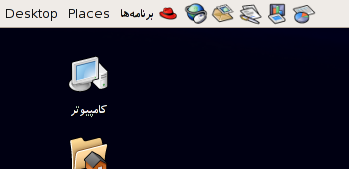

فصل ۴ - عناصر دیداری در میانای کاربر
--------------------------------------

در این فصل به جایگاه عناصر دیداری و جایگاه آنها در میانای کاربر گرافیکی می‌پردازیم. عناصر دیداری عبارتند از کلیهٔ اَشکال و تصاویری که در میانای کاربر بکار می‌روند به علاوهٔ طرح‌بندی و چیدمان عناصر مختلف اعم از متن، تصویر، کادر و فضاهای سفیدی که در مجموع ظاهر گرافیکی میانای کاربر را تشکیل می‌دهند.

از آنجا که در بسیاری از نرم‌افزارها خروجیِ حاصل از پردازش اطلاعات چاپ می شود، بخشی از عناصر دیداری میانای کاربر به تجسم و شبیه‌سازی خروجی چاپی روی صفحهٔ نمایش اختصاص دارند.

به همین دلیل ابتدا به بررسی خصوصیات اسناد کاغذی و تاثیر جهت نوشتار روی آنها می‌پردازیم.

### ۴.۱. ‏مروری بر انواع اسناد کاغذی

خروجی چاپی نرم‌افزار‌ها از یک برگ معمولی (مانند یک نامه یک صفحه‌ای) تا فهرست‌های طوماری بلند و یا کتابهای قطور صدها صفحه‌ای ویا نقشه های چند لایه در ابعاد بزرگ یا پوسترهای رنگی بزرگ متغیر است. در اینجا مطلب را بیشتر بر خروجی صفحه به صفحه در ابعاد متعارف متمرکز می‌کنیم که از همه بیشتر کاربرد دارند.

اسناد چند صفحه‌ای انواع مختلفی دارند: ممکن است برگهای آنها مانند یک نامه جدا جدا و یا صحافی شده باشد. همچنین ممکن است تنها یک روی کاغذ چاپ شود و یا پشت و روی کاغذ چاپ شده باشد. همچنین در صورتی که سند صحافی شده باشد ممکن است درز صحافی از کنار و یا از بالا باشد.

از طرف دیگر ممکن است سند چاپی به فارسی یا لاتین باشد. حالت سوم هم اسناد دو زبانه است. به عنوان مثال قراردادی بین‌المللی که درآن بخش لاتین و فارسی بصورت دو ستون یا دو صفحه در روبروی هم قرارمی‌گیرند ویک مجله علمی دو زبانه که نیمی از برگهای آن به فارسی و نیم دیگر لاتین باشد.

در صورتی که سند چاپی از لبهٔ کناری صحافی شود، جای درز صحافی بستگی به زبان سند دارد. در سند فارسی درز صحافی در سمت راست کاغذ قرار می‌گیرد در حالیکه در لاتین این درز در سمت چپ قرار‌می‌گیرد. بنابراین هنگامی که یک کتاب فارسی (که هر دو روی کاغذ آن چاپ شده) را می‌گشاییم صفحهٔ سمت راست شمارهٔ زوج و صفحهٔ سمت چپ شمارهٔ فرد دارد. یعنی اولین صفحه، صفحهٔ سمت چپ است. در حالیکه در یک کتاب لاتین صفحهٔ سمت راست شمارهٔ فرد و صفحهٔ سمت چپ شمارهٔ زوج دارد. یعنی اولین صفحه، صفحهٔ سمت راست است.

همچنین در صورتی که متن دارای ستونهای متعدد باشد ستونهای متن فارسی در هر صفحه از راست به چپ چیده می‌شوند. ترتیب چیدن ستونها در متن لاتین از چپ به راست است.

با توجه به موارد فوق، در مورد اسناد دو زبانه شرایط از این قرار است:

در صورتی که مانند یک مجلهٔ دو زبانه، فارسی و لاتین در دو بخش مستقل باشند می‌توان سند دو زبانه را در حکم دو سند تک زبانه گرفت که در آن صفحهٔ پشت جلد دو سند به یکدیگر چسبیده باشند و در اینصورت هر دو روی سند مرکب صفحهٔ یک خواهند داشت و شمارهٔ صفحات به سمت وسط سند افزایش می‌یابد.

اما اگر بخواهیم فارسی و لاتین را لابه‌لای هم و در مقابل هم داشته باشیم، (مانند قراردادهای دو زبانه) ناچار هستیم که اولویت را به یکی از زبانها بدهیم. در این صورت به هنگام اولویت فارسی صفحهٔ چپ را فرد می‌گیریم و به هنگام اولویت لاتین صفحهٔ راست را فرد می‌گیریم. در این حالت اگر فارسی و لاتین در صفحات جدا باشند، کلیه صفحات فرد به زبان اصلی و صفحات زوج به زبان دوم اختصاص خواهند یافت. در صورتی که فارسی و لاتین در دو ستون جداگانه در یک صفحه قرار بگیرند همواره ستون سمت راست به متن فارسی و ستون سمت چپ به متن لاتین اختصاص خواهد یافت.

با توجه به تفاوتهای فوق، نرم‌افزاری که بخواهد همهٔ حالت‌های اسناد فارسی، لاتین و فارسی لاتین را پوشش دهد باید خصوصیات ویژه‌ای داشته باشد. برای پشتیبانی اسناد راست به چپ (مانند فارسی) یک نرم افزار باید بتواند جهت صحافی کاغذ را در لبه راست کاغذ بپذیرد و بتواند هر دو حالتی که صفحات چپ یا راست صفحهٔ فرد باشد را پشتیبانی نماید.

در حال حاضر هیچ یک از نرم‌افزارهای شناخته شده پوشش مناسبی برای اسناد دو زبانه ارائه نمی‌کنند.

برای اینکه یک نرم‌افزار بتواند اسناد دو زبانه را پوشش دهد، علاوه بر موارد فوق باید دو توانایی دیگر نیز داشته باشد: اولاً باید بتواند با حداقل دو زنجیرهٔ مستقل متن کارکند، (نرم‌افزارهای صفحه آرایی این قابلیت را دارند) و همچنین باید بتوانند تناظری بین دو زنجیره از طریق تغییر فاصلهٔ پاراگرافها ایجاد کنند به شکلی که بندهای متناظر مقابل هم قرار گیرند. (این قابلیت در حال حاضر در هیچ یک از نرم‌افزارهای متداول وجود ندارد)

در قسمت پایانی این بخش جا دارد که نکاتی را در مورد اندازه‌گیری قسمتهای مختلف سند کاغذی به طوری که در ایران متداول است ذکر کنیم:

در صورتی که عامل مسلّط در یک سند چاپی متن آن باشد، (مانند نامه و کتاب) معمولاً نقطهٔ صفر اندازه‌گیری افقی و عمودی نقطهٔ آغاز حرکت قلم روی صفحه خواهد بود. در مواردی که آرایش صفحه مهم باشد، (مانند روزنامه و مجله) نقطهٔ صفر اندازه‌گیری افقی و عمودی در محل تقاطع لبه بالایی کادر و درز صحافی در نظر گرفته می‌شود.

ابهاد مهم اسناد چاپی عبارتند از: قطع صفحه، عرض ستون متن، درز ستون (فاصلهٔ ستونهای متن در اسناد چند ستونه)، حاشیه‌های سفید در چهارسوی صفحه، دندانهٔ سطر اول پاراگراف (تورفتگی) یا برآمدگی (بیرون آمدگی) سطر اول پاراگراف است. در پاراگراف نقل قول شده گاهی از تورفتگی اضافی در دو سوی پاراگراف هم استفاده می شود. ابعاد فوق در شکل زیر نشان داده شده‌اند.

در مورد حاشیه‌های دو سمت کاغذ و همچنین دندانه و حاشیه اضافی دنبالهٔ پاراگراف نکتهٔ قابل توجه این است که به جای این که از حاشیه چپ و راست استفاده شود، از حاشیه داخل (سمتی که درز صحافی در لبهٔ آن است و عطف نیز نامیده می‌شود) و حاشیه خارج (سمت آزاد کاغذ) یا لبهٔ نزدیک و دور استفاده می‌شود. بر حسب نوع صحافی (فارسی یا لاتین) حاشیهٔ داخل و خارج ممکن است حاشیهٔ چپ یا راست باشد. به همین دلیل در طراحی نرم‌افزارها نباید از چپ و راست استفاده کرد بلکه باید از داخل و خارج (نسبت به صحافی که در صفحات زوج و فرد قرینه می‌شود) یا نزدیک و دور (نسبت به آغاز حرکت قلم) استفاده شود. همچنین دندانه (تورفتگی) یا برآمدگی سطر اول پاراگراف همواره از سمت آغاز پاراگراف یعنی سمت نزدیک هستند. همچنین حاشیه اضافی در دو سمت پاراگراف (تمام سطرهای آن) در مورد پاراگراف نقل قول شده متداول است.

**ضابطهٔ ۲۷: در مورد ابعاد افقی کاغذ از حاشیهٔ داخلی و بیرونی (نسبت به صحافی که در صفحات زوج و فرد قرینه می‌شود) یا نزدیک و دور (نسبت به آغاز حرکت قلم)بجای حاشیهٔ چپ و راست استفاده کنید.**

**ضابطهٔ ۲۸: نرم‌افزارهای جهانی باید بتوانند با اسنادی که از بالا، چپ یا راست صحافی شده باشند کار کنند و در نتیجه بتوانند هم صفحهٔ چپ و هم صفحهٔ راست را صفحهٔ فرد (یک) در نظر بگیرند.**

**ضابطهٔ ۲۹: نرم‌افزارهای جهانی که از متن چند ستونه پشتیبانی می‌کنند و باید بتوانند ستونها را علاوه بر چپ به راست، در حالت راست به چپ نیز پشتیبانی کنند.**

علاوه بر موارد فوق در متن دو زبانه نکات دیگری نیز در مورد ابعاد و اندازه‌گیری‌های صفحه مطرح هستند:

اگر در یک متن فارسی برخی پاراگراف‌ها لاتین باشد (و یا برعکس) مشکلاتی در تعیین محل صفر خط‌کش اندازه‌گیری افقی جلوه می‌کنند. مشکل از اینجا ناشی می‌شود که در پاراگراف فارسی نقطه صفر افقی در لبه سمت راست قرار دارد در حالی که نقطه صفر پاراگراف لاتین در لبه سمت چپ است. برای پشتیبانی صحیح این حالت باید یک مفهوم دیگر را هم در نظر بگیریم: یک بخش از متن (حداقل یک ستون تا چند صفحه) باید فارسی یا لاتین فرض شود حتی اگر لابه‌لای آن پاراگرافهایی از زبان دیگر هم وجود داشته باشند. در این حالت محل صفر خط‌کش اصلی افقی متن تابع جهتِ بخش می‌باشد و نه جهتِ پاراگراف. در این حالت برای پاراگراف‌هایی که جهتی در خلاف جهت بخش دارند می‌توان یک خط‌کش کوچک اضافی با صفر منطبق بر لبهٔ نزدیک پاراگراف به موازات خط‌کش اصلی نمایش داد. این موضوع در دو شکل زیر نمایش داده شده است. یک راه دیگر استفاده از دو خط‌کش ثابت موازی است که صفر یکی از آنها به حاشیهٔ چپ و صفر دیگری به حاشیه راست منطبق باشد.

**رهنمود ۱۱: محل صفر خط‌کش افقی را از روی جهت بخش متن فعلی تعیین کنید نه از روی جهت پاراگراف فعلی.در حالتی که پاراگراف فعلی جهت عکس بخش فعلی را داشته باشد، یک درجه‌بندیِ اضافی موقت برای آن پاراگراف نمایش دهید که صفر آن به حاشیه داخلی آن پاراگراف منطبق باشد.**

به این ترتیب در یک سند چاپی با جهت‌های متعددی می‌توانیم سر و کار داشته باشیم: جهت مجلد (محل لبهٔ صحافی آن) جهت بخش (شامل جهت ستونها)، جهت پاراگراف و جهت یک رشته متن. (هنگامی که یک رشته حروف لاتین لابلای متن فارسی می آید یا برعکس) این جهت‌ها باید از روی میانای کاربر به راحتی قابل تشخیص باشد.

**رهنمود ۱۲: علاوه بر جهت رشته حروف و جهت پاراگراف، نرم‌افزار جهانی را به گونه‌ای طراحی کنید که در آن جهت بخش، جهت ستونها و جهت صحافی سند چاپی نیز به وضوح مشخص باشد و به راحتی قابل تعیین باشد. به عنوان مثال می‌توانید جهت صحافی را با ترسیم یک لبهٔ پر رنگ‌تر از بقیهٔ لبه‌های کاغذ مشخص سازید.**

**رهنمود ۱۳: جهت پیش‌فرض برای هر بخش از متن (یا ستونها) را تابع جهت صحافی و جهت پیش فرض پاراگراف را تابع بخش (یا ستونها) در نظر بگیرید.**

### ۴.۲. ‏بومی‌سازی نمادها و تصاویر

کاربرد تصاویر (images)، نمادها (symbols)، یا شمایلهای (icons) مختلف در میانای کاربر گرافیکی بسیار متداول است و کاربرد آنها معمولاً به سهولت کاربرد و زیبایی میانای کاربر کمک می‌کند. در بسیاری از موارد تولیدکنندگان نرم‌افزار تصور می‌کنند که این شمایلها و تصاویر خود به خود جهانی هستند و نیازی به بومی سازی ندارند، در حالی که چنین تصوری درست نیست.

بهتر است تصاویر و شمایلها و نمادها به گونه‌ای انتخاب شوند که نیازی به بومی سازی نداشته باشند. اما این امر در برخی موارد مشکل است یا از کیفیت نرم‌افزار می‌کاهد. برای این که تصاویر جهانی باشند رعایت نکات زیر ضرورت دارد:

به دلیل تفاوتهای فرهنگی و توهین‌آمیز یا قبیح بودن حرکات یا بخشهایی از بدن انسانی در نظر فرهنگ های مختلف، در تصاویر از کاربر تصویر انسان یا بخشهای مختلف بدن انسان اجتناب نمایید مگر در حدی که در نمادهای بین‌المللی (مانند علائم راهنمایی و رانندگی) کاربرد دارد. به عنوان مثال استفاده از علامت انگشت شست برای تأیید در فرهنگ ایران مفهوم تأیید نداشته بلکه مفهوم توهین‌آمیزی دارد.

نکتهٔ دیگری که نیاز به توجه دارد استفاده از شکل وسایلی است که در سراسر جهان یک شکل نیستند. به عنوان نمونه شکل پاکت نامه، تمبر و حتی مُهر پستی به دلیل مبادلهٔ نامه در نقاط مختلف جهان تا حدود بسیاری مشابهت دارد. اما شکل صندوق پست در هر کشور با کشور دیگر متفاوت است. بنابر‌این به جای استفاده از شکل صندوق پست بهتر است از شکل نامه و تمبر استفاده شود.

نکات فوق اختصاص به بوم ایران ندارد و به همین دلیل در مراجع میانای کاربر جهانی ذکر گردیده به همین دلیل از توضیح بیشتر در این زمینه خودداری می‌شود.

نکتهٔ دیگر که در این مورد اهمیت دارد و در بسیاری موارد بد‌فهمی‌هایی از آن حتی در مراجع مربوط به جهانی سازی دیده می‌شود مربوط به تأثیر یا عدم تأثیر جهت نوشتار راست به چپ روی تصاویر، نمادها و شمایلها است.

از یک سو در برخی موارد لازم است تصویری قرینه شود، در حالی که این امر بدیهی نیست. از سوی دیگر، برخی تصاویر که قرینه نیستند لازم نیست که معکوس شوند، در این موارد حتی ممکن است معکوس کردن آنها نادرست باشد.

به عنوان مثالی از حالت اول، شمایل نیم‌رخ یک آدمک را در نظر بگیرید که کاربرد آن به عنوان نماد کاربر متداول است. شمایل نیم‌رخ در صورتی که همراه متن استفاده شود، به دلیل جهت‌دار بودن نگاه آدمک و نکات ترکیب‌بندی متن و تصویر تولید اشکال می‌کند. به همین دلیل توصیه می شود که به جای شمایل نیم‌رخ از شمایل تمام‌رخ استفاده شود، چرا که شمایل تمام‌رخ از نظر جهت افقی خنثی است.

عکس این حالت هم زمانی اتفاق می‌افتد که یک شکل نا متقارن و جهت‌دار است، اما این جهت‌دار بودن ربطی به نوشتار و ترکیب‌بندی متن و تصویر ندارد. در چنین مواردی قرینه کردن یا خنثی کردن تصویر نه تنها لازم نیست بلکه ممکن است نادرست و گیج‌کننده باشد. به عنوان نمونه علامت تأیید (checkmark) را در نظر بگیرید:  این علامت دارای جهت است، اما جهت آن به راست یا چپ‌دستی نویسنده مربوط است نه جهت نوشتار. در واقع علامت تأییدی به شکل  علامت تأیید چپ دست است.

مثال دیگر، دکمهٔ پخش است که در نرم‌افزار ‌های رسانه‌ای متداول است.  اگر چه این علامت به وضوح چپ به راست است، اما جهت آن از نظر تاریخی از روی جهت حرکت نوار برجای مانده و اکنون که بسیاری از ابزار‌های رسانه‌ای فاقد نوار هستند تنها به یک نماد برای عمل پخش رسانه تبدیل شده و به دلیل کاربرد لوازم رسانه‌ای در منازل سراسر دنیا این علامت حالت جهانی یافته است. به این ترتیب برای کاربران بوم ایران نیز همان مثلث چپ به راست به عنوان علامت پخش کاملاً صحیح است و تغییر آن نه تنها غیر لازم بلکه کلاً نادرست است.

اما مورد دیگری نیز هست که مسأله ساز است. این مورد زمانی رخ می‌دهد که بخواهیم تقدم و تأخر را با تصویر نمایش دهیم. در این حالت مرسوم است که برای بیان رجوع به بعدی از پیکان یا مثلث چپ به راست و بیان رجوع به قبلی از پیکان یا مثلث راست به چپ استفاده شود. چنین کاربردی برای کاربر ایرانی نادرست است، اما در این حالت معمولاً نه تنها معکوس کردن جهت علامت‌ها کمکی نمی‌کند، بلکه گیج‌کننده است.

متأسفانه کاربرد علائم چپ و راست برای مفهوم بعدی و قبلی امروزه بسیار رایج است و به همین دلیل نیاز به توجه ویژه در جهت حل این مشکل وجود دارد. به عنوان نمونه در کلیهٔ مرورگرهای وب دو دکمهٔ قبلی و بعدی بصورت پیکان یا مثلث وجود دارد. اما جهت درست این پیکانها بغرنج است. توجه کنید که با همان مرورگر می‌توان هم صفحات فارسی و هم صفحات لاتین را مرور کرد و جهت این پیکانها باید تابع محتوای صفحه وب یاشد نه تابع زبان میانای کاربر مرورگر!

این موضوع راه‌حل ساده و بدیهی ندارد اما در این سند پیشنهاد زیر در این مورد مطرح می‌گردد:

از آنجا که صفحات وب رسانه‌ای الکترونیک هستند و می‌توانند علاوه برمتن حاوی تصویر و صدا باشند بنظر می‌رسد که می‌توان از نمادهای مربوط به لوازم الکترونیک رسانه‌ای در مورد آنها استفاده کرد. به این ترتیب برای نمایش «قبلی» و «بعدی» پیشنهاد می‌شود که از مثلث‌های دوقلوی راست به چپ و چپ به راست استفاده شود. ( برای «بعدی» و  برای «قبلی») برای اجتناب از ابهام توصیه می‌شود که همراه تصویری که نشانهٔ قبلی و بعدی است، همواره از برچسب «قبلی» و «بعدی» نیز استفاده شود.

**رهنمود ۱۴: از کاربرد علائم پیکان و مثلث رو به چپ و راست برای تجسم مفهوم «قبلی» و «بعدی» بپرهیزید. سعی کنید به جای نماد از کلمات «قبلی» و «بعدی» استفاده کنید و در صورت کاربرد یک نماد حتماً به همراه آن نماد از برچسب کلمات «قبلی» و «بعدی» نیز استفاده کنید.**

**استفاده از نمادهای  و  به استناد کاربرد آنها برای مفهوم مشابه در لوازم الکترونیک رسانه‌ای به ترتیب برای تجسم «بعدی» و «قبلی» مجاز است.**

### ‏۴.۳. ‏تعیین جهت و محل عناصر دیداری

روش چیدمان و ترکیب‌بندی اجزای تصویری میانای کاربر از همان قواعد صفحه‌آرایی و طراحی اسناد کاغذی پیروی می‌کند. به عنوان مثال استفاد از فضای خالی در اطراف طرح، سادگی طرح و تناسب و توازن طرح از ویژگیهای یک طرح خوب هستند. همچنین بخشهایی از طرح که شامل متن اصلی و پیوستهٔ آن است، باید در مجموع تابع جهت نوشتار باشد. بنابراین هر بخش مجزا از میانای کاربر فارسی که حالت متن‌گونه دارد، باید از بالا به پایین و از راست به چپ چیده شده باشد.

رعایت این نکته به آن آسانی که ممکن است بعضی تصور کنند، نیست. عده‌ای تصور می‌کنند که قرینهٔ آینه‌ای یک طرح چپ به راست (حول محور عمودی) همواره یک طرح درست راست به چپ ایجاد می‌کند، اما اینطور نیست.

توجه کنید که گرچه یک قرینهٔ سادهٔ آینه‌ای غالباً راه‌حل صحیح است، اما این امر در تمام حالات درست یا مناسب نیست. باید به این نکته نیز توجه داشت که مکان بسیاری از اجزای میانای کاربر تابع جهت افقی نوشتار نیست. به عنوان نمونه، مکان عمودی یک سر برگ مهم است، (باید در بالای صفحه باشد) اما مکان افقی آن اختیاری است: یک سر برگ می تواند در سمت چپ، سمت راست ویا وسط صفحه باشد. یا به عنوان نمونه‌ای دیگر، اگر یک پرسش چند گزینه‌ای داشته باشیم معمولاً ترتیب گزینه‌ها مهم نیست. (مگر گزینه‌ای چون هیچکدام که باید همواره در آخر باشد.) بنابراین تنها بخش ‌هایی از طرح نیاز به قرینه شدن دارند که لازم باشد آنها را درجهت درست نوشتار قرائت کرد. معمولاً بقیهٔ اجزا را نیز می‌توان قرینه کرد، اما قرینه کردن غیر لازم عناصر و اجزای طرح توصیه نمی‌شود و حتی ممکن است نادرست باشد.

برای درک بهتر این موضوع لازم است ابتدا شرایط واقعی که میانای کاربر در آن واقع می‌شود را در نظر بگیریم.

در یک محیط تماماً لاتین همه چیز تابع جهت واحد یعنی چپ به راست است. (مثلاً دکمه پخش با نماد ) جهت چپ به راست دارد و همچنین جهت روابط ریاضی، نمودارها و محورهای مختصات نیز چپ به راست است.

در مقابل حتی در مورد یک محیط تماماً فارسی ما با واقعیت لوازم الکترونیک (و دکمه پخش با نماد چپ به راست) و ریاضیات مواجه هستیم که یکدستی جهت را به هم می‌زنند. یعنی تفاوت زبان فارسی نه تنها در راست به چپ بودن متن بلکه در دو جهته بودن آن است. به عنوان مثال یک نوار پیشرفت (progress bar) که شبیه دماسنج است از نقطهٔ صفر (بدون پیشرفت) شروع به پر شدن کرده و تا یک عدد حداکثر می‌رسد. از آنجا که نوار پیشرفت یک نوع نمودار است و کمیت عددی را نمایش می‌دهد، برای بوم ایران در همان جهت چپ به راست (که جهت ریاضی و جهت محور دکارتی است) صحیح است و وارونه کردن جهت پر شدن نوار نه تنها برای کاربران فارسی زبان مطلوب نیست بلکه گیج کننده نیز می‌باشد. به همین ترتیب و به تبعیت از نوار پیشرفت ممکن است مکان برخی عناصر دیگر نیز که مربوط به آن بوده و در اطراف آن وجود دارند (مانند یک دکمه توقف عملیات) در مکان متناظر چپ به راست باشند.

از طرف دیگر در دنیای واقعی بسیاری از نرم‌افزارها لاتین هستند وتا آیندهٔ قابل پیش‌بینی هم لاتین خواهند بود. به همین دلیل در بسیاری از موارد کاربران با یک محیط یکدست و تماماً فارسی مواجه نیستند بلکه با یک محیط دو زبانه سر و کار دارند. در این شرایط، برای بسیاری از عناصر میانای کاربر هماهنگ بودن جای آنها در بین نرم‌افزار فارسی و لاتین مهم‌تر از چیدن راست به چپ آنها است.

به عنوان نمونه، محل قرار گرفتن دکمه‌های کنترل پنجره (بستن و کوچک و بزرگ کردن) در دو میز کار گرافیکی متداول در جهان یعنی محیط ویندوز و محیط مکینتاش مکان دکمه‌ها قرینه است. (به شکل توجه کنید.)

**ویندوز**

**مکینتاش**

از این امر نتیجه می‌شود که انتخاب محل بسیاری از عناصر اجباری و مطابق جهت متن نیست و در بسیاری از مواقع عوامل دیگری در انتخاب آن تأثیر دارند.

در اینجا یک نکتهٔ مهم دیگر نیز باید مورد توجه قرار گیرد. با بازگشت به مثال مکان دکمه‌های کنترل پنجره مشاهده می‌شود که علاوه بر این که این دو گروه دکمه در مکان مخالف هم قرار دارند در هر دو محیط دکمهٔ بستن دَمِ دست‌ترین دکمه است چون در یک کُنج قرار دارد. این امر یک انتخاب آگاهانهٔ طراحی است. باید توجه داشت که هنگام تغییر دادن مکان عناصر میانای کاربر برای تطبیق آنها با زبان فارسی نباید آنها را طوری جابجا کنیم که خوش‌دستی میانای کاربر به دلیل قرار گرفتن عناصر در مکانهای نامناسب آسیب ببیند. در این مورد دو مثال آشکار را می‌توان از محیط میز کار گرافیکی گنوم مشاهده کرد:

در نسخهٔ انگلیسی محیط گنوم که به همراه نسخهٔ ۴ گنو/لینوکس فدورا ارائه شده یک نوار گزینگان محیط سیستم در بالای میز کار قرار دارد که از چپ به راست شامل سه گزینگان Programs سپس Places و بعد Desktop است. با فعال کردن بوم ایران این گزینگان هنوز از چپ شروع می‌شود (چپ‌چین است) ولی از چپ به راست شامل گزینگان میزکار (Desktop) سپس «مکآنها» (Places) و بعد «برنامه‌ها» (Programs) می‌شود. به این ترتیب گزینگان «برنامه‌ها» که در نسخهٔ انگلیسی در کنج صفحه قرار دارد به یک نقطه در میان صفحه منتقل می‌شود و این نادرست است؛ زیرا به دلیل کثرت مراجعه به گزینگان «برنامه‌ها» باید این منو راحت‌تر در دسترس باشد و راحت‌ترین نقطهٔ قابل دسترسی کنج صفحه است. (به قانون فیتز در مرجع [Fitts’] مراجعه کنید) در اینجا به دلیل اینکه عنوان هر گزینگان یک کلمه است و به متن می‌ماند ترتیب آنها راست به چپ شده است که به خودی خود نادرست نیست. اما خود مجموعهٔ گزینگان به دلیل محدودیت‌های فنّی هنوز در سمت چپ باقی مانده است. این جابجایی ناقص باعث خراب شدن طرّاحی اصلی شده و کاربرد محیط را برای کاربر فارسی زبان دشوارتر از کاربر انگلیسی زبان می‌سازد. در چنین حالتی بهتر است که گزینگان به حالت اصلی حفظ شود و به صورت ناقص جابجا نشود.

اشکال دوم به جهت نوشتار مربوط نیست بلکه به مرتب سازی الفبایی بر‌می‌گردد. در همان محیط گنوم، اقلام گروه اول در گزینگان برنامه‌ها (Programs) به ترتیب الفبایی مرتب می‌شوند. این امر باعث می‌شود که خُرده‌گزینگان (Submenu) اوّل در محیط لاتین Accessories باشد و خُرده‌گزینگان آخر System Tools باشد . در حالی که در نسخهٔ بومی‌شدهٔ فارسی اولین خُرده‌گزینگان «ابزارهای سیستم» (System Tools) و آخرین آن لوازم (Accessories) است. با توجّه به اینکه معمولاً گزینگان «لوازم» شامل اقلام پر مصرف‌تری از گزینگان «ابزارهای سیستم» است بهتر است که گزینگان «لوازم» درمکانی قبل از گزینگان «ابزارهای سیستم» قرار بگیرد. طرّاح نسخهٔ لاتین در اینجا مرتکب یک اشتباه بزرگ شده است: الفبایی کردن ترتیب گزینه‌های یک گزینگان پرکاربرد نادرست است و بهتر است گزینه‌های آن به ترتیب کثرت استفاده در مکآنهای مناسب‌تر قرار گیرند.

در این مورد طرّاح نسخهٔ لاتین نام دو خُرده‌گزینگان را طوری انتخاب کرده که فرمانها در مکان مناسبی قرار گیرند و با این کار اشتباه طرّاحی اولیّه را جبران کند. اما ممکن است همواره امکان این امر در زبانهای دیگر فراهم نباشد. البتّه استثنائاً در مورد فارسی می‌شد نام خُرده‌گزینگان Accessories را «ابزارها» و نام خُرده‌گزینگان System Tools را «لوازم سیستم» گذاشت تا مکان نسبی آنها حفظ شود. عدم رعایت این امر در نسخهٔ فارسی یک ضعف در بومی‌سازی این نرم‌افزار است.

**ضابطهٔ ۳۰: ترجمهٔ میانای کاربر و بومی‌سازی آن نباید طرّاحی میانای کاربر را از نقطه‌نظر سهولت دسترسی و کاربرد عناصر مختلف تحت تأثیر منفی قرار دهد.**

**ضابطهٔ ۳۱: هنگام طرّاحی نرم‌افزارهای جهانی از چیدن عناصر به ترتیب الفبایی اجتناب کنید . تنها در صورتی‌که تعداد عناصر زیاد باشد و ترتیب منطقی مناسب‌تری برای آنها متصوّر نباشد مجاز به چیدن آنها بر‌اساس الفبا هستیم.**

**رهنمود ۱۵: برای پشتیبانی بوم راست به چپ در طرّاحی نرم‌افزارهای جهانی باید از قرینه کردن کورکورانه همهٔ عناصر اجتناب شود و به جای آن برای تسهیل پشتیبانی صحیح بومهای راست به چپ و دو جهته بهتر است که محیطهای بستر امکانات بیشتری را برای کنترل مکان عناصر میانای کاربر، در اختیار گروه بومی‌سازی نرم‌افزار بگذارند.**

**رهنمود ۱۶: برای کاهش احتمال تولید اشکالات پیش‌بینی نشده بهتر است طرّاحان محیطهای بستر و نرم‌افزارهای جهانی تا حد امکان طرح‌هایی ارائه کنند که حول محور عمودی متقارن باشند و نسبت به جهت راست به چپ و چپ به راست طرحی خنثی داشته باشند.**

### ۴.۴. ‏تأثیرات تفاوت جهت محیط میزکار، نرم‌افزار و سند

در بخش قبل به طور اجمالی به حالت ترکیبی محیط فارسی با لاتین اشاره شد. با توجه به اینکه این امر زیاد اتفاق می‌افتد و می‌تواند مشکلاتی برای کاربران ایجاد کند به بررسی تأثیرات ترکیب چند زبان می‌پردازیم.

هر کاربر به هنگام کار روی رایانه با سه جزء اصلی سر و کار دارد:

جزء اول، محیط میز کار گرافیکی (Graphical Desktop Environment) است که از آن برای مدیریت پرونده و دسترسی به نرم‌افزارها و ابزارهای مختلف استفاده می‌شود. این محیط همچنین برخی از نرم‌افزارهای کاربردیِ پایه مانند ویراستار ساده و پایانه را نیز شامل می‌شود.

جزء دوم، نرم‌افزار کاربردی است که کاربر به وسیلهٔ آن کارهای مورد‌نظر خود را انجام می‌دهد.

جزءسوم، اطلاعات یا سندی است که کاربر بر روی آن به کار مشغول است.

هریک از سه جزء فوق ممکن است فارسی، لاتین یا ترکیب فارسی و لاتین باشند. همچنین در مورد سه جزء فوق یک نوع رابطهٔ ظرف و مظروفی مجازی یا منطقی قابل تصوّر است، گویی نرم‌افزار در داخل محیط میز کار اجرا می‌شود و اطلاعات یا سند مورد کاربرد در داخل نرم افزار قرار دارد. با این تجسّم انتظار می‌رود نوعی تأثیر متقابل بین آنها وجود داشته باشد. از طرف دیگر عامل هماهنگ کنندهٔ اصلی برای محیط کلی رایانه همان جزء اول یعنی محیط میز کار یا سیستم عامل است. بنابراین زبان اصلی محیط میز کار یا سیستم عامل تأثیر هماهنگ کنندهٔ مهمی روی سایر اجزا دارد.

همچنین باید در نظر داشت که مستقل از زبان اصلی سیستم عامل، اطلاعات (یا اسنادی) که مورد پردازش قرار می‌گیرند ممکن است به هر زبانی باشند و باید کاربر بتواند به درستی با آنها کار کند. حلقهٔ واسطه در این میان نرم‌افزار کاربردی است که باید علاوه بر قابلیت تطبیق دادن و هماهنگ ساختن خود با محیط سیستم عامل (مثلاً با نمایش دادن متن پیغام ها به زبان اصلی سیستم عامل) بتواند با اسنادی به زبانهای مختلف به درستی کار کند. در این راستا باید هماهنگی و انسجام مناسبی بین نرم‌افزار و سیستم عامل و بین نرم‌افزار به هنگام کار با سند فارسی و کار با سند لاتین وجود داشته باشد. برای روشن شدن این مطلب به موارد زیر توجه کنید:

گزینه‌های چند گزینگان اول بسیاری از برنامه ها مشابه یکدیگر است مثلاً در اکثر نرم‌افزارها گزینگان اول در نوار منو، گزینگان پرونده (File) و سپس گزینگان ویرایش (Edit) است. گزینه‌های هر یک از این گزینگآنها نیز معمولاً مشابه و متناظر یکدیگر هستند. این امر به سهولت فراگیری و کاربرد نرم‌افزارها کمک می‌کند. یکی از عواملی که به سهولت کاربرد نرم‌افزارها کمک می‌کند یاد گرفتن مکان عناصر میانای کاربر است به طوری که کاربر بتواند بدون نیاز به دقّت کردن و خواندن متن آنها، آنچه را که می‌خواهد پیدا کند و به کار گیرد. برای فراهم کردن امکان این یادگیری (و فراهم کردن سهولت ناشی از آن) باید عناصر اصلی میانای کاربر مکان مشخص و ثابتی داشته باشند. پس بهتر است مکان گزینگان «پرونده» و «ویرایش» نیز ثابت نگاه داشته شود. بنابراین اگر نوارهای گزینگان سیستم عامل تابع زبان فارسی و راست به چپ هستند باید حتّی یک نرم‌افزار لاتین هم منوهای خود را راست به چپ نمایش دهد:

نرم‌افزار فارسی:

پرونده ویرایش نمایش جستجو …

نرم‌افزار لاتین در محیط فارسی:

File Edit View Search …

به عنوان یک مثال مهم که در نرم‌افزارهای فعلی به نادرستی عمل می‌کند، می‌توان از مکان نوارِ پیمایش (scroll bar) در لبه های پنجره نام برد.

در برخی محیطها نوار پیمایش موجود در لبهٔ کنار پنجره برحسب اینکه سند بازشده در پنجره لاتین باشد یا فارسی بین لبه چپ و راست جابجا می‌شود. این رفتار نادرست است زیرا مکان ابزارهای اصلی (در این مورد نوار پیمایش که کاربرد آن بسیار متداول است) در میانای کاربر ثبات ندارد و این امر کار کردن با آن نرم‌افزار را دشوار می‌سازد. توضیح این نکته ضروری است که با توجه به آنچه در بخش قبل گفتیم نوار پیمایش جزء اجزایی از میانای کاربر است که مکان آن لزوماً ربطی به جهت نوشتار ندارد. (مثلاً در محیط SmallTalk نوار پیمایش عمودی برای متن لاتین در سمت چپ قرار دارد.)

**ضابطهٔ ۳۲: یک نرم‌افزار حتی اگر به زبان محلی بوم فعال در سیستم عامل ترجمه نشده باشد، باید اجزا اصلی میانای کاربر خود را در مکآنهایی هماهنگ با نیازهای بوم فعال قراردهد.**

**به عبارت دیگر باید چیدن مکان عناصر اصلی میانای کاربر که لزوماً ربطی به ماهیت اطلاعات و سند فعال نداشته باشند به عهده نرم‌افزار بستر و محیط میز کار باشد تا هماهنگ ساختن نرم افزارها ساده‌تر گردد.**

واقعیت دیگری که اکنون وجود دارد اینست که اغلب کاربران فعلی رایانه‌ها به کاربرد محیط میز کار و نرم‌افزارهای بومی نشده عادت دارند. به همین دلیل بهتر است به هنگام طراحی یک محیط کاملاً فارسی از جابجا کردن مکان عناصر تا حدی که امکان دارد اجتناب کنیم تا انتقال کاربران به محیط میز کار فارسی ساده‌تر گردد. تا حد امکان یک بیان کیفی و نادقیق است، پیشنهادهای مشخص ارائه شده در این مورد در فصل بعدی توضیح داده خواهند شد.

**ضابطهٔ ۳۳: از جابجایی بی مورد عناصر میانای کاربر گرافیکی به هنگام بومی ساختن آن برای محیط فارسی باید اجتناب کنیم.**
